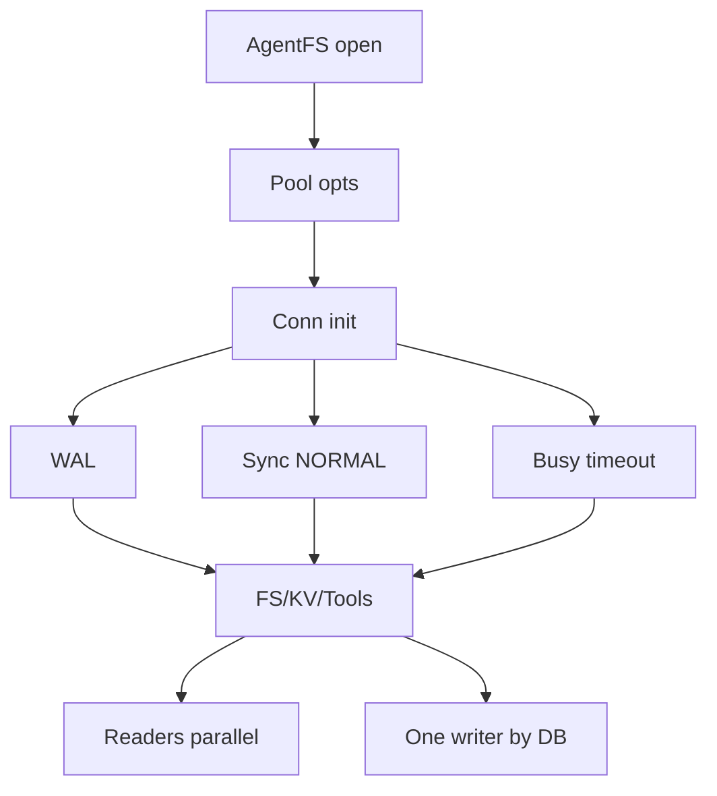

## Approach

Implement the low-risk Phase 3 slice in the Rust/CLI codepaths first: make SQLite/Turso connection concurrency configurable, apply production-safe SQLite pragmas to every internally-created connection, restore `fsync` to the new durable baseline, add focused regression/concurrency tests, and tune macOS NFS transfer sizes. I will not start Phase 4 schema changes, chunk-size migrations, or chunk-granularity overlay copy-up in this pass.

## Files to modify/create

- `sdk/rust/src/connection_pool.rs`
  - Replace the hardcoded `MAX_CONNECTIONS = 1` behavior with `ConnectionPoolOptions` / constructors that accept `max_connections`, timeout, and per-connection setup SQL.
  - Keep a single-connection constructor available for tests or callers that need strict serialization.
  - Ensure setup statements run whenever a new pooled connection is created, not just during initial filesystem setup.

- `sdk/rust/src/filesystem/agentfs.rs`
  - Add the internal production pragma set: `PRAGMA journal_mode = WAL`, `PRAGMA synchronous = NORMAL`, and `PRAGMA busy_timeout = 5000`.
  - Use the new pool options in internally-created file-backed AgentFS constructors.
  - Update `fsync` so it temporarily switches to `FULL` and restores `NORMAL`, not `OFF`.
  - Add tests covering pragma configuration and multi-connection access without regressing filesystem operations.

- `sdk/rust/src/lib.rs`
  - Route `AgentFS::open` / `AgentFS::new` local database creation through the configured FS pool.
  - Preserve `:memory:` safety by using one connection for in-memory DBs unless tests confirm Turso shares in-memory state across connections.
  - Keep `kv`, `fs`, and `tools` in the same database to preserve the single-file snapshot invariant.

- `sdk/rust/src/toolcalls.rs`
  - Convert hot `prepare` / `query` sites that are repeatedly exercised to `prepare_cached` where supported.
  - Do not split `tool_calls` into a sidecar DB in this pass because that violates the core one-file portability premise.

- `cli/src/mount/nfs.rs`
  - Add explicit macOS NFS `wsize` / `rsize` mount options, scoped to the existing mount option string.

## Key decisions

- Default file-backed Rust AgentFS pools will target 8 connections; SQLite/Turso WAL remains the single-writer arbiter, while reads can use distinct pooled connections.
- Pragmas must be applied per newly-created connection, because `busy_timeout` and `synchronous` are connection-scoped in SQLite-like engines.
- In-memory databases stay serialized unless proven safe, avoiding separate empty `:memory:` databases per connection.
- Tool calls remain in the main DB for now; I will reduce statement overhead but not introduce a sidecar that weakens session portability.

## Risks

- Turso may not support every SQLite pragma identically; tests will verify startup succeeds and pragmas are observable where possible.
- Increasing pool width can expose latent write contention; tests should assert concurrent readers/writers complete rather than assuming no busy retries ever occur.
- macOS NFS tuning cannot be fully validated on this Linux host; it will be covered by compile checks, not runtime mount validation here.

## Alternatives rejected

- Simply changing `MAX_CONNECTIONS` from `1` to `8`: insufficient because newly-created connections would miss per-connection pragmas and `:memory:` behavior could regress.
- Splitting `tool_calls` to a separate DB immediately: improves write isolation, but breaks the spec’s main strategic requirement that a full session is portable as one SQLite file.

## Open questions

- None required before this Phase 3 implementation slice. Phase 4 schema migration design should be specified separately before any DB format changes.

## Validation plan

- Worktree pre-check from `worktree-setup` before validators.
- Rust validators from CI: `cargo fmt -- --check`, `cargo clippy -- -D warnings`, `cargo check --all-features`, `cargo test --verbose` in `sdk/rust`.
- CLI validators impacted by NFS option changes: `cargo fmt -- --check`, `cargo clippy -- -D warnings`, `cargo check --all-features`, `cargo test --verbose` in `cli`; run `cli/tests/all.sh` if host prerequisites permit.
- Final quality-ship checklist covering worktree, format, lint, dead-code, ai-slop, typecheck, and tests.