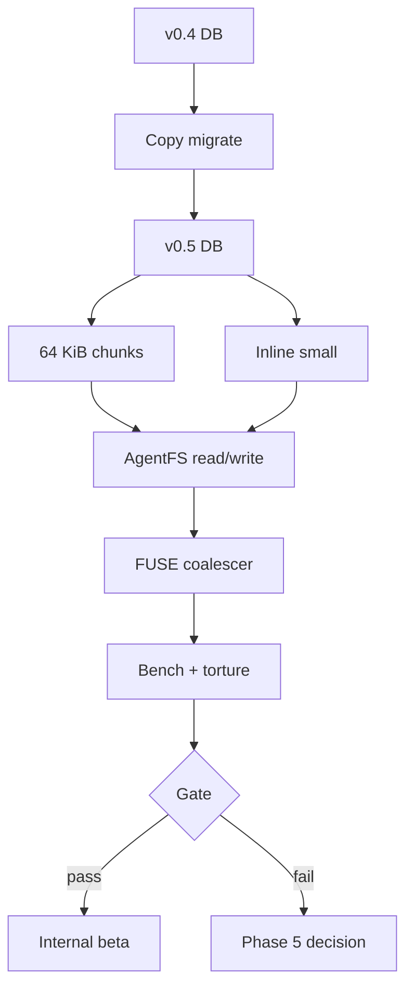
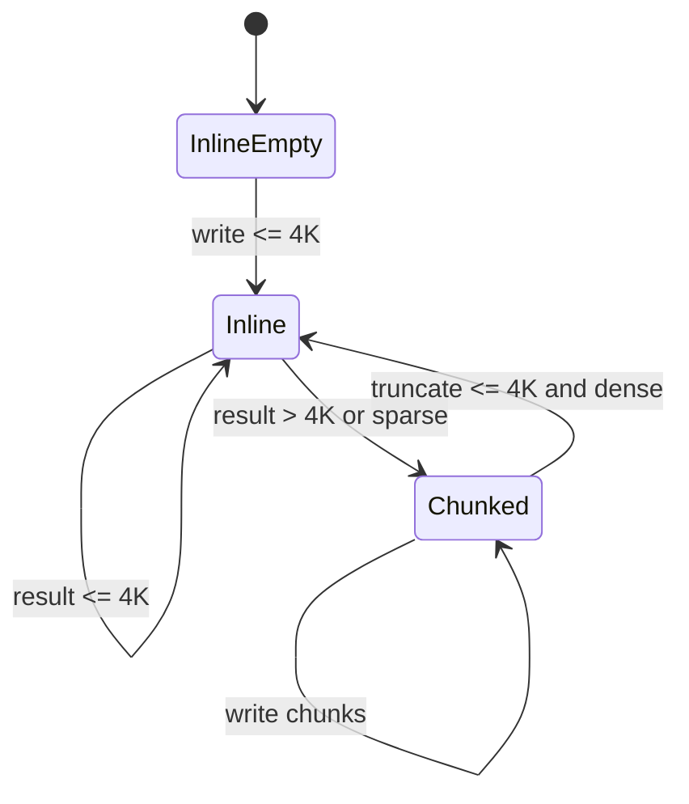
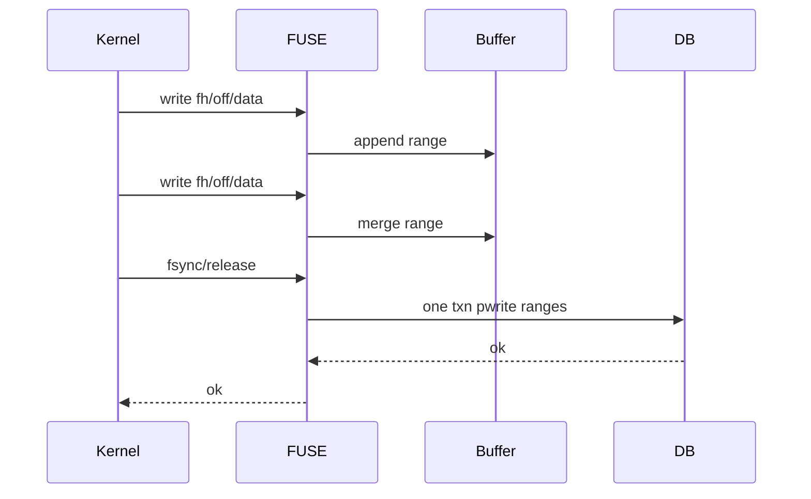
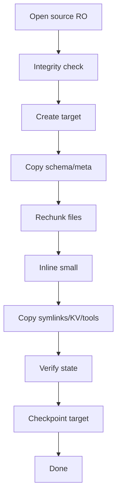

# AgentFS Phase 4 North Star Spec: Schema and Write-Path Performance

**Status:** Draft north-star spec  
**Precondition:** Phase 0-3 branch exists and is under review: `phase0-3-agentfs-hardening`  
**Decision driver:** Phase 3 corruption gate passed locally, but the bounded `factory-mono` read baseline was ~125.8× slower than native. Phase 4 must close the measured performance gap without weakening the single-file snapshot contract.

## 1. Executive summary

Phase 4 is the first invasive AgentFS fork phase. Its goal is to reduce SQL amplification and write-path overhead while preserving:

1. **Single-file portability:** after checkpoint/fsync, copying the main `.db` must preserve filesystem, KV, and tool-call state.
2. **Crash-safety baseline:** WAL + durable checkpoint behavior from Phase 3 remains mandatory.
3. **Copy-and-verify migration:** existing databases are never migrated in place.
4. **Measurable gates:** no change lands on belief; every sub-phase is gated by benchmark, integrity, snapshot/restore, and torture results.

The Phase 4 north star is:

- Default new databases use **64 KiB chunks**.
- Files at or under **4 KiB** are stored inline in `fs_inode`, avoiding `fs_data` rows entirely.
- Legacy databases can be converted by a **copy-based migration tool** that verifies source and target filesystem equivalence.
- FUSE writes are **coalesced per file handle / flush window** so kernel writeback does not become one SQLite transaction per small write.
- Statement-cache and path-resolution hot spots are profiled with concrete counters before and after optimization.

Phase 4 does **not** include chunk-granularity overlay copy-up, FSKit, Turso upgrade, rusqlite fallback, or `.agentignore`; those remain Phase 5/6 or separate initiatives.

## 2. Current baseline and why Phase 4 exists

### 2.1 What Phase 0-3 gave us

- Fork governance and workload baseline harnesses.
- Corruption torture and snapshot/restore tests.
- WAL + `synchronous = NORMAL` startup baseline.
- Explicit WAL checkpointing in `fsync`.
- File-backed connection pool widening.
- Cached tool-call statements.
- macOS NFS `wsize` / `rsize` tuning.

### 2.2 What remains broken

The bounded real `factory-mono` workload:

- Native: ~0.171s
- AgentFS: ~21.51s
- Ratio: ~125.8×

This benchmark is a read-heavy sample, so Phase 4 must not assume the slowdown is only write amplification. Before schema edits, it must separate:

- one-time `agentfs run` session/mount startup,
- path-walk cost,
- inode/stat SQL cost,
- chunk read cost,
- FUSE round-trip cost,
- overlay copy-up cost,
- Turso/WAL behavior.

## 3. Phase 4 success criteria

Phase 4 is successful only when all are true:

| Gate | Requirement |
|---|---|
| Correctness | Full SDK tests, CLI tests, corruption torture, snapshot/restore, replay smoke, and integrity checks pass. |
| Migration | Copy-based migration round-trips representative v0.4 databases into v0.5 with filesystem-state equivalence. |
| Portability | After `fsync`/checkpoint, copying only the main `.db` opens and verifies correctly. |
| Performance | `factory-mono` representative workload moves materially toward the target; final success is **1.5-2× native** on the agreed benchmark. |
| Compatibility | v0.4 databases are either opened read-only with a clear migration error or migrated via copy tool; no silent in-place schema mutation. |

If correctness passes but performance remains far above target, stop and decide whether Phase 5 is justified.

## 4. Design overview



## 5. Schema target: v0.5

### 5.1 Schema version

Increment schema version:

```rust
pub const AGENTFS_SCHEMA_VERSION: &str = "0.5";
```

Add `SchemaVersion::V0_5`.

Detection must identify v0.5 by explicit column/table presence, not by best-effort assumptions.

### 5.2 `fs_config`

For new v0.5 databases:

| Key | Value | Notes |
|---|---:|---|
| `schema_version` | `0.5` | Current schema marker. |
| `chunk_size` | `65536` | Immutable for the database. |
| `inline_threshold` | `4096` | Immutable; files with `size <= threshold` may be inline. |

Existing v0.4 DBs keep their original `chunk_size` until copied through migration.

### 5.3 `fs_inode` additions

Add:

```sql
ALTER TABLE fs_inode ADD COLUMN data_inline BLOB;
ALTER TABLE fs_inode ADD COLUMN storage_kind INTEGER NOT NULL DEFAULT 0;
```

`storage_kind` values:

| Value | Meaning |
|---:|---|
| `0` | Chunked; data lives in `fs_data`. |
| `1` | Inline; data lives in `fs_inode.data_inline`. |

Rules:

1. Directories and symlinks must not use inline data.
2. Inline regular files must have no `fs_data` rows.
3. Chunked regular files must have `data_inline IS NULL`.
4. `fs_inode.size` is authoritative for both layouts.
5. Inline files may be sparse only after transitioning to chunked form; inline sparse representation is not supported.

### 5.4 `fs_data`

No schema change is required for `fs_data`.

The meaning of `chunk_index` remains:

```text
byte_offset = chunk_index * fs_config.chunk_size
```

New v0.5 databases default to 64 KiB chunks.

### 5.5 Schema invariants

Add a verification query set to the migration tool:

```sql
-- Inline files must not have chunks.
SELECT i.ino
FROM fs_inode i
JOIN fs_data d ON d.ino = i.ino
WHERE i.storage_kind = 1
LIMIT 1;

-- Chunked files must not carry inline data.
SELECT ino
FROM fs_inode
WHERE storage_kind = 0 AND data_inline IS NOT NULL
LIMIT 1;

-- Inline sizes must match blob length.
SELECT ino
FROM fs_inode
WHERE storage_kind = 1
  AND COALESCE(length(data_inline), 0) != size
LIMIT 1;
```

## 6. Read/write path design

### 6.1 Read path

`pread(ino, offset, size)` becomes:

1. Fetch `size`, `storage_kind`, and `data_inline`.
2. If EOF, return empty.
3. If `storage_kind = Inline`, slice `data_inline` and zero-pad only if needed for defensive consistency.
4. If `storage_kind = Chunked`, run the current chunk-range query with the database's configured chunk size.

Expected benefit:

- Small source files avoid `fs_data` lookup entirely.
- Medium files reduce chunk SELECT count by 16× vs 4 KiB chunks.

### 6.2 Write path

`pwrite(ino, offset, data)` becomes a state machine:



Rules:

1. Empty file starts as inline with `data_inline = X''`, or chunked with no chunks if easier internally; behavior must be consistent after stat/read.
2. Any write that makes `offset + len(data) <= inline_threshold` and does not create a sparse gap may stay inline.
3. Any write that creates a sparse gap or grows past threshold transitions to chunked:
   - existing inline bytes are written into chunk 0,
   - `data_inline` is cleared,
   - `storage_kind = 0`,
   - then normal chunk writes proceed.
4. Truncation may transition chunked → inline only if the resulting file is dense and at/below threshold. If determining density is expensive, keep it chunked; correctness wins over over-optimization.
5. All transitions must occur in one transaction.

### 6.3 Create/write fast path

`create_file` should avoid inserting `fs_data` for empty files. Initial content writes under the threshold should become inline writes.

### 6.4 Delete path

File deletion must delete `fs_data` rows and clear inode rows as today. Inline data disappears with inode deletion.

### 6.5 Stat path

`stat`/`fstat` remain unchanged from the caller perspective. `size` remains authoritative.

## 7. FUSE write coalescer

### 7.1 Problem

With `FUSE_WRITEBACK_CACHE`, the kernel may submit many writes. Today each file-handle `write` maps to an SDK `pwrite`, which opens a transaction, reads metadata, writes chunks, updates inode, and commits. Small writes therefore become transaction amplification.

### 7.2 North-star behavior

Coalesce writes per open file handle and flush them on:

- `flush`,
- `fsync`,
- `release`,
- explicit close path,
- memory threshold exceeded,
- ordering boundary where POSIX requires visibility.



### 7.3 Coalescer data model

Extend `OpenFile` in `cli/src/fuse.rs`:

```rust
struct OpenFile {
    file: BoxedFile,
    pending: WriteBuffer,
}

struct WriteBuffer {
    ranges: BTreeMap<u64, Vec<u8>>,
    bytes: usize,
}
```

Rules:

1. Adjacent or overlapping writes are merged.
2. Reads through the same file handle must observe pending writes. Either flush before read or overlay pending ranges on read data.
3. `flush`, `fsync`, and `release` must write pending data before returning success.
4. On write error during flush, keep the buffer and return the mapped errno.
5. Cap pending bytes per handle (initially 4 MiB). If exceeded, flush oldest/merged ranges.

### 7.4 Minimal first implementation

To minimize correctness risk, the first implementation may:

- buffer only sequential writes,
- flush before any read,
- flush immediately when writes are non-overlapping and would complicate merging,
- still reduce common append/sequential-write transaction count.

Do not implement complex mmap/page-cache semantics in Phase 4.

## 8. Migration design

### 8.1 No in-place migration

Phase 4 migration must never overwrite the source database. The command shape should be:

```bash
agentfs migrate-v0-5 <source> <target> [--verify] [--overwrite-target]
```

or extend existing `agentfs migrate` only if it remains copy-based by default.

### 8.2 Migration pipeline



### 8.3 Source handling

1. Open source read-only if Turso supports it; otherwise open normally but do not write.
2. Run `PRAGMA integrity_check`.
3. Read source `chunk_size`.
4. Walk all inode/dentry/symlink/data/KV/tool tables.

### 8.4 Target handling

1. Target must not exist unless `--overwrite-target`.
2. Create fresh v0.5 schema.
3. Preserve inode numbers where possible.
4. Preserve:
   - modes,
   - nlink,
   - uid/gid,
   - timestamps + nsec,
   - rdev,
   - symlink targets,
   - whiteouts,
   - origins,
   - KV rows,
   - tool calls.

### 8.5 Rechunking algorithm

For each regular file:

1. Stream source content in inode order.
2. If final file size <= inline threshold and dense, write inline.
3. Otherwise write 64 KiB chunks.
4. Preserve sparse holes by omitting all-zero chunks only if current semantics already support sparse holes. If uncertain, materialize chunks to preserve exact read behavior.

### 8.6 Verification

The migration tool must verify:

1. `PRAGMA integrity_check` on target.
2. All paths from source exist in target with equivalent stats.
3. File bytes match for every regular file.
4. Symlink targets match.
5. Directory listings match.
6. KV keys/values match.
7. Tool-call rows match.
8. Snapshot/restore property: after target fsync/checkpoint, copy only `.db`, reopen, verify again.

## 9. Profiling and observability

Phase 4 must begin with profiling before schema edits.

### 9.1 Counters

Add feature-gated or env-gated counters:

| Counter | Purpose |
|---|---|
| SQL statement count by kind | Identify hot statements. |
| Connection wait time | Detect pool contention. |
| Dentry cache hit/miss | Quantify path-walk cost. |
| Inline hit count | Prove inline files help. |
| Chunk read/write count | Quantify chunk amplification. |
| FUSE write flush batch size | Prove coalescer impact. |
| WAL checkpoint duration | Detect portability/durability cost. |

### 9.2 Output

Use structured logs via existing `tracing` where possible. Avoid printing by default.

Example env:

```bash
AGENTFS_PROFILE=1 agentfs run ...
```

## 10. Test strategy

### 10.1 Test placement decisions

```text
Invariant: inline files read/write/stat like chunked files.
Owning layer: SDK integration + unit-ish AgentFS tests.
Canonical target: sdk/rust/src/filesystem/agentfs.rs tests and sdk/rust/tests/snapshot_restore.rs.

Invariant: migration preserves filesystem/KV/tool state.
Owning layer: CLI/SDK integration.
Canonical target: new sdk/rust/tests/migration_v05.rs or cli migration tests if CLI owns command.

Invariant: FUSE coalescer preserves POSIX write ordering.
Owning layer: CLI integration / FUSE tests.
Canonical target: cli/tests plus targeted Rust tests if a pure buffer unit exists.
```

### 10.2 Required new/updated tests

SDK:

- inline empty file,
- inline small file,
- inline overwrite,
- inline → chunked transition,
- chunked → inline truncate if implemented,
- sparse write transitions to chunked,
- 64 KiB chunk boundary reads/writes,
- migration v0.4 → v0.5 with chunked and inline outputs,
- snapshot/restore on v0.5,
- concurrency/integrity on v0.5.

CLI/FUSE:

- sequential writes coalesce and produce correct file contents,
- read after write before flush observes pending data,
- fsync flushes pending data and checkpoints,
- release flushes pending data,
- corruption torture remains clean.

Bench/harness:

- synthetic workload before/after,
- `factory-mono` bounded read before/after,
- representative write-heavy workload,
- replay workload from a captured trace when available.

## 11. Rollout stages

### Stage 4.0: profiling-only

No schema changes. Add counters and benchmark commands. Establish the actual dominant costs.

Exit criteria:

- profile output for synthetic and `factory-mono` baselines,
- clear ranking of bottlenecks.

### Stage 4.1: v0.5 schema + inline reads/writes for new DBs

Add v0.5 detection and new DB creation. No migration yet.

Exit criteria:

- all SDK inline/chunk tests pass,
- snapshot/restore passes for v0.5,
- no v0.4 behavior regression.

### Stage 4.2: copy migration tool

Implement v0.4 → v0.5 copy-and-verify migration.

Exit criteria:

- migration tests pass,
- migrated sample DB opens and verifies,
- source DB remains byte-unchanged.

### Stage 4.3: FUSE write coalescer

Implement conservative coalescer.

Exit criteria:

- FUSE write ordering tests pass,
- corruption torture passes,
- write-heavy benchmark improves.

### Stage 4.4: profiling-guided statement-cache/path optimizations

Use counters to optimize remaining hot SQL paths.

Exit criteria:

- measurable improvement in target workloads,
- no complexity without measurement.

### Stage 4.5: gate decision

Run full gates:

- validators,
- corruption torture extended,
- snapshot/restore,
- migration round-trip,
- synthetic + `factory-mono` baselines.

Decision:

- If target reached: internal beta candidate.
- If not: write Phase 5 spec with data.

## 12. Worker delegation packets

### Worker A: Profiling counters

Files likely:

- `sdk/rust/src/connection_pool.rs`
- `sdk/rust/src/filesystem/agentfs.rs`
- `cli/src/fuse.rs`

Deliverable:

- env-gated counters,
- profile output schema,
- benchmark report from existing harnesses.

### Worker B: v0.5 schema and inline storage

Files likely:

- `sdk/rust/src/schema.rs`
- `sdk/rust/src/filesystem/agentfs.rs`
- `sdk/rust/tests/snapshot_restore.rs`
- new SDK tests.

Deliverable:

- new DBs use v0.5,
- inline small files,
- 64 KiB chunks,
- tests.

### Worker C: Migration tool

Files likely:

- `cli/src/cmd/migrate.rs`
- `sdk/rust/src/schema.rs`
- new migration tests.

Deliverable:

- copy-based v0.4 → v0.5 migration,
- verification pipeline,
- source untouched.

### Worker D: FUSE write coalescer

Files likely:

- `cli/src/fuse.rs`
- CLI integration tests.

Deliverable:

- conservative per-handle write buffer,
- flush/read/fsync/release semantics,
- tests.

### Reviewer set

Reviewers should overlap on:

1. schema correctness and migration safety,
2. read/write semantic equivalence,
3. FUSE ordering and cache semantics,
4. benchmark validity and performance claims.

## 13. Risks

| Risk | Mitigation |
|---|---|
| Migration data loss | Copy-only migration, source immutability check, state equivalence verification. |
| Inline/chunk dual path bugs | Explicit storage invariants and transition tests. |
| FUSE coalescer reorders writes | Conservative flush boundaries, read-before-flush handling, integration tests. |
| Performance remains dominated by mount startup | Profiling stage must isolate startup vs steady state before schema work is judged. |
| Turso pragma/SQL quirks | Keep tests around checkpoint and snapshot portability. |

## 14. Non-goals

- No chunk-granularity overlay copy-up.
- No FSKit.
- No Turso upgrade or rusqlite fallback.
- No `.agentignore`.
- No production rollout until gates pass.

## 15. Definition of done

Phase 4 is done when:

1. v0.5 schema is implemented for new DBs.
2. v0.4 → v0.5 copy migration is implemented and verified.
3. Inline small-file storage is correct and covered.
4. 64 KiB chunk default is active for v0.5.
5. FUSE write coalescer is correct and covered.
6. Full Phase 0-3 validators still pass.
7. Performance gates are rerun and results are recorded.
8. A go/no-go recommendation is made for internal beta vs Phase 5.
```
quality-ship checklist:
- worktree: required before validators
- format: Rust + script syntax
- lint: clippy SDK/CLI
- typecheck: cargo check SDK/CLI
- tests: SDK, CLI, torture, migration, replay
- perf: synthetic + factory-mono baselines
```
