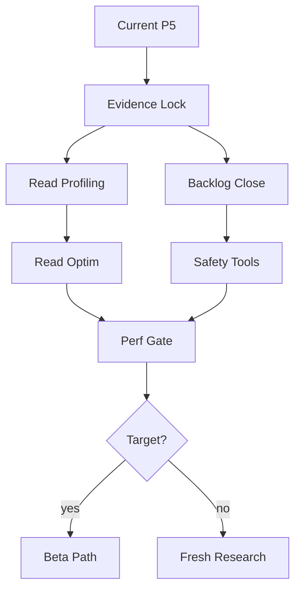
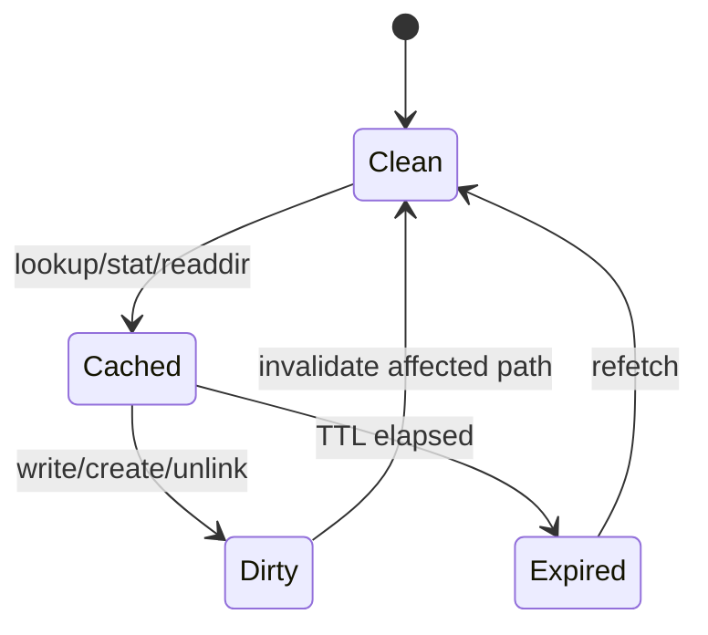

# AgentFS Phase 5.5 North-Star Spec: Finish Backlog + Attack Read-Path Bottlenecks

## 1. Status and decision driver

Phase 5 has landed a first pass of the conditional architectural backlog:

- **Chunk-granularity overlay copy-up:** implemented as an opt-in prototype behind `AGENTFS_OVERLAY_PARTIAL_ORIGIN=1`; benchmark proves a 1 MiB single-byte base-file edit materializes one 64 KiB chunk instead of the full file.
- **macOS NFS git issue (#333):** code-level fix implemented with CREATE-returned write-authorized NFS handles and SETATTR/truncate coverage, but not yet validated with real macOS `mount_nfs` + `git add/commit`.
- **Turso/backend risk (#331):** only decision scaffolding exists; no actual Turso 0.5.x spike or rusqlite fallback experiment has run.
- **POSIX gates:** `phase45-ci` and `phase5-ci` pjdfstest profiles pass; full pjdfstest remains a known-gap taxonomy input.
- **Performance:** read-heavy `factory-mono` bounded smoke improved from Phase 3 but remains far from target.

Current comparable read-heavy benchmark:

| Phase | Ratio vs native | Meaning |
|---|---:|---|
| Phase 3 | ~125.8x | pre-v0.5 performance gate failure |
| Phase 4 | ~15.17x | schema/write-path gains |
| Phase 5 | ~14.25x | copy-up work does not materially affect read-heavy path |

Phase 5.5 exists to **finish remaining known backlog and aggressively optimize the measured read-path bottleneck before inventing new architecture**.

## 2. Phase 5.5 thesis

We should not start open-ended research yet. There is still concrete backlog whose results will either close the gap or tell us exactly where fresh research is needed:

1. Make partial-origin safe enough to default or explicitly keep it opt-in.
2. Validate/finalize the macOS #333 fix on the real platform.
3. Run the actual #331 Turso 0.5.x upgrade spike and make a backend decision.
4. Implement productionization basics that support safe experimentation: integrity telemetry, backup/restore, slow-query/profile visibility.
5. Attack read-heavy overhead directly: path/stat/readdir/FUSE round trips, cache TTLs, statement/query hot paths, and startup-vs-steady-state split.

## 3. Success criteria

Phase 5.5 is successful when all are true:

| Gate | Requirement |
|---|---|
| Correctness | SDK tests, CLI tests, `cli/tests/all.sh`, corruption torture, replay smoke, snapshot/restore, migration tests, `pjdfstest phase45-ci`, and `pjdfstest phase5-ci` pass. |
| Partial-origin | Default/opt-in decision is backed by tests: remount, snapshot, rename, unlink, hardlink, truncate, drift, torture, and large-edit DB-growth results. |
| macOS #333 | Real macOS NFS mount validates `git add && git commit`, or explicit tier-2 deferral is documented with FSKit follow-up. |
| Backend #331 | Turso 0.5.x spike is run and decision is recorded: upgrade now, defer with blockers, or build fallback. |
| Read perf | `factory-mono` bounded read improves materially beyond Phase 5, or profiling identifies the next non-speculative bottleneck. |
| Production safety | Integrity telemetry and backup/restore CLI exist at least as local commands/scripts with verification. |
| Documentation | SPEC/MANUAL/TESTING reflect the selected Phase 5.5 behavior and remaining gaps. |

## 4. Strategy overview



Legend: `Read Optim` = path/stat/readdir/FUSE/backend optimizations. `Safety Tools` = integrity telemetry + backup/restore + docs/runbook.

## 5. Workstream A: evidence lock and benchmark harness hardening

### Goals

Before changing read paths, freeze reproducible measurements:

- Synthetic baseline.
- `factory-mono` bounded read smoke.
- Write-heavy representative workload.
- Large base-file edit benchmark with and without `AGENTFS_OVERLAY_PARTIAL_ORIGIN=1`.
- Startup-only vs steady-state read benchmark.
- `AGENTFS_PROFILE=1` summaries attached to every run.

### Implementation plan

1. Add a **read-path benchmark script** if current `workload-baseline.py` is insufficient:
   - bounded file scan,
   - repeated stat/lstat storm,
   - readdir/readdir_plus storm,
   - open/read/close loop,
   - cold vs warm modes.
2. Ensure outputs include:
   - native seconds,
   - AgentFS seconds,
   - ratio,
   - stdout equivalence,
   - profile counters,
   - command/env/git SHA,
   - mount/session startup time if measurable.
3. Store JSON reports under `/tmp` by default; do not commit generated benchmark output.

### Exit criteria

- One command can reproduce the current ~14-15x `factory-mono` read ratio.
- One command can separate startup cost from steady-state per-operation cost.

## 6. Workstream B: max-bottleneck read-path improvements

### 6.1 Bottleneck hypotheses to test first

Read-heavy overhead is likely dominated by one or more of:

| Hypothesis | Signal | Potential fix |
|---|---|---|
| Path/stat SQL amplification | high dentry misses, inode SELECT count | inode/attr cache, path resolution batching, statement cache audit |
| FUSE round trips | many getattr/lookup/readdir calls | TTL tuning, cache invalidation correctness, readdir_plus improvements |
| Overlay base/delta double lookup | base+delta checks for each path | negative cache, merged directory cache, faster base fallback |
| Startup dominates short commands | ratio shrinks for longer warm loops | session reuse, mount/startup amortization, benchmark correction |
| Turso query overhead | high SQL time even warm | Turso upgrade spike, prepared statements, backend fallback data |

### 6.2 Profiling additions

Add or extend counters for:

- `lookup_count`, `lookup_delta_count`, `lookup_base_count`, `lookup_whiteout_count`
- `getattr_count`, `readdir_count`, `readdir_plus_count`
- `path_cache_hit/miss`, `attr_cache_hit/miss`, negative lookup hits
- SQL statement counts by operation kind if feasible
- FUSE operation counts by callback
- startup/mount/session timing

### 6.3 Optimization order

1. **Low-risk measurement/caching**
   - Add read-path counters.
   - Add conservative attr/path cache with explicit invalidation on mutation.
   - Add negative lookup cache for misses, invalidated by create/rename/unlink/mkdir/rmdir/whiteout changes.
2. **FUSE metadata tuning**
   - Review `TTL` values and invalidation paths.
   - Increase TTL only where mutation callbacks invalidate correctly.
   - Preserve correctness for read-after-write/stat-after-write and rename/unlink visibility.
3. **Overlay lookup reduction**
   - Avoid redundant base walks when parent mapping already proves absence/presence.
   - Batch directory entry stat work in `readdir_plus` where possible.
4. **DB/backend experiments**
   - Compare current Turso against Turso 0.5.x in isolated spike before adding abstractions.

### 6.4 State and invalidation model



Invariant: any operation that mutates namespace, metadata, or file size must invalidate affected path, parent directory, inode attr, and negative entries before returning success.

### Exit criteria

- Read benchmark shows material improvement, or counters prove the dominant cost is outside current code changes.
- No regressions in snapshot/restore, POSIX profiles, torture, replay, or CLI tests.

## 7. Workstream C: partial-origin hardening and default decision

### Current status

Partial-origin proves the intended O(changed chunks) behavior but remains opt-in.

### Required hardening

1. Add/verify tests for:
   - remount/snapshot restore,
   - `readdir_plus` inode paths,
   - rename/unlink/hardlink of partial-origin files,
   - truncate shrink/extend,
   - base drift detection,
   - corruption torture with env flag enabled,
   - large-edit benchmark with env flag enabled.
2. Decide default behavior:
   - keep opt-in for Phase 5.5 if edge cases remain,
   - or enable by default only for regular files with safe fallback to whole-copy detach.
3. Record known limitations in SPEC/TESTING.

### Exit criteria

- Default/opt-in decision documented.
- If defaulted, all supported gates run with partial-origin enabled.
- If kept opt-in, Phase 5.5 still benefits from it as an experimental mode and benchmark tool.

## 8. Workstream D: macOS #333 finalization

### Current status

NFS CREATE-returned write handles are implemented and unit-tested, but not platform-validated.

### Plan

1. Add a deterministic manual/CI script:
   - initialize AgentFS DB,
   - mount via macOS NFS path,
   - `git init`, create file, `git add`, `git commit`, `git fsck`.
2. Run on real macOS host if available.
3. If macOS CI cannot support it, document manual validation command and expected output.
4. Re-check security implications:
   - write handle token randomness,
   - bounded token storage,
   - stale handle behavior,
   - fresh-open denial preserved.

### Exit criteria

- #333 is marked internally as fixed if real macOS validation passes.
- Otherwise, the code-level fix remains landed but #333 is tracked as “needs platform validation.”

## 9. Workstream E: #331 Turso upgrade / backend decision

### Current status

Only scaffolding exists.

### Plan

1. Create isolated worktree/branch for Turso 0.5.x.
2. Attempt dependency upgrade with minimal code changes.
3. Run:
   - SDK tests,
   - CLI tests,
   - migration tests,
   - snapshot/restore,
   - corruption torture,
   - replay smoke,
   - pjdfstest profiles,
   - factory-mono read benchmark.
4. Record results in backend-risk JSON.
5. If upgrade is blocked, scope rusqlite fallback feasibility:
   - required DB API surface,
   - sync/async boundary,
   - WAL/checkpoint behavior,
   - encryption/sync feature implications.

### Exit criteria

- #331 has a concrete internal status: upgraded, blocked with reasons, or fallback spike required.
- No backend abstraction lands without measured need.

## 10. Workstream F: Phase 6 minimum productionization

### 10.1 Observability

Add local structured outputs first, not Factory service wiring yet:

- SQL/operation slow log behind env flag.
- Profile summary includes read-path counters.
- FUSE/NFS operation counters are emitted with existing profile summaries.

### 10.2 Corruption telemetry

Add session-close or explicit command support for:

```bash
agentfs integrity <id-or-path> --json
```

Minimum checks:

- `PRAGMA integrity_check`
- schema invariant queries,
- inline/chunk invariant queries,
- optional fsck-style namespace checks.

### 10.3 Backup/restore CLI

Add:

```bash
agentfs backup <id-or-path> <target.db> --verify
```

Requirements:

- checkpoint WAL,
- copy main DB,
- reopen copy,
- run integrity/schema checks,
- optionally compare filesystem/KV/tool state if source is available.

### 10.4 Runbook/docs

Update existing docs, not new docs unless needed:

- `TESTING.md`: integrity, backup, perf commands.
- `MANUAL.md`: new CLI commands.
- `SPEC.md`: any new invariant checks.

### Exit criteria

- Operators have a local way to detect corruption and make verified portable backups.
- Productionization no longer depends on ad hoc SQLite commands.

## 11. Worker delegation packets

### Worker A: Read-path profiler and benchmark

Deliver:

- read-path benchmark script or workload-baseline extension,
- counters for lookup/getattr/readdir/FUSE callbacks,
- Phase 5.5 baseline report.

### Worker B: Read-path optimization

Deliver:

- conservative cache or lookup/readdir optimization,
- invalidation tests,
- before/after benchmark report.

### Worker C: Partial-origin hardening

Deliver:

- missing tests,
- default/opt-in decision evidence,
- torture/benchmark with `AGENTFS_OVERLAY_PARTIAL_ORIGIN=1`.

### Worker D: macOS #333 validation

Deliver:

- macOS git validation script,
- real run result or explicit environment blocker,
- docs update.

### Worker E: #331 backend spike

Deliver:

- Turso 0.5.x worktree result,
- backend-risk JSON filled in,
- upgrade/defer/fallback recommendation.

### Worker F: productionization minimum

Deliver:

- integrity command,
- backup command,
- docs and validators.

## 12. Reviewer plan

Run medium review workers after implementation in overlapping batches:

1. **Read-path correctness/perf review**
   - cache invalidation,
   - benchmark validity,
   - profile counter accuracy.
2. **Overlay/POSIX review**
   - partial-origin hardening,
   - pjdfstest profile impact,
   - snapshot/restore and torture risk.
3. **Ops/backend review**
   - Turso spike evidence,
   - integrity/backup safety,
   - docs and command UX.

## 13. Definition of done

Phase 5.5 is done when:

1. All known Phase 5 backlog items have a landed fix, a passing validation, or an explicit evidence-backed deferral.
2. Read-heavy bottleneck has been attacked directly with profiling-guided changes.
3. #333 is platform-validated or tracked as code-fixed/validation-pending.
4. #331 has a real upgrade/fallback decision, not just scaffolding.
5. Partial-origin has a default/opt-in decision backed by tests and benchmarks.
6. Integrity and backup/restore tooling exists for safe production experimentation.
7. Final report includes Phase 3 → Phase 4 → Phase 5 → Phase 5.5 benchmark deltas.

Only after this should we shift to fresh research or deeper architectural alternatives.