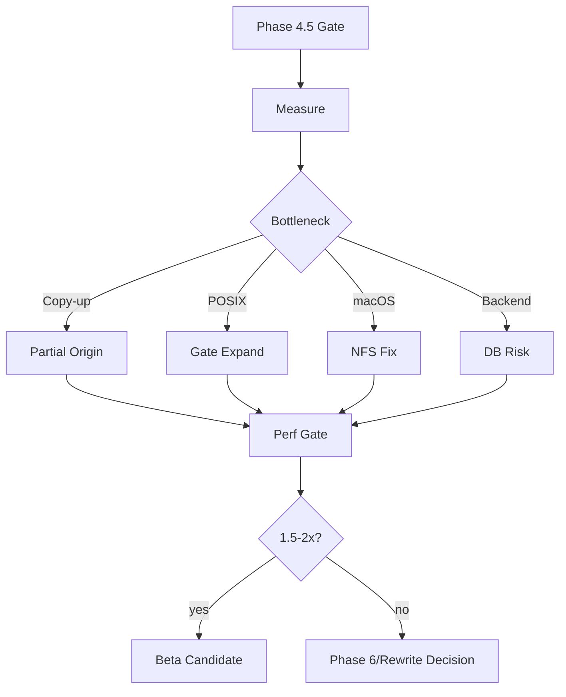
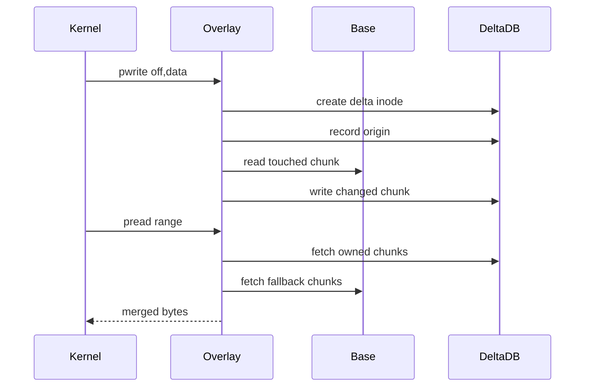
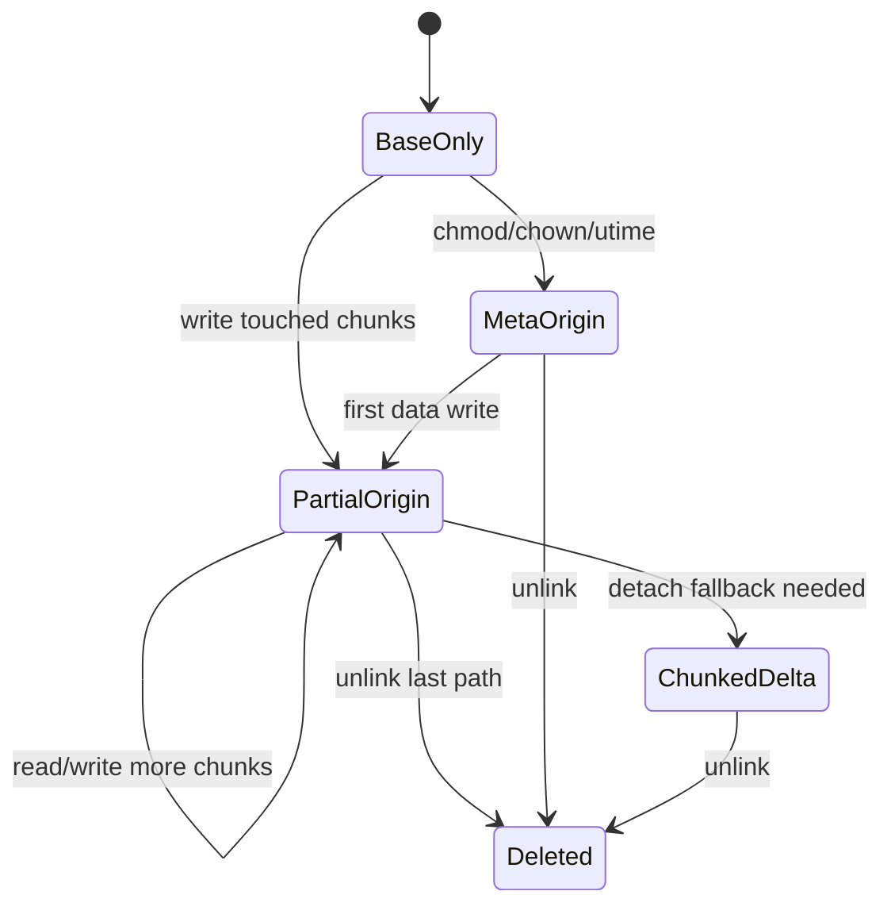

# AgentFS Phase 5 North-Star Spec: Overlay Architecture, POSIX Stabilization, and Backend Risk Reduction

## 1. Status and decision driver

Phase 0-4.5 established the fork foundation:

- Phase 0-2: governance, workload baseline, corruption torture, replay, snapshot/restore, and POSIX harness scaffolding.
- Phase 3: WAL, `synchronous=NORMAL`, file-backed reader pool, explicit checkpointing, cached tool-call statements, and macOS NFS rsize/wsize tuning.
- Phase 4: v0.5 schema with 64 KiB chunks, 4 KiB inline dense files, copy-only migration, profiling counters, and conservative FUSE write coalescing.
- Phase 4.5: a passing `pjdfstest --profile phase45-ci` supported gate plus a known-gap taxonomy for full pjdfstest.

Phase 4 improved the bounded `factory-mono` read smoke from ~125.8x native to ~15.17x native, but missed the north-star 1.5-2x target. Phase 5 is therefore justified, but it must be correctness-gated because it touches overlay semantics and schema contracts.

## 2. Phase 5 thesis

Phase 5 should make AgentFS benefit from the Phase 4 stabilizations by targeting the remaining structural bottlenecks and correctness risks:

1. **Whole-file overlay copy-up** is the biggest write amplification left.
2. **Full pjdfstest failures** are now visible and must be separated into unsupported contract gaps vs real POSIX bugs before expanding the gate.
3. **macOS NFS git semantics** remain a platform blocker for macOS Droid users.
4. **Turso 0.4.4** remains a backend risk that should be reduced before productionization.
5. **Performance profiling** must guide which invasive change lands first.

## 3. Success criteria

Phase 5 is successful only when all required gates pass:

| Gate | Requirement |
|---|---|
| Correctness | SDK tests, CLI tests, `cli/tests/all.sh`, corruption torture, snapshot/restore, replay smoke, and `pjdfstest phase45-ci` pass. |
| POSIX expansion | A broader `phase5-ci` pjdfstest profile exists and passes, or every excluded file has a documented unsupported-contract reason. |
| Overlay copy-up | Single-byte edits to large base files write O(changed chunks), not O(file size), while preserving read/stat/rename/unlink semantics. |
| Portability | Partial-origin overlay databases retain single-file checkpoint/snapshot behavior for delta state. |
| Performance | `factory-mono` agreed workload improves materially beyond Phase 4, with a go/no-go against the 1.5-2x native target. |
| macOS | Git loose-object write pattern is fixed or macOS remains explicitly tier-2 with FSKit/NFS follow-up documented. |
| Backend risk | Turso 0.5.x upgrade or rusqlite fallback feasibility is measured with a documented decision. |

## 4. Architecture overview



Legend: `Partial Origin` = chunk-granularity overlay copy-up; `Gate Expand` = supported pjdfstest profile expansion; `DB Risk` = Turso/rusqlite risk-reduction track.

## 5. Workstream A: POSIX stabilization and gate expansion

### 5.1 Goals

Turn full pjdfstest from a giant failure blob into a structured roadmap:

- Keep `phase45-ci` passing as the regression floor.
- Add `phase5-ci` once enough core semantic gaps are fixed.
- Preserve `full` as exploratory/nightly/manual.
- Keep exit `77` reserved for missing prerequisites only.

### 5.2 Failure taxonomy

Classify every full-suite failure into one of:

| Class | Examples | Handling |
|---|---|---|
| Unsupported by current contract | block/char `mknod`, successful `chown`, alternate uid/gid execution | Keep out of supported profiles; document in `known-gaps.tsv`. |
| Environment-sensitive | root-only tests, platform-specific flags | Keep out unless CI can provide the environment. |
| Core correctness bug | rename/unlink/rmdir/symlink/truncate/utimensat semantics | Fix or add targeted lower-layer tests before adding to `phase5-ci`. |
| Mixed test file | One `.t` mixes unsupported and core semantics | Do not gate the file wholesale; cover core invariant in AgentFS tests or upstream-split later. |

### 5.3 Test placement policy

Invariant ownership:

- Pure SDK inode/chunk/storage invariants → existing SDK filesystem tests.
- Overlay/base/delta interactions → existing `overlayfs` SDK tests.
- FUSE-visible ordering/cache behavior → CLI/FUSE integration tests plus `pjdfstest` profile.
- External POSIX contract smoke → `scripts/validation/posix/run-pjdfstest.sh --profile phase5-ci`.

Do not duplicate the same invariant at all layers unless each layer catches a distinct failure mode.

### 5.4 Exit criteria

- `phase45-ci` remains green.
- `known-gaps.tsv` is exhaustive for observed full-suite failures.
- At least one core gap family is either fixed and promoted into `phase5-ci`, or explicitly deferred with an RCA.

## 6. Workstream B: chunk-granularity overlay copy-up

### 6.1 Problem

Current overlay copy-up turns a small write to a base-only file into a full-file copy into SQLite. With v0.5, this is less amplified than 4 KiB chunks, but still O(file size). Large lockfiles, vendored assets, generated blobs, and checked-in binary assets still make AgentFS pay for bytes the agent did not change.

### 6.2 North-star behavior

When a write targets a base-only file:

1. Create a delta inode with metadata copied from base.
2. Record a persistent origin from delta inode to base identity.
3. Materialize only chunks touched by writes/truncate boundaries.
4. Reads merge delta-owned chunks with base fallback chunks.
5. Metadata changes remain delta-local.
6. Snapshotting the `.db` preserves all delta changes and the base-origin references needed to reopen against the same base.



### 6.3 Proposed schema extension

Phase 5 should introduce a v0.6 overlay extension only after the design is tested on throwaway databases.

Candidate tables/columns:

```sql
CREATE TABLE fs_origin_v2 (
  delta_ino INTEGER PRIMARY KEY,
  base_ino INTEGER NOT NULL,
  base_path TEXT NOT NULL,
  base_size INTEGER NOT NULL,
  base_mtime INTEGER NOT NULL,
  base_mtime_nsec INTEGER NOT NULL DEFAULT 0,
  base_ctime INTEGER NOT NULL,
  base_ctime_nsec INTEGER NOT NULL DEFAULT 0,
  base_fingerprint TEXT,
  created_at INTEGER NOT NULL
);

CREATE TABLE fs_chunk_override (
  delta_ino INTEGER NOT NULL,
  chunk_index INTEGER NOT NULL,
  PRIMARY KEY (delta_ino, chunk_index)
);
```

Design notes:

- `fs_chunk_override` marks chunks owned by delta.
- For partial-origin files, an owned chunk MUST have a corresponding `fs_data` row even if all bytes are zero; otherwise missing zero chunks would incorrectly fall through to base.
- Missing override rows mean read-through to base until EOF; beyond `base_size`, missing chunks read as zeroes up to delta `size`.
- `base_path` is valid because the base layer is treated as read-only for a session; `base_*` fingerprint fields detect external base drift.
- Existing `fs_origin` remains for whole-file-origin compatibility until a copy migration canonicalizes it.

### 6.4 State machine



`ChunkedDelta` is a full delta-owned file with no base fallback. Detach is allowed as a conservative fallback when a corner case is too risky for partial origin.

### 6.5 Read algorithm

For partial-origin regular files:

1. Fetch delta inode `size` and origin metadata.
2. For requested range, calculate v0.5/v0.6 chunk indexes.
3. For each chunk:
   - If `fs_chunk_override` exists, read from delta `fs_data`.
   - Else if offset is below recorded `base_size`, read from base file.
   - Else fill zeroes.
4. Clip to delta inode `size`.

### 6.6 Write algorithm

For writes to missing chunks:

1. If write covers a full chunk, store it directly in delta and mark override.
2. If write is partial within a base-backed chunk, read the full base chunk, overlay changed bytes, store full chunk in delta, mark override.
3. If write extends beyond base EOF, zero-fill missing portions and store the owned chunk.
4. Update delta inode size/mtime/ctime transactionally.

### 6.7 Truncate algorithm

- Shrink: delete overrides beyond new EOF, trim boundary owned chunk if needed, set delta size.
- Extend: set delta size; missing extended chunks read as zeroes unless later written.
- Truncate inside a base-backed chunk does not require materialization unless later extending or writing into that chunk.

### 6.8 Correctness risks

| Risk | Mitigation |
|---|---|
| Base file mutates outside AgentFS | Store and verify base fingerprint on open/read; fail loudly or detach to full copy. |
| Zero writes fall through to base | Require `fs_chunk_override` + `fs_data` row for owned zero chunks. |
| Rename/unlink whiteout errors | Add overlay tests before enabling partial origin by default. |
| Hardlink origin confusion | Preserve one delta inode per copied-up base inode; test hardlink/readdir/stat stability. |
| Snapshot ambiguity | Snapshot preserves delta + origin references, but requires same base path/fingerprint to reopen as overlay. |

### 6.9 Exit criteria

- Single-byte write to a 200 MB base file grows DB by O(64 KiB), not O(200 MB).
- Reads across modified/unmodified chunk boundaries match native overlay expectations.
- Rename/unlink/rmdir/hardlink tests pass for partial-origin files.
- Corruption torture remains clean.
- `factory-mono` write-heavy workload improves materially.

## 7. Workstream C: macOS NFS git semantics

### 7.1 Problem

NFSv3 rechecks mode bits on each WRITE RPC. Git loose objects are opened writable, chmod-like mode is effectively 0444, then written through the open fd. Native filesystems honor open-time write authorization; NFS rejects later writes.

### 7.2 North-star behavior

AgentFS's macOS path should allow writes through a handle that was opened with write permissions, even if current mode bits would deny a fresh open.

### 7.3 Plan

1. Add a minimal reproduction for git loose-object behavior.
2. Trace NFS open/create/write path and identify where mode is rechecked.
3. Store per-open handle write authorization in the NFS server layer.
4. During WRITE, authorize against handle state first, then fallback to mode checks for stateless/unknown handles.
5. Add macOS-specific or NFS-layer tests; if CI cannot run them, add a deterministic unit/integration test around the NFS file-handle abstraction.

### 7.4 Exit criteria

- `git add` / `git commit` works on macOS NFS AgentFS for loose objects.
- No regression in regular permission-denied behavior for fresh opens.
- If not feasible without FSKit, document macOS as tier-2 and write the FSKit evaluation plan.

## 8. Workstream D: backend risk reduction

### 8.1 Goals

Reduce production risk from Turso 0.4.4 without prematurely rewriting the storage layer.

### 8.2 Tracks

1. **Turso 0.5.x upgrade spike**
   - Upgrade in an isolated branch/worktree.
   - Record API breakage and behavior changes.
   - Run SDK/CLI tests, migration tests, replay, corruption torture, and `phase45-ci`.

2. **rusqlite fallback feasibility**
   - Identify the minimum storage API surface AgentFS needs.
   - Decide whether a `DbBackend` trait is practical or too invasive.
   - Avoid landing abstraction unless the spike proves Turso risk outweighs complexity.

### 8.3 Exit criteria

- Written decision: upgrade now, defer with blockers, or build fallback.
- Any chosen backend path preserves single-file snapshot/checkpoint behavior.

## 9. Workstream E: profiling-guided performance gates

### 9.1 Required measurements

Run each before and after any invasive Phase 5 change:

- Synthetic workload baseline.
- Bounded `factory-mono` read smoke.
- Write-heavy representative workload.
- Large base-file single-byte edit DB growth benchmark.
- Startup vs steady-state split.
- `AGENTFS_PROFILE=1` summaries for chunk reads/writes, dentry cache, FUSE writes/flushes, WAL checkpoints, and connection wait.

### 9.2 Benchmark output contract

Each run should record:

- command, source tree, exclusions, iteration count,
- native mean, AgentFS mean, ratio,
- stdout equivalence result,
- profile counter summary,
- DB size before/after for copy-up benchmarks,
- git commit SHA and feature flags.

### 9.3 Exit criteria

- Phase 5 final report says whether the 1.5-2x target is reached.
- If not reached, it identifies the dominant remaining bottleneck and recommends beta/no-beta/architectural rewrite.

## 10. Rollout stages

### Stage 5.0: evidence lock

No schema changes. Re-run current gates and collect fresh profiling:

- `phase45-ci` pjdfstest,
- corruption torture extended,
- synthetic + `factory-mono` read baseline,
- write-heavy and large-copy-up benchmark,
- full pjdfstest report snapshot.

### Stage 5.1: POSIX core gap triage

Fix or explicitly defer the smallest high-signal core gap family. Prefer targeted AgentFS tests over wholesale pjdfstest file promotion for mixed files.

### Stage 5.2: partial-origin prototype behind flag

Implement partial-origin overlay copy-up behind an opt-in flag. Add SDK/overlay tests for read/write/truncate/rename/unlink/hardlink semantics.

### Stage 5.3: partial-origin default candidate

If Stage 5.2 passes torture and performance gates, make partial-origin the default for supported regular-file operations. Keep full-copy fallback for unsupported edge cases with metrics.

### Stage 5.4: macOS NFS fix or explicit deferral

Fix the git loose-object issue if feasible; otherwise record FSKit as required for tier-1 macOS support.

### Stage 5.5: backend decision

Run Turso upgrade/rusqlite feasibility and commit a decision with evidence.

### Stage 5.6: gate decision

Run full gates and decide:

- internal beta candidate,
- continue Phase 5 with another bottleneck,
- or stop and reconsider architecture.

## 11. Worker delegation packets

### Worker A: POSIX taxonomy and profile expansion

Deliver:

- parsed full pjdfstest report,
- updated known-gap taxonomy,
- proposed `phase5-ci` additions,
- targeted tests for one core gap family.

### Worker B: partial-origin overlay design/prototype

Deliver:

- schema design proof,
- opt-in partial-origin read/write path,
- overlay tests for chunk fallback and modified chunks,
- DB-growth benchmark for large file edits.

### Worker C: macOS/NFS git semantics

Deliver:

- reproduction,
- open-handle authorization fix or infeasibility proof,
- test coverage for git loose-object pattern.

### Worker D: backend risk spike

Deliver:

- Turso 0.5.x upgrade branch results,
- rusqlite fallback feasibility matrix,
- recommended backend decision.

### Reviewer set

Reviewers should overlap on:

1. partial-origin correctness and schema invariants,
2. POSIX gate placement and duplicate test coverage,
3. benchmark validity and profiling claims,
4. migration/snapshot portability implications,
5. macOS behavior and backend risk.

## 12. Definition of done

Phase 5 is done when:

1. `phase45-ci` remains green and `phase5-ci` exists or is explicitly deferred.
2. Core full-pjdfstest failures are categorized with actionable next steps.
3. Chunk-granularity overlay copy-up is either safely landed or rejected with evidence.
4. macOS git loose-object behavior is fixed or clearly scoped out.
5. Backend dependency risk has a recorded upgrade/fallback decision.
6. Corruption torture, replay, snapshot/restore, migration, SDK/CLI tests, and supported pjdfstest gates pass.
7. Performance results are recorded against Phase 4 baselines.
8. A beta/go-no-go recommendation is made.