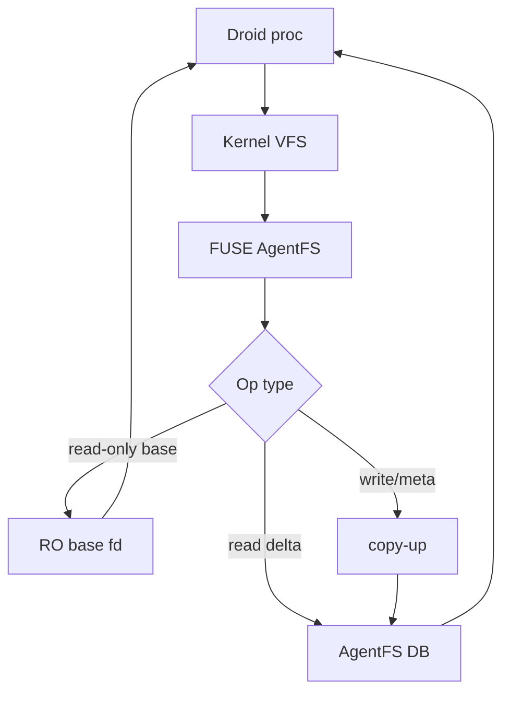
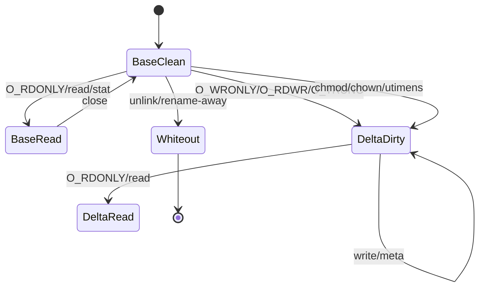
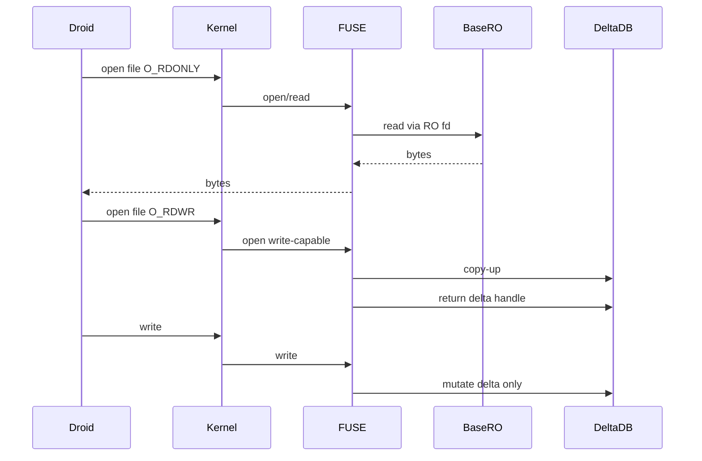

# AgentFS Phase 6 North Star Spec: Secure Read-Only Passthrough

## 1. Executive Summary

Phase 6’s goal is to push AgentFS read-heavy workloads from the current ~15x-over-native range toward the practical minimum, without compromising the core Droid safety property: **writes must never reach the host/base tree**.

The north-star architecture is **read-only lower passthrough + virtual write layer**:

- Unchanged base files may be read from native read-only fds.
- Any write-capable operation must copy up into AgentFS delta first.
- The sandboxed process must never receive or derive a writable base fd.
- Single-file AgentFS remains the durable snapshot/audit/export format, even if the live fast path uses read-only base passthrough.

## 2. Current Baseline

Recent comparable `factory-mono` bounded-read benchmarks:

| Configuration | Mean AgentFS | Mean ratio |
|---|---:|---:|
| Phase 5 | ~51.2s | ~20.4x |
| Phase 5.5 pre-fix | ~53.9s | ~22.7x |
| Phase 5.5 FUSE cache | ~29.3s | ~15.6x |
| Phase 5.5 FUSE cache + partial-origin | ~15.3s | ~8.35x |

Profile after FUSE caches still shows very high callback counts:

- `fuse_readdir_count`: ~160k
- `fuse_lookup_count`: ~44k
- `fuse_getattr_count`: ~41k
- `fuse_open_count`: ~2k
- `fuse_read_count`: ~2.5k

The partial-origin result proves that avoiding whole-file copy-up/read-through-delta is a major lever, but it must be made production-safe and security-preserving.

## 3. Goals

### Primary Goals

1. Preserve Droid safety:
   - no host/base writes;
   - no writable base fd exposure;
   - writes/metadata mutations stay in AgentFS delta.
2. Make unchanged-base read paths fast:
   - read-only base file opens avoid copy-up;
   - repeated directory/lookup/stat traversals use bounded, invalidated caches;
   - read-only passthrough is explicit and testable.
3. Establish honest performance ceilings:
   - quantify current-FUSE limit;
   - quantify read-only passthrough benefit;
   - decide whether 1.5–2x requires kernel/FUSE passthrough or kernel overlayfs architecture.
4. Preserve AgentFS portability:
   - single-file DB remains canonical export/checkpoint/audit artifact;
   - live fast path may reference base tree, but portable backup must reject or materialize non-portable state.

### Stretch Goals

- Current FUSE architecture target: <=5x on bounded read workload.
- Kernel/FUSE read-only passthrough target: <=2x.
- North-star target: 1.5–2x while preserving write virtualization.

## 4. Non-Goals

- No writable passthrough to host/base files.
- No unsafe fallback that opens base with `O_RDWR`, `O_WRONLY`, `O_TRUNC`, or write-equivalent flags.
- No weakening of namespace/read-only sandbox restrictions.
- No claiming 1.5–2x is achievable in pure single-threaded userspace FUSE until measured.
- No portable backup of partial-origin/live-base-dependent DBs unless materialized.

## 5. Core Security Invariant

> A Droid may read unchanged base files through optimized read-only paths, but every write, truncate, metadata mutation, rename, link, unlink, or directory mutation must affect only AgentFS virtual state unless explicitly exported.

Equivalent operational rule:

```text
if operation can mutate bytes or metadata:
    route to delta only
else if operation reads unchanged base state:
    allow read-only lower fast path
```

## 6. Architecture



Legend:
- `RO base fd`: read-only descriptor or equivalent kernel passthrough for unchanged base files.
- `AgentFS DB`: virtual delta, metadata, whiteouts, audit state.

## 7. Read/Write State Machine



Rules:

- `BaseRead` may use read-only lower passthrough.
- `DeltaDirty` is the only writable state.
- `Whiteout` hides base state.
- Transitions into `DeltaDirty` must invalidate read caches.

## 8. Concrete Phase 6 Workstreams

### Workstream A: Productionize Read-Only Base Passthrough

Make read-only base access a first-class behavior, not just an experimental side effect.

Implementation requirements:

- `OverlayFS::open`:
  - `Layer::Base + O_RDONLY` returns read-only base file handle.
  - `Layer::Base + write-capable flags` copy up before returning handle.
  - `O_TRUNC` always copies/truncates delta, never base.
- FUSE open handling:
  - detect write flags conservatively;
  - clear read caches on any write-capable open that mutates state;
  - never hand writable base handles to the child.
- Tests:
  - read-only base open does not create `fs_origin`/`fs_data` rows;
  - `O_RDWR`, `O_WRONLY`, `O_TRUNC` copy up;
  - base file remains unchanged after writes/truncates/chmod/chown/utimens;
  - stale read cache invalidates after copy-up/whiteout.

### Workstream B: Cache the Remaining Metadata Hot Paths

Current FUSE cache reduced backend calls, but `readdirplus` remains a major hotspot.

Implementation requirements:

- Cache `readdirplus` pages/results across offset callbacks.
- Cache `.` and `..` attrs without repeated backend `getattr`.
- Cache positive lookup results from `readdirplus`.
- Add negative delta lookup cache for empty-delta/base-heavy workloads.
- Invalidate all caches on:
  - create/mkdir/mknod/symlink/link;
  - unlink/rmdir/rename;
  - chmod/chown/utimens/truncate;
  - write/flush/fsync after dirtying;
  - `O_TRUNC` open;
  - copy-up/whiteout.

### Workstream C: Kernel/FUSE Cache and Passthrough Probe

Evaluate kernel-level read acceleration without enabling unsafe write passthrough.

Research and prototype:

- `FOPEN_KEEP_CACHE` for read-only opens.
- `auto_cache`/kernel attr-entry timeout behavior in current fuser fork.
- Linux FUSE passthrough/backing-fd support availability in current kernel/fuser stack.
- If backing-fd passthrough exists:
  - only return read-only lower fd;
  - deny passthrough for dirty/copy-up files;
  - invalidate on mutation.

Deliverable:

- A capability report and optional gated prototype.
- No default enablement until security and correctness gates pass.

### Workstream D: Concurrency and Serialization Audit

Current architecture likely serializes too much.

Audit and prototype:

- Remove or narrow global `tokio::Mutex` around mounted filesystem if internal structures are already safe.
- Identify FUSE session single-loop constraints.
- Prototype worker-based dispatch only if reply/open-file ordering can remain correct.

Success condition:

- measurable improvement on read benchmark;
- no regression in write ordering, flush behavior, or POSIX gates.

### Workstream E: Single-File Portability Boundary

Define the honest boundary between live fast-path state and portable AgentFS state.

Rules:

- Live sessions may depend on external base tree for unchanged reads.
- Portable backups must either:
  - reject base-dependent DBs, or
  - materialize all base-dependent content into the DB first.
- Add explicit command/help text:
  - `agentfs backup` rejects non-portable partial-origin state;
  - future `agentfs materialize` can convert live state to single-file portable DB.

## 9. Performance Validation Plan

Use the same benchmark suite for every step.

Required benchmark matrix:

1. `factory-mono` bounded-read benchmark:
   - 3 iterations minimum;
   - stdout equivalence required;
   - compare mean and median ratio.
2. `read-path-benchmark.py`:
   - warm and cold modes;
   - profile enabled;
   - include phase timing breakdown.
3. Large-edit benchmark:
   - default copy-up;
   - partial-origin/read-only base path;
   - verify copied bytes and DB rows.
4. Profile counter sanity:
   - `profile_summary_count > 0`;
   - backend `readdir_plus_count` drops after cache work;
   - `chunk_read_queries == 0` for unchanged base reads when passthrough is active.

Target gates:

| Gate | Target |
|---|---:|
| Phase 6A FUSE cache + read-only base passthrough | <=8x |
| Phase 6B optimized metadata cache | <=5x |
| Phase 6C kernel read-only passthrough prototype | <=2.5x |
| North-star stretch | 1.5–2x |

## 10. Correctness and Security Validation

Required validators:

- SDK tests for overlay state transitions.
- CLI/FUSE cache invalidation tests.
- `cli/tests/all.sh` where feasible.
- pjdfstest `phase45-ci` and `phase5-ci`.
- NFS #333 validation remains non-regressed.
- Backend #331 no-default checks remain non-regressed.
- New security regression tests:
  - write to base-read file changes only delta;
  - base file SHA unchanged after all write-capable operations;
  - no writable base fd returned for any write flag combination;
  - cache does not expose stale base contents after copy-up/whiteout.

## 11. Architectural Decision Points

Phase 6 should be explicit about what the data says.

Decision gate after Workstreams A/B:

- If bounded-read remains >5x:
  - pure userspace FUSE is probably the limiting factor.
  - proceed to kernel/FUSE passthrough prototype.

Decision gate after Workstream C:

- If read-only kernel passthrough remains >2.5x:
  - 1.5–2x likely requires a larger architecture shift.

Potential Phase 7 architecture if needed:

- kernel overlayfs lowerdir/upperdir fast path;
- AgentFS DB as snapshot/export/audit layer;
- explicit materialization/checkpoint into single-file DB;
- no native write passthrough from Droid process.

## 12. Mermaid Sequence: Safe Read vs Write



## 13. Risks

- Cache invalidation bugs could expose stale reads.
- Conservative invalidation may reduce performance gains.
- FUSE passthrough support may be unavailable or require deeper fuser changes.
- Concurrent FUSE dispatch may create write-ordering bugs.
- Partial-origin/live-base state is not inherently portable.

## 14. Phase 6 Deliverables

1. Secure read-only base passthrough enabled by default for unchanged base files.
2. `readdirplus`/lookup/getattr cache improvements with invalidation tests.
3. Profile summary emission reliable for `agentfs run`.
4. Benchmark report comparing Phase 5, Phase 5.5, and Phase 6.
5. Security report proving no writable base passthrough.
6. Decision document: whether 1.5–2x is feasible in current FUSE architecture or requires Phase 7 kernel-assisted design.

## 15. Recommended Implementation Order

1. Add/finish tests around read-only base passthrough and no-base-write invariants.
2. Cache `readdirplus` and tighten invalidation.
3. Make read-only base passthrough default and verify no copy-up on reads.
4. Rerun benchmark matrix.
5. Prototype `FOPEN_KEEP_CACHE` / read-only kernel passthrough if available.
6. Decide whether to continue optimizing FUSE or move to Phase 7 architecture.
