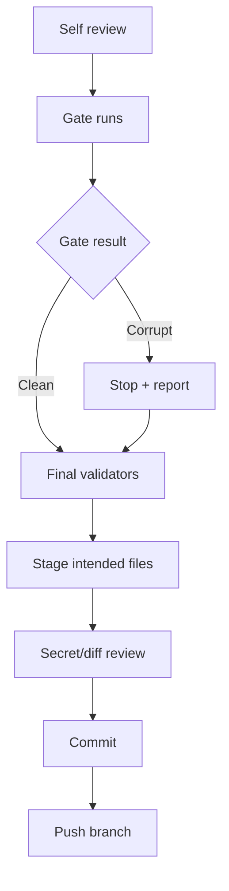

## Approach

Finalize the current Phase 0-3 work as a reviewable branch, run the remaining Phase 3 success-gate checks, then commit and push a dedicated branch. I will not start Phase 4 implementation in this pass; if the performance gate fails, I will record that explicitly and stop after pushing Phase 0-3.

## Concrete plan

1. **Final self-review**
   - Inspect full diff and status.
   - Include the `.agents/specs/*` files in the commit because they were explicitly requested as codified implementation/handoff specs and contain no secrets.
   - Exclude build artifacts, temp files, and any unrelated local files.
   - Re-check for accidental Phase 4 scope creep: no chunk-size migration, inline-file schema, write coalescer, chunk-granularity copy-up, Turso upgrade, or FSKit work.

2. **Finish remaining Phase 3 success-gate blockers**
   - Run an extended #332-style corruption torture beyond the CI smoke, using higher workers/iterations and final integrity/git checks.
   - Run Phase 0/Phase 3 workload baselines:
     - synthetic native vs AgentFS equivalence smoke,
     - bounded real `factory-mono` read workload,
     - one or two real read-only `factory-mono` check commands if they are present and safe.
   - Treat results honestly:
     - corruption/integrity failure blocks commit until fixed,
     - performance ratio > target does **not** block committing Phase 0-3, but it blocks claiming Phase 3 success and becomes the reason to write a Phase 4 spec next.

3. **Run final validators**
   - Worktree pre-check.
   - Script syntax + `git diff --check`.
   - `sdk/rust`: `cargo fmt -- --check`, `cargo clippy -- -D warnings`, `cargo clippy --tests -- -D warnings`, `cargo check --all-features`, `cargo build --verbose`, `cargo test --verbose`.
   - `cli`: `cargo fmt -- --check`, `cargo clippy -- -D warnings`, `cargo check --all-features`, `cargo check --no-default-features`, `cargo build --verbose`, `cargo test --verbose`, `tests/all.sh`.
   - Validation harness smokes: `phase0.sh`, workload replay smoke, pjdfstest harness skip/pass handling.

4. **Commit on a dedicated branch**
   - Create/switch to a branch like `phase0-3-agentfs-hardening`.
   - Stage intended Phase 0-3 files, including `.agents/specs/*`.
   - Run `git status`, `git diff --cached`, and inspect for secrets/credentials/API keys before committing.
   - Commit with a concise message, e.g. `feat(agentfs): add phase 0-3 validation and quick wins`, including the required Factory Droid co-author trailer.

5. **Push**
   - Push the dedicated branch with `git push -u origin phase0-3-agentfs-hardening`.
   - Report branch name, commit hash, gate results, and validator checklist.

## Risks / notes

- The current bounded `factory-mono` read baseline was much slower under AgentFS, so Phase 3 may still fail the performance gate even if corruption tests pass.
- Full `pjdfstest` may skip locally if external prerequisites are missing; the harness itself should validate skip/pass behavior.
- Pushing modifies the remote branch; I will only push the dedicated branch approved here, not `main`.