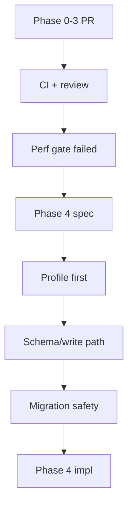

## Recommendation

Next is **Phase 4 planning**, not implementation yet. Phase 0-3 is pushed, the corruption gate passed, but the performance gate failed (`factory-mono` bounded read was ~125.8x slower), so the spec’s next technical step is a **self-contained Phase 4 north-star spec** that starts with profiling and then designs schema/write-path changes.

## Immediate next actions

1. **Let the Phase 0-3 branch go through CI/review**
   - Branch: `phase0-3-agentfs-hardening`
   - Commit: `6528a1e`
   - Keep it separate from Phase 4 so test-harness + quick-win foundations are reviewable independently.

2. **Draft the Phase 4 north-star spec**
   - Start with profiling to separate mount/session startup cost from steady-state FS cost.
   - Define schema version target, likely `0.5`, for:
     - larger default chunk size (`64 KiB`),
     - inline small-file storage,
     - copy-and-verify migration tooling.
   - Define write-path work:
     - coalesced FUSE writes,
     - statement-cache profiling,
     - baseline comparisons using Phase 2 harnesses.

3. **Use Phase 4 gates before coding invasive work**
   - Migration round-trip must prove no filesystem-state loss.
   - Snapshot/restore must still copy only the main `.db` after checkpoint.
   - Torture tests must remain clean.
   - Factory workload target should move toward `1.5-2x` native.

## Not next

- Do not start Phase 5 yet: chunk-granularity overlay copy-up, FSKit, and Turso/rusqlite fallback remain conditional.
- Do not ship/internal-beta claim yet: Phase 3 did not meet the performance gate.

## Proposed next deliverable

A full **Phase 4 North Star Technical Spec** with implementation stages, schema design, migration rules, test ownership, rollback plan, and worker delegation packets.