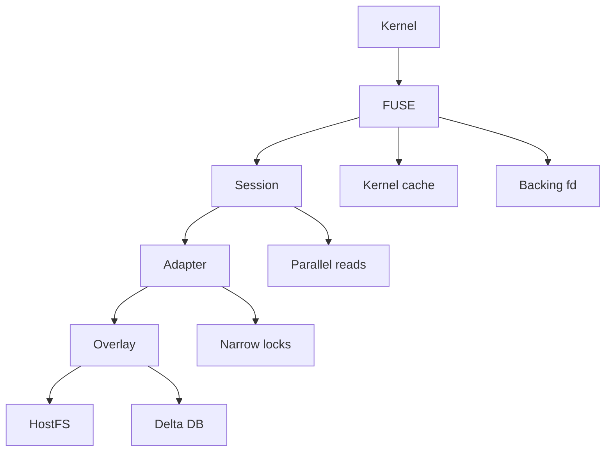
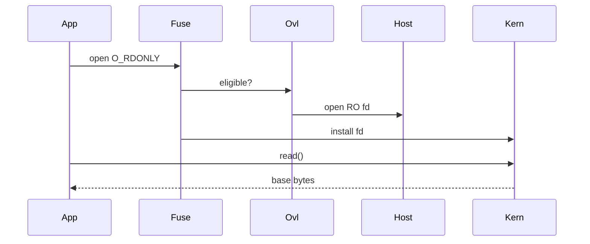
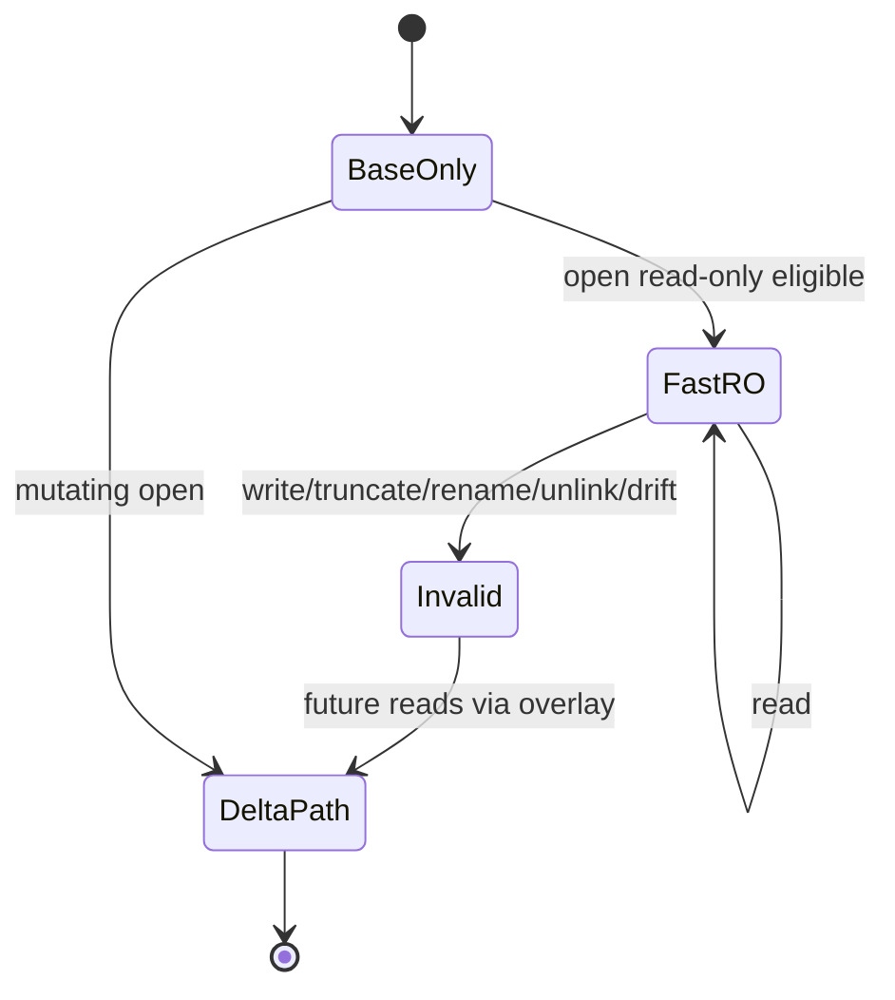

# Phase 6.5 North Star: Secure Read-Only Fast Path

## Goal

Phase 6.5 targets the remaining read-path bottleneck after Phase 6: **FUSE callback overhead and serialized userspace metadata/data reads**.

Phase 6 proved:

- unchanged base reads no longer hit delta chunks;
- partial-origin fixes large-write amplification;
- materialization preserves the portable single-file artifact boundary.

Phase 6.5 should make unchanged read-only workloads closer to native by reducing FUSE round trips, avoiding unnecessary serialization, and prototyping kernel-backed read passthrough for unchanged base files.

## Principles That Must Hold

1. **Portable artifact principle**
   - Any DB called portable must be self-contained.
   - Read fast paths must not create hidden portability dependencies.

2. **No-real-write principle**
   - Writes, truncates, and metadata mutations must never touch the real base tree.
   - Any direct or kernel-assisted base access is read-only only.

3. **Scoped-read principle**
   - Any base read must remain confined to the scoped base root / sandbox policy.
   - Prompt-injected workloads must not gain broader filesystem read access.

4. **Fail-safe invalidation**
   - If a file becomes delta-backed, partial-origin-backed, truncated, renamed, unlinked, or drifted, cached/passthrough base reads must be invalidated or disabled.

## Current Phase 6 Baseline

From Phase 6 full gates:

| Gate | Result |
|---|---:|
| `factory-mono` bounded read | `3.60x` native |
| controlled read/metadata | `3.71x` native |
| unchanged base chunk reads | `0` |
| 200MiB partial-origin write | `12.38x`, `64KiB` stored |
| materialized output | portable |

Conclusion: **SQLite data reads are no longer the read bottleneck**.

Remaining read cost is mostly:

1. FUSE request/response boundary.
2. single-threaded FUSE dispatch.
3. adapter-level serialization.
4. repeated metadata callbacks.
5. userspace data path for base-file reads.

## Non-Goals

- Do not replace AgentFS with kernel overlayfs in Phase 6.5.
- Do not make unsafe direct host writes.
- Do not require privileged mounts as the only usable path.
- Do not claim `1.5x` native unless benchmarks prove it.
- Do not weaken Phase 6 materialization/portability semantics.

## Core Strategy

Phase 6.5 has three implementation tracks.



### Track A: Remove Avoidable Serialization

Current architecture serializes more than necessary. Phase 6.5 should:

- audit `cli/src/fuser/session.rs` dispatch behavior;
- identify callbacks safe for parallel execution: `read`, `getattr`, `lookup`, `readdir`, `readdirplus`;
- narrow adapter `Mutex` boundaries where filesystem implementations are already internally safe;
- preserve strict ordering for write, flush, truncate, release, and cache invalidation paths;
- add profile counters for lock wait time / dispatch queue delay if measurable.

### Track B: Stronger Kernel Cache Use

Phase 6 added conservative `FOPEN_KEEP_CACHE`. Phase 6.5 should expand correctness and measurement:

- keep cache only for unchanged base regular files;
- invalidate inode on truncate, copy-up, write, rename, unlink, and metadata mutation;
- measure callback reduction from repeated reads;
- evaluate `READDIRPLUS_AUTO` and kernel dentry/attr TTL behavior;
- add counters for keep-cache eligible, used, invalidated, and rejected opens.

### Track C: Read-Only Base Passthrough Prototype

Prototype a read-only backing-fd fast path for unchanged base files.



Eligibility:

- inode maps to `Layer::Base`;
- file is regular;
- flags are strictly read-only;
- no `O_TRUNC`, `O_RDWR`, `O_WRONLY`, `O_APPEND`, create-like flags, or mutation-like mode;
- not whiteouted;
- not delta-backed;
- not partial-origin dirty;
- base path remains under scoped base root;
- optional fingerprint/drift check passes.

Fallback:

- If kernel/FUSE passthrough is unsupported, cleanly fall back to the current HostFS read path.
- Report support status in profile output.

## Fast-Path State Model



## Safety Requirements

### No Real Writes

Tests must prove:

- `O_RDWR` on base file does not write base;
- `O_TRUNC` invalidates cache and writes delta/override only;
- chmod/chown/utimens do not mutate base when routed through overlay;
- base tree hash/sample metadata remains unchanged after writes.

### Scoped Reads

Passthrough/backing-fd path must prove:

- fd is opened under the scoped base root;
- no path traversal escapes are possible;
- allow-list/read-scope behavior remains unchanged;
- direct fd is read-only and cannot be upgraded.

### Cache Invalidation

Must invalidate or disable fast path on:

- write / pwrite;
- flush of pending writes;
- truncate / ftruncate;
- chmod / chown / utimens;
- unlink / rmdir / rename / link;
- detected base drift;
- partial-origin transition.

## Instrumentation

Add counters to profiling output:

```text
fuse_dispatch_wait_nanos
fuse_parallel_dispatch_count
fuse_adapter_lock_wait_nanos
base_fast_open_eligible
base_fast_open_keep_cache
base_fast_open_passthrough_attempted
base_fast_open_passthrough_succeeded
base_fast_open_passthrough_fallback
base_fast_open_rejected
base_fast_inode_invalidations
base_fast_stale_rejections
```

These counters should be included in benchmark JSON summaries where available.

## Milestones

### Milestone A: Instrumentation

- Add counters.
- Add benchmark output fields.
- Establish current before/after trace for `factory-mono` and controlled read-path benchmark.

### Milestone B: Concurrency Audit

- Map safe/unsafe FUSE callbacks.
- Prototype parallel dispatch only for read-safe operations.
- Keep mutating operations serialized.
- Add stress tests for read/write/flush ordering.

### Milestone C: Cache Tuning

- Evaluate `READDIRPLUS_AUTO`.
- Strengthen invalidation tests.
- Add repeated-read benchmark specifically measuring keep-cache wins.

### Milestone D: Passthrough Prototype

- Feature-probe FUSE backing-fd support.
- Implement read-only passthrough behind a flag/env guard.
- Keep fallback path as default if unsupported.
- Prove no writes use passthrough fd.

### Milestone E: Decision Gate

Use benchmark data to decide whether:

- current FUSE + cache is enough;
- full FUSE passthrough is worth deeper investment;
- Phase 7 should explore kernel overlayfs / daemon architecture.

## Validation Matrix

### Correctness

- Full SDK tests.
- Full CLI no-default tests.
- FUSE cache invalidation integration.
- Partial-origin drift tests.
- No-real-write tests.
- Read-only base tests with attempted chmod/truncate/write.
- Concurrency stress: read while write/truncate/rename.

### Performance Gates

| Gate | Target |
|---|---:|
| `factory-mono` bounded read | `<= 3x` native |
| controlled read/metadata | `<= 3x` native |
| repeated read-only base open/read | `<= 2x` native if passthrough works |
| unchanged base chunk reads | `0` |
| stale read after mutation | `0 occurrences` |

### Fallback Gate

If passthrough is unsupported, Phase 6.5 must still pass correctness and report:

```text
passthrough_supported=false
passthrough_attempted=N
passthrough_succeeded=0
fallback_read_path=hostfs
```

## Benchmark Suite

Required runs:

1. `factory-mono` bounded read, 3 iterations.
2. `read-path-benchmark.py`, cold+warm, profile enabled.
3. repeated-open/read benchmark for unchanged base files.
4. cache invalidation benchmark: read -> mutate -> read.
5. optional passthrough-specific benchmark when supported.

## Risks

1. **Stale kernel cache**
   - Mitigation: conservative eligibility and aggressive invalidation.

2. **Security escape through backing fd**
   - Mitigation: read-only fd, scoped root validation, no mutating flags.

3. **Concurrency races**
   - Mitigation: parallelize read-only callbacks first; keep writes/flush serialized.

4. **Kernel support variance**
   - Mitigation: feature probe and fallback.

5. **Complexity without meaningful win**
   - Mitigation: require benchmark proof before making passthrough default.

## Definition of Done

Phase 6.5 is complete when:

1. Read fast-path eligibility is explicit and profiled.
2. FUSE cache behavior is validated against mutation tests.
3. Avoidable serialization is reduced or justified with data.
4. Passthrough prototype either works safely or is ruled out with evidence.
5. `factory-mono` and controlled read benchmarks show whether `<=3x` is achievable.
6. No AgentFS safety principle is weakened.
7. If passthrough is unavailable, fallback behavior is explicit and correct.