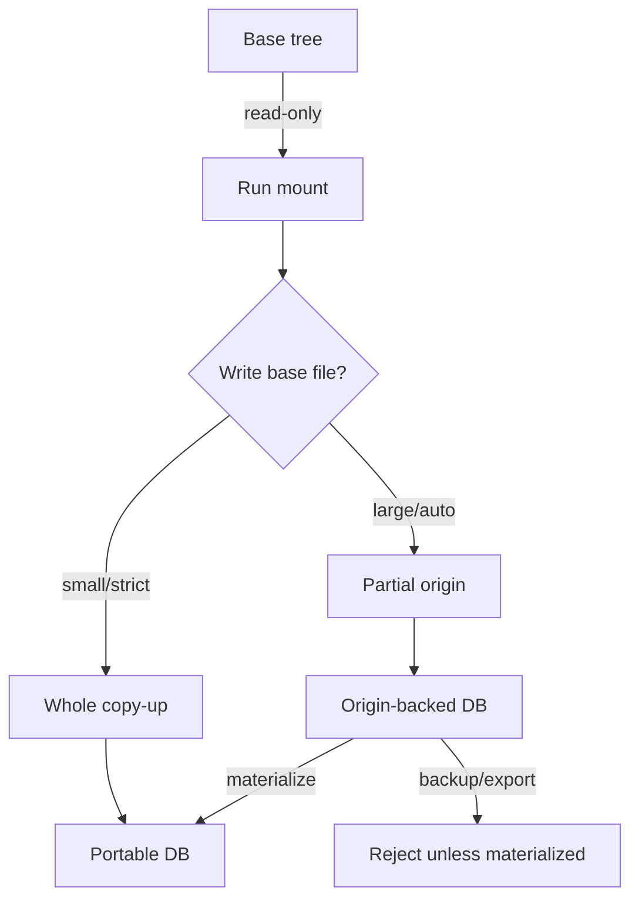
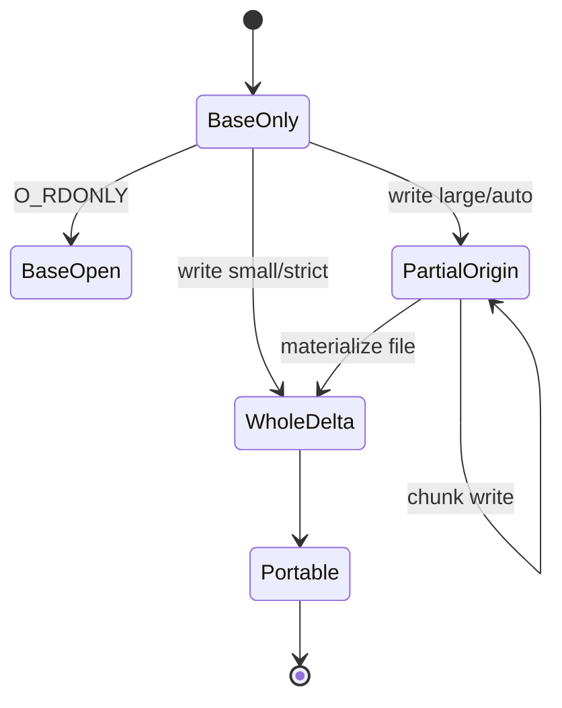
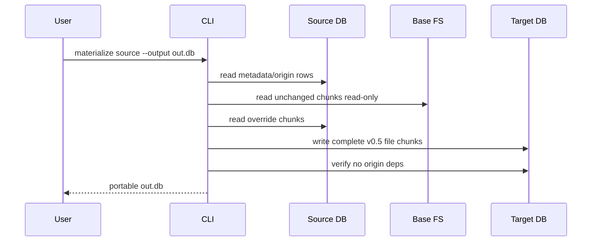

# Phase 6 North Star: Safe Partial-Origin, Portable Materialization, and VFS Performance

## Goal

Phase 6 turns the Phase 5.5 read-path gains into a coherent production model: fast read-only base passthrough, safe partial-origin copy-on-write for large-file edits, and explicit materialization boundaries so AgentFS does not silently abandon its core safety principles.

## Core Principles

1. **Portable artifact principle:** any database we call a portable AgentFS artifact must be self-contained in one DB file.
2. **No-real-write principle:** AgentFS run/mount must never write to the real base tree unless a path is explicitly allowed outside the COW overlay.
3. **Scoped-read principle:** base reads must remain constrained by the sandbox/read allow policy and must be auditable.
4. **No silent semantic downgrade:** origin-backed DBs must be visibly marked as non-portable until materialized.

## Current Baseline

Recent current-binary benchmarks:

| Workload | Native | AgentFS | Ratio | Meaning |
|---|---:|---:|---:|---|
| `factory-mono` bounded read, 3x | `3.04s` | `16.02s` | `5.27x` | Read path improved, still FUSE-bound |
| controlled read/metadata | `0.071s` | `0.285s` | `4.00x` | Metadata/callback overhead remains |
| synthetic write/read | `0.027s` | `0.311s` | `11.55x` | Tiny workload, startup dominates |
| 200MiB one-byte edit, default COW | `0.150s` | `7.107s` | `47.38x` | Whole-file copy-up; bad amplification |
| 200MiB one-byte edit, partial-origin | `0.149s` | `1.698s` | `11.41x` | Only one 64KiB chunk stored |

Important profile state:

- Unchanged base reads now avoid delta data reads: `chunk_read_queries=0`, `chunk_read_chunks=0`.
- Main read overhead is FUSE metadata/callbacks.
- Main write/COW overhead is default whole-file copy-up.

## Architecture Decision

Phase 6 will use **two explicit representations**:

1. **Portable DB**
   - Self-contained.
   - Safe for backup/export/share.
   - Contains all file bytes needed to reconstruct the virtual filesystem.
   - `fs_partial_origin` must be empty.

2. **Origin-backed working DB**
   - Fast runtime representation.
   - May reference unchanged bytes from a read-only base tree.
   - Not portable by itself.
   - Must be materialized before backup/export/share if portability is required.

This preserves the principles by making the non-portable state explicit and by enforcing a materialization boundary.



## File State Model



State meanings:

- `BaseOnly`: file exists only in the real base tree; AgentFS may read it read-only.
- `BaseOpen`: read-only file handle to base; no DB bytes copied.
- `PartialOrigin`: DB stores metadata plus overridden chunks; unchanged chunks come from base.
- `WholeDelta`: DB contains the complete file bytes.
- `Portable`: no external base dependency remains.

## Scope

### In Scope

1. Productionize partial-origin as an explicit working representation.
2. Add materialization tooling to restore single-file portability.
3. Strengthen integrity/backup behavior around origin-backed rows.
4. Preserve no-real-write and scoped-read guarantees.
5. Keep improving read-path performance within current FUSE design.
6. Establish repeatable VFS-vs-native benchmark gates.

### Out of Scope

1. Making non-materialized partial-origin DBs magically portable.
2. Claiming current FUSE can reach `1.5x` native without bigger architecture changes.
3. Replacing AgentFS with kernel overlayfs in Phase 6.
4. Enabling partial-origin as an unconditional global default before correctness gates pass.

## Concrete Implementation Plan

### 1. Explicit Partial-Origin Policy

Add a first-class policy surface:

```text
agentfs run --partial-origin off|on|auto
agentfs mount --partial-origin off|on|auto
```

Policy behavior:

- `off`: current strict portable COW behavior; whole-file copy-up.
- `on`: use partial-origin for eligible base regular files.
- `auto`: use partial-origin only when file size is above a threshold, default proposed threshold `1 MiB`.

Initial default:

- Keep default `off` for ordinary persistent mounts.
- Allow `auto` in controlled run/benchmark paths.
- Only consider flipping `agentfs run` default to `auto` after Phase 6 gates pass.

### 2. Materialization Command

Add:

```text
agentfs materialize <ID_OR_PATH> --output <TARGET_DB> [--verify]
```

Behavior:

1. Open source DB read-only/query-only where possible.
2. For every `fs_partial_origin` row:
   - Resolve the base path under the recorded base root.
   - Validate fast fingerprint before reading.
   - Reconstruct full logical file content by merging base chunks and override chunks.
   - Write complete content into target DB using v0.5 chunk layout.
3. Copy all non-origin metadata, dentries, whiteouts, symlinks, KV/tool-call state.
4. Remove all `fs_partial_origin` and `fs_chunk_override` dependencies in target.
5. Verify target integrity and content hashes if `--verify` is set.

Materialization should be copy-only by default; no in-place mutation in Phase 6.



### 3. Backup and Export Safety

Update `agentfs backup` behavior:

```text
agentfs backup <SRC> <TARGET> --verify
agentfs backup <SRC> <TARGET> --materialize --verify
```

Rules:

- Without `--materialize`, backup rejects DBs with non-empty `fs_partial_origin`.
- With `--materialize`, backup writes a portable materialized target.
- Backup must never silently produce a non-portable file.

### 4. Integrity Checks

Extend `agentfs integrity` with partial-origin awareness:

Checks:

- Every `fs_partial_origin.delta_ino` exists and is a regular file inode.
- Every `fs_chunk_override.delta_ino` references an existing partial-origin file.
- Override chunk indexes are unique and in range.
- Base path is within the recorded base root and not path-traversal escaped.
- Fast fingerprint matches current base if `--check-base` is provided.
- `--require-portable` fails if any partial-origin rows exist.

CLI shape:

```text
agentfs integrity <DB> --json
agentfs integrity <DB> --require-portable
agentfs integrity <DB> --check-base
```

### 5. Strengthen Partial-Origin Data Model

Keep existing tables but ensure enough metadata for safe validation:

```text
fs_partial_origin(
  delta_ino,
  base_path,
  base_size,
  base_fingerprint_size,
  base_mtime,
  base_mtime_nsec,
  base_ctime,
  base_ctime_nsec,
  base_dev?,
  base_ino?,
  base_sample_hash?,
  created_at
)

fs_chunk_override(
  delta_ino,
  chunk_index,
  data_ino/data_ref
)
```

Important nuance:

- Full cryptographic hashing of huge base files on first write would erase much of the performance win.
- Phase 6 should use fast fingerprinting for runtime drift detection and full hashing during materialization/backup verification.

### 6. Preserve No-Real-Write Guarantee

Add explicit tests proving no writes touch the base tree:

1. Hash base tree before/after partial-origin writes.
2. Try `O_TRUNC`, `O_RDWR`, chmod/chown/utimens through overlay and prove base unchanged.
3. Run with base tree made read-only and verify workload still succeeds.
4. Trace or assert that base file handles for partial-origin are opened read-only.

Critical invariant:

```text
Any operation that may mutate file bytes or metadata must target delta/override state, never HostFS base state.
```

### 7. Read-Path Continuation

Keep current Phase 5.5/6 read-path improvements as baseline:

- read-only base open passthrough
- FUSE dir/attr/lookup caches
- readdir/readdirplus cache integration
- conservative `FOPEN_KEEP_CACHE`
- explicit profile summaries from `agentfs run`

Next read-focused work after partial-origin safety:

1. Evaluate FUSE `READDIRPLUS_AUTO` with profile counters.
2. Remove avoidable serialization in the FUSE mount adapter where safe.
3. Prototype FUSE passthrough/backing-fd for unchanged base files.

The likely largest read speedup beyond current `4–6x` is kernel/FUSE passthrough for unchanged base file reads, but that is a larger architecture project than partial-origin hardening.

## Validation Matrix

### Correctness

- SDK unit tests:
  - read-only base open does not copy-up
  - partial-origin write stores only touched chunks
  - truncate/extend does not re-expose stale base bytes
  - rename/link/unlink cleanup of origin rows
  - drift detection
  - materialize produces no partial-origin rows

- CLI tests:
  - `integrity --require-portable` rejects origin-backed DBs
  - `backup` rejects origin-backed DB without `--materialize`
  - `backup --materialize --verify` creates portable DB
  - encrypted materialize/backup works with `--key/--cipher`

- FUSE integration:
  - cache invalidation after create/unlink/rmdir/rename/truncate
  - base tree unchanged after writes
  - partial-origin with read-only base tree

### POSIX

Run both profiles with partial-origin enabled:

```text
scripts/validation/posix/run-pjdfstest.sh --profile phase45-ci ...
scripts/validation/posix/run-pjdfstest.sh --profile phase5-ci ...
```

### Benchmarks

Required benchmark suite:

1. `factory-mono` bounded read, 3 iterations.
2. `read-path-benchmark.py`, cold+warm, profile enabled.
3. `large-edit-benchmark.py --file-size-mib 200` default COW.
4. `large-edit-benchmark.py --file-size-mib 200 --partial-origin`.
5. `materialize` benchmark for the same 200MiB partial-origin DB.

### Performance Gates

Phase 6 should not regress current read performance materially:

- `factory-mono` bounded read: target mean `<= 6x` native.
- controlled read/metadata: target total `<= 5x` native.
- unchanged base reads: `chunk_read_queries == 0` and `chunk_read_chunks == 0`.

Partial-origin COW targets:

- 200MiB one-byte edit stores `<= 1` chunk override and `<= 128KiB` file data.
- 200MiB one-byte edit runtime target `<= 15x` native cold.
- materialized output has `fs_partial_origin_rows == 0`.

## Rollout Plan

### Milestone A: Safety Model

- Add policy flags.
- Add integrity checks.
- Keep backup rejection for origin-backed DBs.
- Add no-real-write tests.

### Milestone B: Materialization

- Implement copy-only `agentfs materialize`.
- Add `backup --materialize`.
- Add encrypted DB coverage.
- Add materialization benchmarks.

### Milestone C: Partial-Origin Gate

- Run POSIX, FUSE, crash/restart, and drift tests with partial-origin enabled.
- Run full benchmark suite.
- Decide whether `agentfs run --partial-origin auto` can become default in a later phase.

### Milestone D: Next Read Speedup Research

- Prototype `READDIRPLUS_AUTO` and/or FUSE passthrough.
- Decide whether 1.5–2x native requires a Phase 7 architecture change.

## Risks

1. **Principle confusion:** users may mistake origin-backed DBs for portable DBs.
   - Mitigation: explicit status, backup rejection, `integrity --require-portable`.

2. **Base drift:** external base tree changes after partial-origin rows are created.
   - Mitigation: fast fingerprint checks at read/materialize boundaries; full verification during materialization.

3. **Security regression:** accidental base writes through HostFS.
   - Mitigation: operation-level tests, read-only base tests, write path audit.

4. **Performance regression:** full hashing or validation on hot write path.
   - Mitigation: avoid full hash on first partial-origin write; defer full validation to materialize/integrity.

## Definition of Done

Phase 6 is complete when:

1. Partial-origin is a documented, explicit working representation.
2. Portable backup/export paths cannot silently emit non-portable DBs.
3. `agentfs materialize` can create a self-contained DB from origin-backed state.
4. Integrity reports clearly distinguish portable vs origin-backed DBs.
5. No-real-write tests pass under partial-origin.
6. Read performance remains at least as good as current Phase 5.5/6 baseline.
7. Large-file COW uses O(chunks touched) storage in partial-origin mode.
8. The team has a data-backed decision on whether to enable `--partial-origin auto` by default for `agentfs run`.