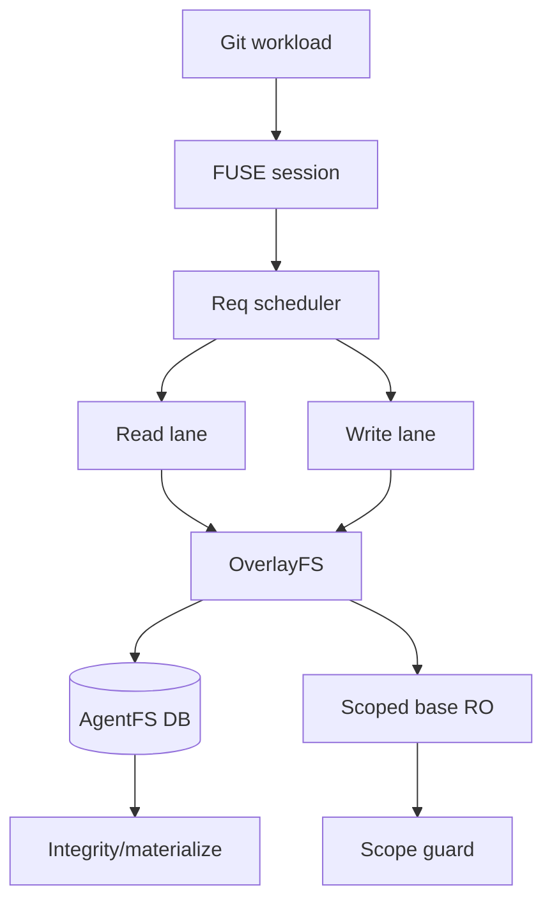

## Goal

Push AgentFS toward a realistic `<=2x` native bound for a Git-sized mixed workload (`clone/checkout`, `status`, read/search, edit, `diff`) **without weakening either core principle**:

1. A portable AgentFS artifact is reconstructable from the AgentFS DB alone after checkpoint/materialization/backup.
2. Sandboxed writes never touch the real filesystem, and base reads remain explicitly scoped.

I will not claim `2x` unless the new Git gate proves it. Phase 7 should produce either passing gates or a profile-backed blocker report showing the next required architecture step.

## Non-negotiable invariants

- **No native staging/import shortcut:** never run Git on the real filesystem and import later.
- **No default partial-origin dependence for the Git gate:** strict-portable mode must be the performance target. Partial-origin remains optional and marked non-portable until materialized.
- **No writable base handles:** HostFS/base may only be used through scoped read-only paths/fds.
- **Single artifact at rest:** runtime SQLite WAL is allowed only if final validation checkpoints/backups to one verified DB file.
- **Every cache optimization must have exact invalidation before success replies.**

## Architecture target

Legend: `Read lane` permits safe parallel metadata/read operations; `Write lane` serializes mutations. `Scoped base RO` is read-only and never part of the strict-portable Git pass condition unless materialized.

## Implementation plan

### 1. Add a real Git workload benchmark gate first

Create `scripts/validation/git-workload-benchmark.py` with:

- deterministic local fixture repo generation, plus optional `--remote https://github.com/openai/codex` / local mirror mode;
- native vs AgentFS runs for:
  - `git clone --local` or checkout from a prepared bare mirror,
  - `git status --short`,
  - `git ls-files` + `rg`/bounded reads,
  - edit a representative set of files,
  - `git diff`,
  - optional `git fsck --strict`;
- phase timing split: clone, checkout, status, read/search, edit, diff;
- AgentFS profile counters, DB size, row counts, chunk/write counts, cache hit/miss, FUSE callback counts;
- base tree hash before/after to prove no real writes.

### 2. Build a safe concurrent FUSE request path

Current FUSE dispatch and `MutexFsAdapter` effectively serialize callbacks. Phase 7 will introduce an explicit request scheduler:

- classify callbacks as **pure read**, **read requiring dirty-buffer synchronization**, or **mutation**;
- run pure reads concurrently only when they cannot observe pending dirty writes;
- serialize mutations and dirty-buffer flush/release/truncate/rename paths;
- preserve ordered cache invalidation before returning mutation success;
- add profile counters for scheduler queue wait, read-lane concurrency, write-lane wait, and fallback-to-exclusive cases.

### 3. Make metadata caching targeted, not global

- Replace broad `clear_read_caches()` usage where safe with targeted invalidation for affected inode, parent directory, and names.
- Add parent/name negative lookup caching in AgentFS/OverlayFS with invalidation on create/link/symlink/mkdir/rename/unlink/rmdir.
- Default `AGENTFS_FUSE_READDIRPLUS` to `auto` after cache-invalidation tests pass; keep env override for rollback.

### 4. Batch SQLite write/chunk operations

- Add a batch write API, e.g. `pwrite_ranges`, with one transaction, prepared statement reuse, batched chunk upserts, and one metadata update.
- Wire FUSE pending write buffers into the batch API.
- Keep all staged data inside canonical SQLite tables or an in-DB replayable journal; no sidecar staging files.
- Ensure `fsync`, backup, materialize, and integrity either checkpoint/apply pending journal rows or fail safely.

### 5. Principle gates

Add/extend validation to require:

- `agentfs integrity --require-portable` passes after strict Git runs;
- `agentfs backup --verify` produces a single portable DB;
- materialized output matches the AgentFS view byte-for-byte;
- base tree hash is unchanged after clone/edit/diff;
- no `fs_partial_origin`/external-origin dependency rows in strict Git pass mode;
- no stale reads during read/write/rename/truncate stress.

### 6. Parallel worker strategy after approval

- Heavy worker A: Git benchmark/gate harness.
- Heavy worker B: concurrent FUSE scheduler and profiling.
- Heavy worker C: targeted cache + negative lookup cache.
- Heavy worker D: batched SQLite write path.
- Heavy worker E: principle gates, crash/reopen/materialize validation.

Then launch 3 medium reviewers:

- concurrency/order/cache invalidation reviewer;
- principle/security/no-real-write reviewer;
- performance gate/statistics reviewer.

## Acceptance targets

Mandatory correctness gates:

- full SDK and CLI no-default tests pass;
- FUSE invalidation tests pass;
- no-real-write/base-hash gates pass;
- strict-portable integrity + backup/materialize gates pass;
- `git fsck --strict` passes for the benchmark repo.

Performance targets:

- `status`, read/search, edit, and diff steady-state: target `<=2x` native;
- clone/checkout mixed write path: target `<=3x`, stretch `<=2x`;
- if any target misses, Phase 7 must output a profile-backed bottleneck report rather than hiding the miss.

## Explicitly out of scope

- Running clone/edit on the real filesystem and importing afterward.
- Making partial-origin default for the Git gate.
- Git-specific semantic shortcuts that bypass POSIX-visible AgentFS state.
- Claiming kernel passthrough support unless the vendored FUSE layer actually supports it and no-write/scoped-read gates prove it.