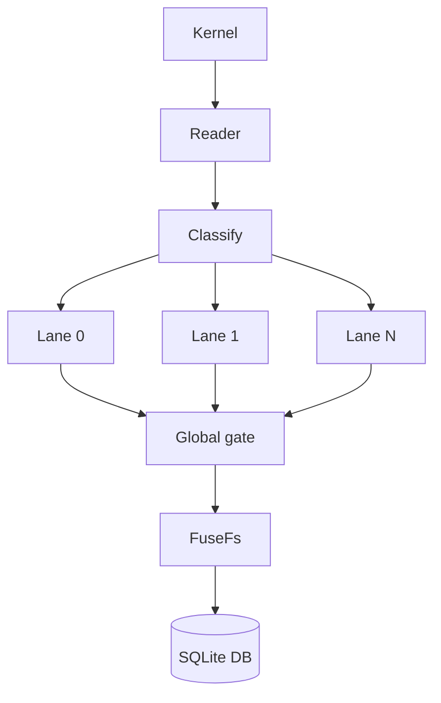
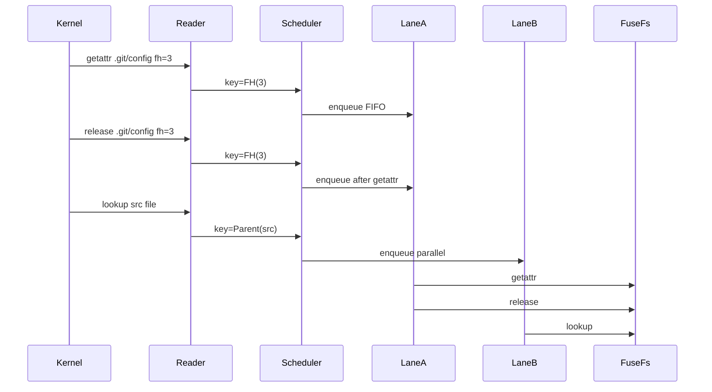

## Phase 8.1 — Fix Parallel FUSE Ordering With a Keyed Scheduler

### Expected behavior

Parallel FUSE should let unrelated operations proceed concurrently, but operations that FUSE/Git expect to be ordered for the same file handle, inode, or namespace parent must remain FIFO. The core AgentFS principles stay unchanged:

1. The SQLite DB remains the single-file virtual filesystem artifact.
2. Sandbox writes never touch the real filesystem; reads remain scoped.

### Current failure

`AGENTFS_FUSE_WORKERS=25%` correctly bounds worker count and passes pure-read serialization, but concurrent Git hangs. In the repro, Git children block in kernel FUSE waits on `.git/config`; the AgentFS reader is blocked in `fuse_dev_do_read`; worker threads are idle/waiting; FUSE has pending requests. That points to **request ordering/lifecycle breakage**, not CPU or memory pressure.

### Root cause hypothesis

The current worker pool dispatches globally parallel requests with no per-`fh` / per-inode / per-parent ordering. Git concurrently touches `.git/config`, `.git/index`, and related paths, so operations like `getattr`, `open`, `flush`, `release`, `forget`, and path lookups can interleave in ways serial FUSE never allowed.

The current queue-full overflow path also risks ordering violations because an overflow request can run on a fresh thread and overtake an older queued request for the same key.

### Design

Add a keyed scheduler between `/dev/fuse` reads and worker execution.

Legend: each lane is FIFO. Same key always maps to the same lane. Global gate is a read/write lock: normal keyed ops take read; namespace/global ops take write.

### Scheduling rules

#### Key extraction

Add `Request::schedule_key()` in `cli/src/fuser/request.rs`, parsing the owned request once enough to classify it.

Keys:

- `FileHandle(fh)` when the op has a file handle:
  - `read`, `write`, `flush`, `fsync`, `release`, `getattr(Some(fh))`, `lseek`, `copy_file_range` endpoints.
- `Inode(ino)` for inode-scoped ops without `fh`:
  - `getattr`, `setattr`, `readlink`, `open`, `opendir`, `readdir`, `readdirplus`, `forget`.
- `Parent(parent_ino)` for namespace reads:
  - `lookup(parent, name)`.
- `GlobalWrite` for namespace mutations and lifecycle ops:
  - `create`, `mknod`, `mkdir`, `unlink`, `rmdir`, `symlink`, `link`, `rename`, `rename2`, `batch_forget`, `init`, `destroy`, unsupported/unknown mutation-like ops.

#### Locking model

- Same key => same lane => FIFO ordering preserved.
- Different keys => may run in parallel.
- `GlobalWrite` ops acquire a scheduler-wide write gate before callback.
- Normal keyed ops acquire a scheduler-wide read gate before callback.
- No overflow-worker fallback for keyed mode; overflow can overtake. If a lane is full, apply backpressure to that lane.

#### Defaults

- Keep default `AGENTFS_FUSE_WORKERS=serial` until the keyed scheduler passes Git stress.
- Keep `AGENTFS_FUSE_SYNC_INVAL=0` by default during this phase.
- Keep TTL/writeback/keep-cache/readdirplus gated behind explicit sync-inval + non-serial workers.

### Implementation steps

1. **Add request scheduling classification**
   - Add `ScheduleKey` / `ScheduleClass` in `cli/src/fuser/request.rs` or a new `cli/src/fuser/scheduler.rs`.
   - Unit-test representative operations: lookup, read, write, release, forget, create, rename.

2. **Replace global queue with lane queues**
   - In `cli/src/fuser/session.rs`, create `FuseScheduler`:
     - `lanes: Vec<SyncSender<QueuedRequest>>`
     - one worker thread per lane
     - `global_gate: Arc<parking_lot::RwLock<()>>`
   - Hash `ScheduleKey` to a lane.
   - Route `GlobalWrite` through a stable lane but take the global write gate inside the worker.
   - Route normal ops through hashed lane and take global read gate.

3. **Remove unsafe overflow overtaking**
   - Delete the current queue-full overflow thread path for keyed scheduling.
   - On full lane queue, block on that lane’s sender with profiling counters; reader backpressure is acceptable while sync invalidation remains disabled.
   - Keep `serial` rollback unchanged.

4. **Add profiling**
   - `fuse_scheduler_lanes`
   - `fuse_scheduler_keyed_tasks`
   - `fuse_scheduler_global_tasks`
   - `fuse_scheduler_lane_backpressure_count`
   - `fuse_scheduler_lane_backpressure_ns_total`
   - `fuse_scheduler_max_lane_depth`

5. **Validation**
   - Low-memory build/test path:
     - `CARGO_BUILD_JOBS=1 cargo check --manifest-path cli/Cargo.toml --no-default-features`
     - `CARGO_BUILD_JOBS=1 cargo test --manifest-path cli/Cargo.toml --no-default-features --lib`
     - `CARGO_BUILD_JOBS=1 cargo clippy --manifest-path cli/Cargo.toml --no-default-features --lib -- -D warnings`
   - Repro gates:
     - `AGENTFS_FUSE_WORKERS=25% phase8-concurrent-git-stress.py --timeout 60 ...` must pass without timeout.
     - `AGENTFS_FUSE_WORKERS=25% fuse-serialization-stress.py ...` must still show `fuse_dispatch_max_concurrent > 1`.
   - Safety gates:
     - `phase8-validation.py --smoke --timeout 60` must pass.
     - Full `phase8-validation.py --timeout 120` may still fail performance thresholds, but must not fail correctness/sidecar/crash gates.

### Step-through of fixed flow

Same file-handle operations cannot overtake; unrelated lookup still runs in parallel.

### Acceptance criteria

- `AGENTFS_FUSE_WORKERS=25%` no longer hangs concurrent Git stress.
- Same-key FUSE operations are FIFO by construction.
- No queue-full overflow path can overtake older same-key requests.
- Correctness gates continue to preserve single-file DB and no-real-write principles.
- Defaults remain safe until the keyed scheduler proves stable.