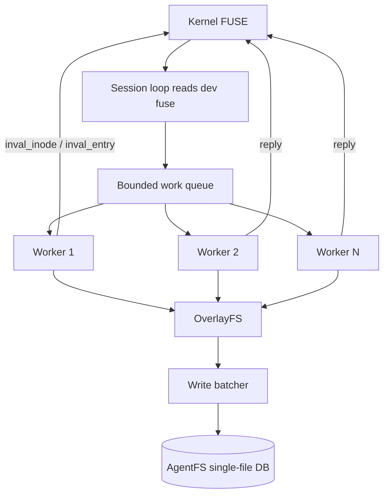

## Phase 8 — Unblock the Crux: Parallel FUSE Dispatch + Synchronous Invalidation + Safe Kernel Caching + Write Batching

### Why this is the crux

Phase 7 confirmed the shape of the bottleneck:

- kernel `TTL`, `FUSE_WRITEBACK_CACHE`, `FUSE_DO_READDIRPLUS`, `FOPEN_KEEP_CACHE` are all **disabled** because cache invalidation cannot safely precede mutation replies; that forces every lookup/getattr/read through userspace and makes every `write(2)` round-trip to SQLite immediately;
- FUSE session dispatch is **serial** — `Request` borrows the read buffer and `Filesystem` callbacks take `&mut Session`, so `MutexFsAdapter` serialization is the real floor, not just the visible one;
- every AgentFS write is **one immediate SQLite transaction**, regardless of whether it is a 64 B line append or a burst of small-file creates like `git clone`.

No remaining optimization on read caches, write batching, or passthrough matters until these three are lifted together, because each one alone stalls on the other two. Phase 8 lifts them **as one coupled unit** behind a safety-first sequencing: parallel dispatch first, synchronous invalidation second, kernel caching re-enable third, write batching last.

### Principles preserved (unchanged)

- Single-file DB artifact: writes continue to land in the SQLite `delta.db` file; backup/materialize/integrity still gate portability.
- No real FS writes: overlay still routes all writes to delta; HostFS base fd stays read-only; scoped under the cwd fd.
- Scoped reads: nothing new escapes the sandbox scope; keep-cache is only re-enabled for read-only base regular files with explicit drift invalidation.

Writeback cache is not a principle violation — the kernel's page cache buffering is the same semantics any native FS provides; data still becomes durable in `delta.db` on `fsync`/`flush`.

### Architecture

Legend: the loop keeps draining `/dev/fuse`, so workers can issue `FUSE_NOTIFY_INVAL_*` synchronously without the historic notify/reply deadlock.

### Implementation plan

#### 1. Parallel FUSE dispatch
- `cli/src/fuser/request.rs`: refactor `Request<'_>` into an owned `Request` (copy the bytes out of the rotating buffer) so it can cross a thread boundary.
- `cli/src/fuser/session.rs`: session loop reads, decodes owned `Request`, pushes to a bounded async work queue; N workers call `Filesystem` methods on `&self`.
- `Filesystem` trait moves to `&self` + `Sync` for read ops; mutation ops keep explicit write-side serialization inside the SDK where required by OverlayFS mappings.
- Feature flag `AGENTFS_FUSE_WORKERS=<N|serial>` with `serial` fallback.

#### 2. Synchronous cache invalidation
- `cli/src/fuse.rs`: replace `DeferredNotifier.inval_*` calls in mutation paths with direct `Notifier.inval_*` calls, invoked from the worker thread **before** the success reply.
- Since dispatch is parallel, `FUSE_NOTIFY_INVAL_ENTRY` no longer deadlocks with the dispatch loop.
- Add `AGENTFS_FUSE_SYNC_INVAL=0` env knob to fall back to deferred invalidation for rollback.

#### 3. Re-enable safe kernel caching
- `TTL = Duration::from_secs(1)` (env-tunable `AGENTFS_FUSE_TTL_MS`).
- Restore capabilities: `FUSE_WRITEBACK_CACHE`, `FUSE_DO_READDIRPLUS` (auto default), `FOPEN_KEEP_CACHE` for eligible read-only base files only.
- Every mutation (`setattr`, `write`, `truncate`, `unlink`, `rmdir`, `rename`, `link`, `symlink`, `create`, `mknod`, `mkdir`, `chmod`, `chown`, `utimens`, partial-origin copy-up) issues targeted `inval_inode`/`inval_entry` synchronously before reply, including parent dir for namespace changes and hard-link peers.
- Drift guard: copy-up, truncate, or base-drift detection unconditionally invalidates any prior `FOPEN_KEEP_CACHE` eligibility for the affected inode.

#### 4. Write batching with group commit
- `sdk/rust/src/filesystem/agentfs.rs`: introduce `AgentFSWriteBatcher`:
  - coalesces `pwrite` / `pwrite_ranges` for a given inode into one immediate SQLite transaction on a short timer (e.g. `5 ms`) or at `4 MiB` pending bytes;
  - `fsync`/`flush`/`release` block on the inode's pending batch draining, then checkpoint WAL;
  - all data stays in canonical SQLite tables — no sidecar files, no hidden state outside `delta.db`.
- FUSE writeback cache may ack `write(2)` to the application early; durability boundary is `fsync`/`close`/`flush`, which drain the batcher. Backup/materialize/integrity remain correct because they checkpoint first, as today.
- Feature flag `AGENTFS_BATCH_MS` / `AGENTFS_BATCH_BYTES`.

#### 5. Read path concurrency
- `sdk/rust/src/filesystem/mod.rs` and overlay/agentfs read methods: audit for any remaining `&mut self` on read operations; all reads must run through the connection pool on `&self`.
- Overlay metadata caches (attr / dentry / negative) already `&self`; confirm and expand coverage.

#### 6. Validation & gates
- New `scripts/validation/phase8-validation.py` composing:
  - Phase 7 principle gates (integrity, backup/materialize verify, no real base writes, portable DB, partial-origin = 0 in strict mode, invalidation shell test);
  - concurrent Git stress: two `git status` + one `git diff` in parallel, AgentFS vs native digest equality required;
  - writeback cache durability test: write, `fsync`, kill, reopen DB, confirm data present and base unchanged;
  - write-without-fsync crash test: data may be lost but `delta.db` remains consistent and base is untouched;
  - serialization stress must now show `fuse_read_lane_max_concurrent > 1`.
- Performance gates (fail in full mode):
  - Git `status` / `read_search` / `edit` / `diff` ≤ `2.0x`;
  - Git `checkout` ≤ `3.0x`;
  - Git `clone` ≤ `5.0x` (stretch `3.0x`);
  - base repeated-read workload ratio ≤ `1.5x` (kernel page cache hit on second read);
  - controlled read/metadata ≤ `2.0x`.
- All Phase 7 scripts remain runnable; Phase 8 gate orchestrates them plus the new tests.

### Parallel worker plan (user-requested)

Heavy workers (in detached worktrees under `vfs-phase8-worktrees/`), each directed to first read `SPEC.md`, `.agents/specs/2026-05-11-phase-7-principle-preserving-git-workload-fast-path.md`, and the relevant current-code pointers:

- A `dispatch` — owned `Request`, worker pool in `cli/src/fuser/session.rs`, `Filesystem: Sync` plumbing through adapters.
- B `notify` — synchronous `inval_inode`/`inval_entry` in all mutation handlers; remove unsafe kernel-cache disables tied to deferred notify.
- C `kernel-cache` — restore `TTL`, `FUSE_WRITEBACK_CACHE`, `FUSE_DO_READDIRPLUS`, `FOPEN_KEEP_CACHE` with drift guards and env flags.
- D `batcher` — `AgentFSWriteBatcher` + `fsync`/`flush`/`release` drain semantics + group commit timer.
- E `gates` — `scripts/validation/phase8-validation.py`, concurrent Git stress, writeback crash test, performance thresholds.

Then medium review workers in two batches of 2–3 with overlapping coverage:
- batch 1: dispatch deadlock/safety + invalidation ordering + kernel cache correctness;
- batch 2: batcher durability/fsync semantics + no-real-write/principle audit + gate integrity/performance honesty.

Final inspection by me before any commit; no push.

### Rollback strategy

Every new capability is env-gated (`AGENTFS_FUSE_WORKERS`, `AGENTFS_FUSE_SYNC_INVAL`, `AGENTFS_FUSE_TTL_MS`, `AGENTFS_FUSE_WRITEBACK`, `AGENTFS_FUSE_KEEPCACHE`, `AGENTFS_FUSE_READDIRPLUS`, `AGENTFS_BATCH_MS`, `AGENTFS_BATCH_BYTES`). If any gate regresses, we can disable the component without reverting the others.

### Out of scope

- True kernel backing-fd passthrough (the vendored fuser still cannot prove it).
- Replacing SQLite / Turso.
- Making partial-origin default for Git.
- Any optimization that requires a writable base handle or hidden non-portable sidecar.