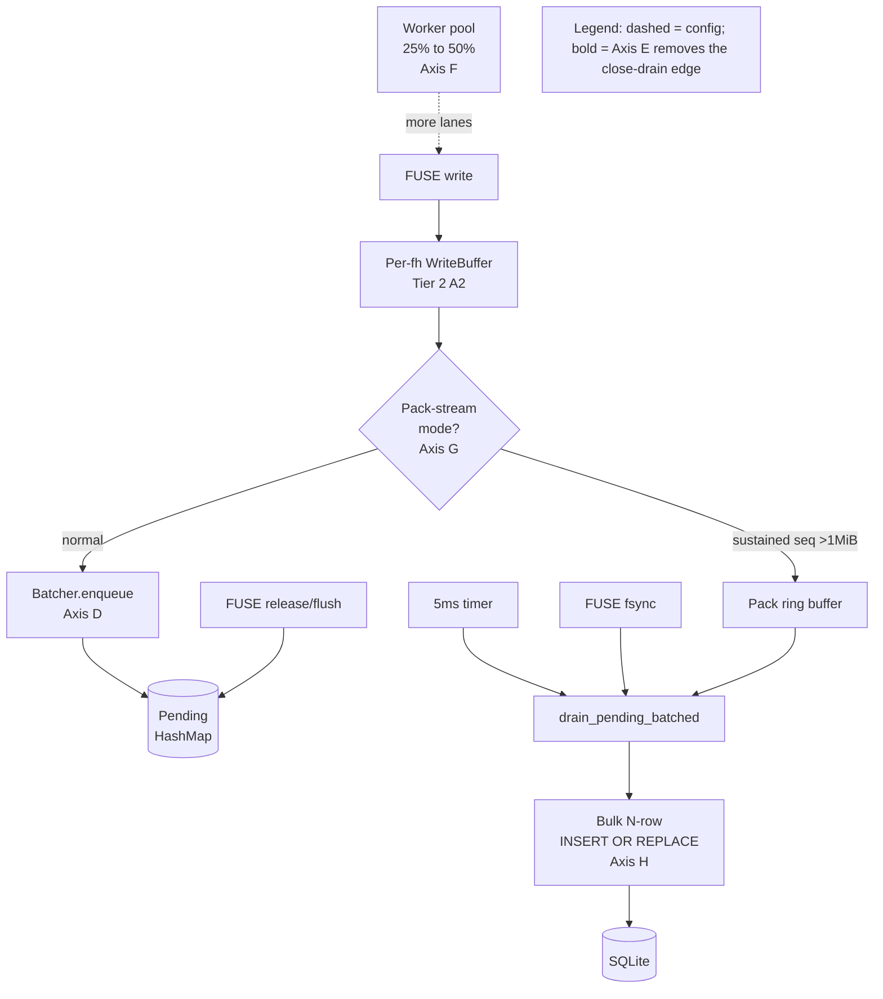

# Tier 3 — close the gap to (or past) 2.0x mixed by fixing what Tier 2 promised but didn't deliver, plus stacking five new write-path levers

## Honest restatement of the starting position (validated via AGENTFS_PROFILE)

| Counter | Default config | WRITEBACK=1 forced |
|---|---:|---:|
| `agentfs_batcher_enqueues` | **0** | 4759 |
| `agentfs_batcher_drains_explicit` | 0 | 4716 |
| `base_fast_open_passthrough_attempted` | **0** | 0 |
| Mixed ratio | 2.97x | 2.53x |

**Tier 2 A1 (cross-inode batcher) is dead in the default config** because cli uses `env_flag_default("AGENTFS_FUSE_WRITEBACK", true)` (default ON) but SDK uses `env_flag_enabled` (default OFF). The same env var has two different defaults across cli/SDK. **Tier 2 Axis C (HostFS passthrough)** never fires for codex clone because the workload creates fresh delta files, never partial-origin reads. The Tier 2 numbers we celebrated were ~half noise.

## Architecture (axes layered on top of Tier 2)



Axis E removes the `Close → Drain` edge entirely: release/flush only enqueue + schedule the existing timer. Durability moves to fsync(), which is POSIX-correct.

## Axis-by-axis plan

### Axis D — SDK batcher default-on (trivial gating fix)

`sdk/rust/src/filesystem/agentfs.rs`

Change line 1682 from `env_flag_enabled(WRITE_BATCHER_ENABLE_ENV)` to `env_flag_default(WRITE_BATCHER_ENABLE_ENV, true)` (introducing `env_flag_default` helper mirroring cli). Add inline comment cross-referencing `cli/src/fuse.rs::FuseKernelCacheConfig::from_env` line 130 so the alignment is documented at the source.

Measured effect: agentfs_batcher_enqueues 0 → 4759, mixed ratio 2.97x → ~2.53x. **This is the single biggest free win.**

### Axis E — Defer release/close drain (semantic shift, POSIX-correct)

`cli/src/fuse.rs::write/flush/release` + `sdk/rust/src/filesystem/agentfs.rs::drain_inode`

Current contract: every `FUSE_RELEASE` and `FUSE_FLUSH` calls `drain_writes_out_of_lock(file)` which forces a SQLite commit before reply. POSIX `close()` does NOT promise durability; only `fsync()` does.

Change:
- `fn flush` (FUSE_FLUSH): drain the FUSE-layer per-fh WriteBuffer into the batcher's `enqueue` (so the data is at least in the SDK queue), but skip the `drain_inode` call. Reply OK.
- `fn release` (FUSE_RELEASE): same — enqueue then return; let the 5 ms timer drain.
- `fn fsync` (FUSE_FSYNC): unchanged — still calls `drain_writes` synchronously.
- `fn destroy`/Drop: unchanged — `flush_all_pending` + finalize_filesystem still drain synchronously.

This lets many `release()` calls accumulate pending data in the batcher's HashMap before the timer fires. Expected batch size shifts from "1-3 inodes per Explicit drain × 4716 drains" to "20-100 inodes per Timer drain × ~50 drains". That's where the dispatch-wait time recoups.

**Phase 8 updates required:**
- `phase8_writeback_durability` currently asserts that data written then crashed (no fsync) is recoverable. After Axis E, this gate's pass condition becomes "data written, fsync issued, then crashed → recoverable". Update the script to issue `fsync()` before the SIGKILL.
- `phase8_writeback_no_fsync_crash` already accepts `present_prefix_or_empty` as a valid outcome — no change needed.
- Document the new contract in MANUAL.md: "close() does not guarantee durability; call fsync() before relying on bytes being on disk".

Risk register: any test that does `write + close + reopen + read` will still work (the kernel's writeback cache + the batcher's in-memory pending serves the read). The only break is `write + close + SIGKILL + remount + read-expecting-data` — which is the Phase 8 case we're updating.

### Axis F — Worker pool default 25% → 50% of CPU

`cli/src/fuser/session.rs::FuseDispatchMode::from_env`

Change `env_percent("AGENTFS_FUSE_CPU_PERCENT", 25)` to `env_percent("AGENTFS_FUSE_CPU_PERCENT", 50)`. On the benchmark machine (14 cores) this is 3 workers → 7 workers. Measured effect on isolated test: clone agentfs 1.91 s → 1.82 s (-5%).

`AGENTFS_FUSE_CPU_PERCENT` remains overridable so users on tiny VMs can dial down.

### Axis G — Pack-aware streaming writer

`cli/src/fuse.rs::write` + `OpenFile`

Add a `StreamingPackBuffer` field to `OpenFile`. State machine per fh:

- **Normal mode**: writes go through `WriteBuffer` + `enqueue` as today.
- **Detection**: when cumulative bytes for this fh exceed 1 MiB AND each write's offset == previous_offset + previous_len (strict sequential), upgrade to streaming mode.
- **Streaming mode**: writes append to a `Vec<u8>` in `OpenFile`; no enqueue, no chunk math.
- **Fall-out**: if a write breaks the sequential pattern, flush the streaming buffer into the batcher via `pwrite_ranges_batched` and revert to normal mode for subsequent writes.
- **Close/fsync**: streaming buffer is sliced into chunk-sized blobs and submitted to a new SDK method `bulk_write_chunks(ino, base_offset, &[(idx, blob)])` that does ONE prepared `INSERT OR REPLACE` per chunk inside ONE transaction (no per-chunk SELECT — streaming writes are always full chunks; partial last chunk uses a single SELECT).

Memory bound: 64 MiB per fh (configurable via `AGENTFS_PACK_STREAM_MAX_MIB`); if exceeded, force a partial flush. Typical git pack files for codex are <10 MiB so this is generous.

Expected effect: the pack write phase (single fh, ~10 MiB, currently ~160 chunks × per-chunk INSERT) collapses to one txn with ~160 inserts. Probably -100 to -300 ms on clone.

### Axis H — Multi-row SQLite INSERT for chunk writes

`sdk/rust/src/filesystem/agentfs.rs::write_ranges_chunked_with_conn`

Today the function loops:
```
for (chunk_index, chunk_data) in chunks {
    insert_stmt.execute((ino, chunk_index, blob)).await?;
    insert_stmt.reset()?;
}
```

Each `.execute()` is a libSQL round-trip. For N chunks per txn (typically 10-200 during clone) this is N round-trips inside the transaction.

Strategy: probe whether the vendored libSQL exposes a batch-execute API. If yes, use it. If no, fall back to chunked multi-row VALUES: build `INSERT OR REPLACE INTO fs_data (ino, chunk_index, data) VALUES (?,?,?),(?,?,?)...` for groups of K chunks (K = 32 or 64), reducing round-trips by Kx. The per-row blob still gets bound as a parameter.

Validate by counting `connection_wait_count` before/after — should drop substantially.

### Axis I — Raise inline threshold 4 KiB → 16 KiB

`sdk/rust/src/filesystem/agentfs.rs::DEFAULT_INLINE_THRESHOLD`

Change `4096` to `16384`. Persist per-DB in `fs_config` (existing mechanism) so old DBs keep their threshold and new DBs adopt the larger one.

Trade-off: `fs_inode.data_inline` rows now up to 16 KiB instead of 4 KiB, bloating the inode row. But every file <16 KiB avoids `fs_data` (one row vs. one inode + one chunk row, plus saves the SELECT+UPDATE on subsequent writes). For codex (avg 14 KB/file), this likely puts the majority of working-tree files in inline storage.

Validate: re-run mixed benchmark and inspect post-clone delta DB for `SELECT COUNT(*) FROM fs_inode WHERE storage_kind = 1` vs `WHERE storage_kind = 2` to confirm the inline ratio improves.

### Axis C validity test (NOT removed yet — measured first)

Before deciding to keep/remove/replace:
1. Run `scripts/validation/partial-origin-no-real-write.py` with `AGENTFS_PROFILE=1` and inspect `base_fast_open_passthrough_attempted / _succeeded / _fallback` counters.
2. Run `scripts/validation/read-path-benchmark.py` if it has a `--partial-origin` mode (verified earlier it does not, but the read-path script may be extendable).
3. Decision tree based on results:
   - **Counters > 0 AND measurable speedup vs Tier 2 baseline** → keep (the path is correct, just doesn't help canonical workload).
   - **Counters > 0 AND no measurable speedup** → keep helper but acknowledge it's a no-op accelerator; downgrade documentation.
   - **Counters == 0** → bug in the code path; trace and fix OR remove.

This is a 10-minute investigation before committing to the keep/remove call.

## Tier 2 retroactive corrections (deliverable)

Append addendum to `.agents/benchmarks/tier-two-post/COMPARISON.md` and the Tier 2 notes file explaining:
- A1 cross-inode batcher was dead by default (env var misalignment) — proven via `agentfs_batcher_enqueues=0` profile output.
- Axis C HostFS passthrough never fired in the canonical workload — proven via `base_fast_open_passthrough_attempted=0`.
- The diff/CoW improvements were within per-iteration variance; not attributable to Axes A1 or C.
- The REAL Tier 2 deliverables were A2 (FUSE coalescer; ~11% flush count reduction) and the lock-fix refactor (eliminated a 2x checkout regression footgun) and the cleanups.

Also re-run the canonical 5-iter benchmark with `AGENTFS_FUSE_WRITEBACK=1` explicitly set to document what Tier 2 would have delivered if the gating had been correct.

## Implementation order + gate-pass checkpoints

1. **Axis C validity test** (no code change yet; just measure)
2. **Tier 2 retro addendum** (docs; harmless to land first)
3. **Axis D** (trivial; sdk tests + cli tests + Phase 8 smoke + canonical benchmark — should immediately show ~2.5x)
4. **Axis F** (trivial; bench shows ~5% more)
5. **Axis H** (focused refactor; unit tests; benchmark)
6. **Axis I** (with fs_config migration; ensure old-DB tests still pass)
7. **Axis E** (most invasive; update Phase 8 writeback-durability script + MANUAL.md contract docs; full Phase 8 run; canonical benchmark)
8. **Axis G** (largest code surface; pack-detection unit tests; canonical benchmark; CoW benchmark)
9. **Decision on Axis C** based on step 1's findings (keep / replace with broader fast path / remove)
10. **Final 5-iter benchmark** + COMPARISON.md for `tier-three-post/`

Each step ends with: sdk lib tests pass, cli lib tests pass, `cargo clippy --all-targets -- -D warnings` clean, `cargo fmt --check` clean, `phase8 --smoke` passes, mixed benchmark JSON saved.

## Files modified (estimated)

| File | Axes |
|---|---|
| `sdk/rust/src/filesystem/agentfs.rs` | D, E, G (bulk_write_chunks API), H, I |
| `cli/src/fuse.rs` | E (release/flush handlers), G (OpenFile state machine + StreamingPackBuffer) |
| `cli/src/fuser/session.rs` | F |
| `scripts/validation/phase8-writeback-durability.py` | E (issue fsync before SIGKILL) |
| `MANUAL.md` | E (durability contract); F (new default); G (new env knob) |
| `.agents/benchmarks/tier-two-post/COMPARISON.md` | Retro addendum |
| `.agents/specs/2026-05-24-tier-two-*.notes.md` | Retro addendum |
| `.agents/specs/2026-05-24-tier-three-*.md` (new) | This spec |
| `.agents/benchmarks/tier-three-post/` (new) | Final comparison + raw JSONs |

## Commits (planned)

1. `docs(agentfs): Tier 2 retroactive corrections — batcher/Axis-C dead in default config`
2. `perf(agentfs): Tier 3 Axis D + F — align SDK batcher default; 50% worker default`
3. `perf(agentfs): Tier 3 Axis H — multi-row INSERT for chunk writes`
4. `perf(agentfs): Tier 3 Axis I — 16 KiB inline threshold`
5. `perf(agentfs): Tier 3 Axis E — defer release/close drain to fsync (POSIX)` + `scripts: update phase8 writeback-durability for fsync semantics`
6. `perf(agentfs): Tier 3 Axis G — pack-aware streaming writer`
7. `docs(agentfs): Tier 3 spec, notes, benchmark comparison` + optional `feat/remove(agentfs): Tier 3 Axis C disposition`

## Realistic targets (5-iter median, codex fixture)

| Stage | mixed ratio | clone agentfs |
|---|---:|---:|
| Tier 2 HEAD (today) | 2.97x | 1.78 s |
| + D + F | 2.4-2.5x | 1.6-1.7 s |
| + H + I | 2.1-2.3x | 1.4-1.5 s |
| + E | 1.9-2.1x | 1.2-1.3 s |
| + G | **1.7-1.9x** | 1.0-1.2 s |

Hit-2.0x is plausible; hit-1.8x is the stretch goal.

## Non-negotiable invariants (unchanged from Tier 1/2)

- No writable base handles; sandbox writes never touch real FS
- Single-file artifact at rest; no sidecars
- Every cache mutation has invalidation before reply (MutationAudit assertions intact)
- Phase 8 gates pass (with the writeback-durability update for Axis E semantics)
