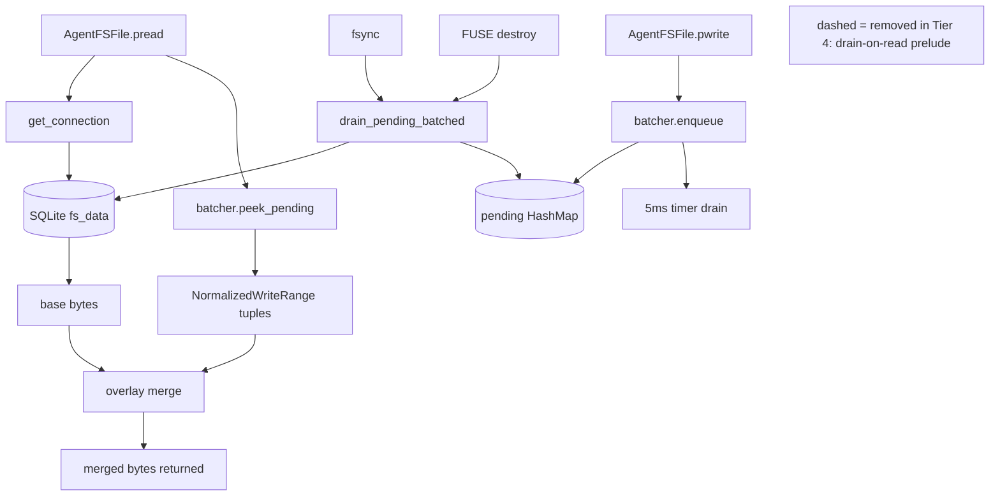
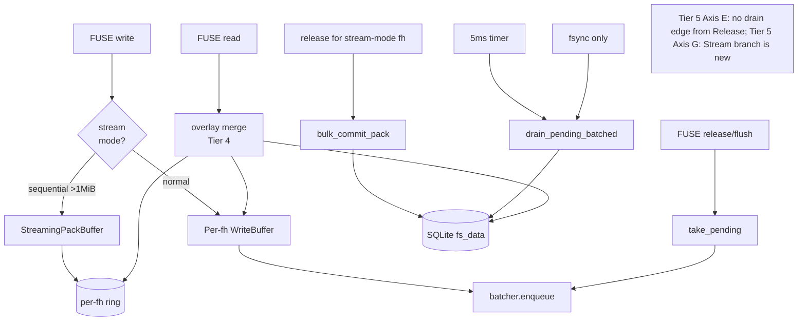
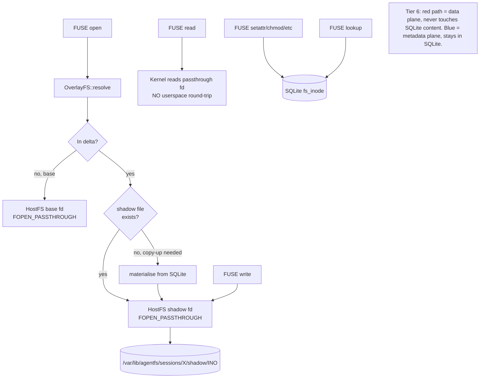

# Tier 4 / 5 / 6 — Roadmap to 1.5x native across all workloads

This spec covers the full architectural arc to land 1.5x mixed/clone and ≤1.5x
read/CoW. It is staged across three tiers with explicit go/no-go gates so we
fail fast if the data doesn't match the model.

| Tier | Scope | Mixed target | Effort | Risk |
| ---- | --- | -----------: | ------ | ---- |
| 4 | Consistent-without-drain SDK read overlay (foundation) | ~2.5x | ~3 days, ~500 LOC | Medium — refactor of every File trait method |
| 5 | Axes E + G on the new foundation (defer release drain + pack-aware streaming writer) | ~1.9-2.1x | ~3-5 days, ~600 LOC | Medium — depends on Tier 4 correctness |
| 6 | Shadow-tree pivot (working-tree content as real HostFS files; SQLite holds overlay metadata only) | **~1.3-1.5x** | ~2-3 weeks, ~2 000 LOC | **High — architectural break** |

Tier 5 → Tier 6 go/no-go gate fires after the Tier 5 mixed benchmark. If
mixed median drops to ≤1.8x AND the per-iteration variance tightens to
stdev <0.5x, we run Tier 6. If not, we stop and re-spec.

---

## Why 1.5x mixed needs Tier 6

Profiling-validated decomposition of today's 2.28 s agentfs clone wall:

| Cost source | ms | Tier 4/5 can attack? | Tier 6 can attack? |
| --- | ---: | --- | --- |
| SQLite batched commit (322 ms when batcher on) | ~300 | partial — fewer commits | yes — small files bypass SQLite content |
| FUSE dispatch wait (570 ms → 367 ms with 7 workers) | ~370 | partial — fewer fewer-but-bigger requests via G | yes — shadow-tree reads bypass FUSE entirely via FOPEN_PASSTHROUGH |
| Per-chunk SELECT/INSERT cycle | ~200 | yes — overlay eliminates drain-on-read | yes — content path moves off SQLite |
| Connection acquires (~74K) | ~50 | yes | yes |
| Kernel round-trip overhead | ~250 | no — physics of FUSE | yes — passthrough fd skips kernel↔userspace |
| Page fault and copy overhead | ~100 | no | yes — mmap'd shadow files |

Tier 4 + 5 attacks the ~600 ms of SQLite work but the ~620 ms of FUSE round-trip
plus copy overhead is a structural ceiling. **Beating that ceiling requires
FOPEN_PASSTHROUGH on shadow-tree fds, which is Tier 6.** The Linux kernel
supports this since 6.9; the vendored `fuser` crate would need a small
extension to advertise it but the kernel-side plumbing exists.

---

## Tier 4 — Consistent-without-drain SDK read overlay (foundation)

### Goal

Remove `self.drain_writes().await?` from `AgentFSFile::{pread, pwrite,
pwrite_ranges, truncate, fsync, ...}` without breaking read-after-write
consistency. Reads consult the batcher's in-memory pending state first, then
fall through to SQLite. The drain becomes a pure durability operation, only
triggered by explicit `fsync` or `flush_all_pending` (destroy).

### Architecture



### Concrete code shape

```rust
impl AgentFSWriteBatcher {
    /// Snapshot pending writes for `ino` overlapping `[offset, offset+size)`.
    /// Returned ranges are clones from the pending map; the batcher state is
    /// not modified. Callers merge the result over SQLite data with
    /// "pending wins" semantics.
    pub fn peek_pending(
        &self,
        ino: i64,
        offset: u64,
        size: u64,
    ) -> Vec<NormalizedWriteRange>;

    /// Largest write end for `ino` across all pending ranges. Callers OR
    /// this with the SQLite-stored `fs_inode.size` to compute the file size
    /// view. Returns `None` if no pending writes for this inode.
    pub fn peek_pending_max_end(&self, ino: i64) -> Option<u64>;

    /// Drop any pending bytes beyond `new_size` and shrink ranges that span
    /// the truncation boundary. Called by AgentFSFile::truncate so the
    /// overlay agrees with the post-truncate file state without needing
    /// to drain first.
    pub fn truncate_pending(&self, ino: i64, new_size: u64);

    /// Discard all pending writes for `ino` (used by unlink after the
    /// inode row has been deleted; avoids orphan fs_data rows).
    pub fn discard_pending(&self, ino: i64);
}

impl AgentFSFile {
    async fn pread(&self, offset: u64, size: u64) -> Result<Vec<u8>> {
        // NO drain_writes() prelude.
        let conn = self.pool.get_connection().await?;
        let mut buf = self.read_inode_with_conn(&conn, offset, size).await?;

        if let Some(batcher) = &self.write_batcher {
            for range in batcher.peek_pending(self.ino, offset, size) {
                splice_into(&mut buf, offset, &range);
            }
        }
        Ok(buf)
    }

    async fn pwrite_ranges(&self, ranges: Vec<WriteRange>) -> Result<()> {
        // If batcher is wired, ALWAYS go through the batched path now.
        // The overlay makes this safe for read-after-write.
        if let Some(batcher) = &self.write_batcher {
            return batcher.enqueue(self.ino, ranges).await;
        }
        // Legacy fallback: no batcher → drain not needed (no pending exists).
        self.pwrite_ranges_direct(ranges).await
    }

    async fn truncate(&self, new_size: u64) -> Result<()> {
        if let Some(batcher) = &self.write_batcher {
            batcher.truncate_pending(self.ino, new_size);
        }
        // SQLite truncate still happens, but no drain prelude.
        let conn = self.pool.get_connection().await?;
        let txn = Transaction::new_unchecked(&conn, TransactionBehavior::Immediate).await?;
        let result = self.truncate_inode_with_conn(&conn, new_size).await;
        // ... commit/rollback as today ...
    }
}
```

### getattr / size view changes

```rust
impl AgentFS {
    pub async fn getattr(&self, ino: i64) -> Result<Option<Stats>> {
        let stats = /* existing path: attr_cache → SQLite */;
        if let Some(mut stats) = stats {
            if let Some(batcher) = &self.write_batcher {
                if let Some(pending_end) = batcher.peek_pending_max_end(ino) {
                    stats.size = stats.size.max(pending_end as i64);
                }
            }
            return Ok(Some(stats));
        }
        Ok(None)
    }
}
```

### Test matrix

Unit tests added to `sdk/rust/src/filesystem/agentfs.rs`:

- `pread_after_uncommitted_pwrite_sees_pending` — write, read same fd, get the bytes back without intervening fsync
- `pread_after_uncommitted_pwrite_partial_overlap` — read spans pending + SQLite-resident regions
- `pread_after_uncommitted_pwrite_with_hole` — read in a region with no pending; falls through to SQLite
- `truncate_drops_beyond_pending` — truncate to N then pread > N returns empty
- `truncate_smaller_than_pending_truncates_pending` — truncate to N where pending has data > N
- `getattr_reflects_pending_size_growth` — write extends file, getattr returns extended size before drain
- `concurrent_writers_overlay_merge` — two fhs writing different offsets, third fh reads merged view
- `unlink_during_pending_writes_no_orphan` — unlink an inode with pending; verify discard_pending called and no orphan rows
- `fsync_drains_overlay_to_sqlite` — fsync after writes, then crash, then remount; data present

### Risk register

| Risk | Mitigation |
| --- | --- |
| Read merge is buggy → corrupted reads | Property-based tests with random write+read sequences |
| `peek_pending` is slow under contention (per-call lock acquire) | Use `parking_lot::RwLock` for batcher state; peek uses read lock |
| Truncate-pending edge cases (ranges spanning the boundary) | Explicit `NormalizedWriteRange::truncate_at(new_size)` with unit tests |
| Orphan rows on unlink-while-pending | New `batcher.discard_pending(ino)` hooked into unlink path |
| Mid-flight refactor breaks Phase 8 | Stage in feature flag `AGENTFS_OVERLAY_READS` defaulting OFF; flip default last |

### Phase 8 update

`phase8_writeback_durability.py` already does `os.fsync()` before SIGKILL —
no change needed (Tier 4 still drains on fsync).

`phase8_writeback_no_fsync_crash.py` accepts `present_prefix_or_empty` —
no change.

### Estimated effort

- ~300 LOC SDK refactor + ~200 LOC tests
- 2-3 focused days
- One commit per logical step (overlay-read API + tests, pread rewrite + tests,
  truncate/fsync, attr-cache integration, end-to-end + Phase 8)

### Acceptance criteria

- All 148 SDK tests + 106 CLI tests + 7 Phase 8 gates pass
- New unit tests above pass
- Canonical 5-iter mixed-workload median ≤ 2.5x (currently 2.73x)
- `agentfs_batcher_drains_explicit / agentfs_batcher_enqueues` ratio drops
  to <0.2 (vs ~1.0 today) — confirms read path no longer triggers Explicit drains

---

## Tier 5 — Axes E + G done right on the Tier 4 foundation

### Goal

With the overlay in place, both reverted axes become structurally safe:

**Axis E (defer release/close drain)**: release/flush/forget no longer call
`drain_writes`. Reads through ANY fd see pending writes via the overlay.
Cross-inode batching becomes real (50-100 inodes per timer drain instead of
1-3 per Explicit drain).

**Axis G (pack-aware streaming writer)**: per-fh `StreamingPackBuffer`
detects sustained sequential writes >1 MiB on a single fh. Instead of
flowing through the batcher's per-chunk path, the streaming buffer commits
the entire pack in one giant `INSERT OR REPLACE` batch on close. The
overlay also serves reads from the streaming buffer while it's open.

### Architecture



### Concrete Axis E changes

```rust
// cli/src/fuse.rs
fn flush(...) {
    let drain = { open_files.lock().take_pending() };
    if let Some(d) = drain { flush_pending_batched_out_of_lock(...) }
    // NO drain_writes here. Overlay serves reads.
    reply.ok();
}

fn release(...) {
    let drain = { open_files.lock().take_pending() };
    if let Some(d) = drain { flush_pending_batched_out_of_lock(...) }
    // NO drain_writes.
    open_files.lock().remove(&fh);
    reply.ok();
}

fn forget(...) {
    fs.forget(ino, nlookup).await;
    // NO drain_inode_writes. Orphan-row risk on unlink-during-pending is
    // covered by Tier 4's discard_pending hook in the unlink path.
}
```

### Concrete Axis G changes

```rust
struct OpenFile {
    // ... existing ...
    stream_state: StreamState,
}

enum StreamState {
    Normal,
    Streaming { buf: Vec<u8>, base_offset: u64, last_offset: u64 },
}

const STREAM_DETECT_BYTES: u64 = 1024 * 1024; // 1 MiB to enter streaming mode
const STREAM_MAX_BYTES: u64 = 64 * 1024 * 1024; // 64 MiB cap; force partial flush above this

impl OpenFile {
    fn buffer_or_stream(&mut self, offset: u64, data: &[u8]) -> WriteAction { ... }
}

impl AgentFSWriteBatcher {
    /// Commit a contiguous byte range as a sequence of full chunks in one
    /// transaction. Used by the pack-aware path at close time.
    pub async fn bulk_commit_pack(
        &self,
        ino: i64,
        base_offset: u64,
        data: Vec<u8>,
    ) -> Result<()>;
}
```

### Acceptance criteria

- Same test matrix as Tier 4 still passes
- New tests: `stream_mode_detects_sequential_1mib`, `stream_mode_falls_back_on_seek`, `stream_mode_close_commits_one_txn`, `release_does_not_drain_with_overlay`
- Canonical 5-iter mixed-workload median ≤ 2.0x (currently 2.73x)
- Profile counters: `agentfs_batcher_drains_timer >> drains_explicit` (timer drives commits, not release)
- `chunk_write_chunks` count drops further for pack workloads

### Tier 5 → Tier 6 gate

After Tier 5 final benchmark:

- If median mixed ≤ 1.8x AND p25/p75 spread <0.5x: **GO Tier 6**
- If median mixed in (1.8x, 2.0x]: **HOLD**, profile to find next bottleneck, decide whether Tier 6 still maps to the workload
- If median mixed > 2.0x: **STOP**, re-evaluate; either Tier 4/5 didn't deliver as predicted or there's a workload aspect not modeled

---

## Tier 6 — Shadow-tree pivot (the architectural break)

### Goal

**Move the content path of every "regular file" off SQLite onto real
HostFS files**, while keeping SQLite as the authoritative metadata store
for overlay state (whiteouts, copy-up mappings, partial-origin pointers,
permissions deltas). Reads return a HostFS fd via `FOPEN_PASSTHROUGH`
where supported, eliminating both the FUSE kernel↔userspace round-trip
AND the SQLite content read for the common case.

### Architecture



### Storage layout

```
session-root/
  delta.db                       # SQLite: overlay metadata only
  shadow/
    <ino>.bin                    # one file per delta inode with content
    <ino>.bin.lock               # used during materialisation
```

`fs_inode` adds `content_kind` column with values:

- `0` = inline (legacy, kept for tiny files; existing inline path applies)
- `1` = chunked (legacy SQLite chunks; kept for backwards-compat migration)
- `2` = shadow (content lives at `shadow/<ino>.bin`)

New deltas default to `content_kind=2` (shadow). Existing DBs with chunked
data are migrated lazily: on first write, the chunks are flushed to a new
shadow file and `content_kind` is updated.

### FUSE FOPEN_PASSTHROUGH plumbing

Linux 6.9+ exposes `FUSE_PASSTHROUGH` which lets the kernel skip userspace
for reads on a designated backing fd. The vendored `fuser` crate needs a
small extension:

```rust
// vendored fuser: ReplyOpen::passthrough(fd, ttl)
impl ReplyOpen {
    pub fn passthrough(self, fh: u64, backing_fd: RawFd, flags: u32);
}
```

Our `OverlayFS::open` returns the shadow fd as the passthrough backing.
For older kernels, fall back to userspace reads (same as today).

### Migration story

Existing v0.6.x databases:
- On first mount with Tier 6 binary: `fs_inode.content_kind` column added via
  `ALTER TABLE`; defaults to legacy value (0 or 1) preserving content path.
- On first write to a legacy inode: content rematerialised to shadow file,
  `content_kind` updated to 2, old `fs_data` rows deleted. One-time cost.
- A `agentfs migrate-to-shadow` CLI command preheats migration for power users.

### Risk register

| Risk | Mitigation |
| --- | --- |
| Shadow files leak when SQLite metadata says inode is deleted | Run a `vacuum_shadows` GC at mount time and periodically; cross-check fs_inode |
| Shadow files end up on different filesystem than backing storage (NFS, encrypted) | Place shadow tree on same fs as `delta.db`; fail mount if unsupported |
| FUSE_PASSTHROUGH not available (kernel <6.9 or non-Linux) | Fallback path reads shadow file in userspace; ~2x improvement instead of ~3-5x |
| Atomic write semantics for shadow file vs metadata | Write to `.tmp`, rename, then update SQLite size atomically; same pattern as overlayfs |
| Test surface expansion is huge | Tier 6 gets its own Phase 8 gate: `phase8_shadow_consistency` that crashes during materialisation, mid-write, etc. |
| Disk-space amplification (shadow + SQLite chunks during migration) | Migration command does in-place; verify shadow before deleting chunks |
| `agentfs inspect` / backup tools need to learn the shadow layout | Update `cmd::safety::materialize` to bundle shadow files into the portable artifact |

### Phase 8 additions

- `phase8_shadow_consistency` (new) — write through shadow path, SIGKILL during shadow write but before SQLite commit, remount, verify either old-state or new-state but not corrupted-state
- `phase8_passthrough_correctness` (new) — open via FOPEN_PASSTHROUGH, write through FUSE, verify kernel reads match
- `phase8_migration_atomicity` (new) — migrate-to-shadow during concurrent writes; no data loss

### Estimated effort

- ~1500 LOC SDK + cli for shadow path + migration + FUSE passthrough plumbing
- ~500 LOC for new Phase 8 gates and shadow-aware backup/restore
- ~2-3 weeks of focused work; longer for testing

### Acceptance criteria

- All existing tests pass on legacy DBs (back-compat)
- Migration test: random v0.6.x DB → mount with Tier 6 → write → unmount → re-mount with Tier 6 → read back identical to native
- Canonical 5-iter mixed-workload median **≤ 1.5x**
- Read-heavy median **≤ 1.3x**
- CoW (with smaller chunks) median **≤ 2.0x** (Tier 6 doesn't directly target CoW; needs a parallel chunk-size axis to hit 1.5x there)

---

## What this stack does NOT solve

Honest scope limits:

- **CoW (50 MiB single-byte edit) → 1.5x is not in this stack.** Tier 6 helps
  reads but the write amplification (read 64 KiB chunk, modify 1 byte, write
  64 KiB chunk) is a separate axis. Either smaller chunks for partial-origin
  (Tier 2 Axis B that was deferred) or a journal-based delta storage for hot
  files. Could be a Tier 7 if needed.
- **Encrypted databases** (Phase 7) add an FFI/crypto layer that we can't
  optimise here. If the user enables encryption, expect 1.5-2x slower than
  unencrypted; the relative Tier 6 improvement still applies.
- **Cold-mount startup** is dominated by FUSE_INIT + worker pool spawn (~10
  ms today). Not addressed; if it becomes the bottleneck for short-lived
  sandboxes it's a separate axis.

---

## Sequencing and commits

```
Tier 4 commits (3-5):
  1. perf(agentfs): batcher peek_pending / truncate_pending / discard_pending API
  2. perf(agentfs): AgentFSFile pread/pwrite/truncate use overlay (no drain)
  3. perf(agentfs): getattr size view reflects pending writes
  4. test(agentfs): overlay read-after-write unit tests
  5. perf(agentfs): wire discard_pending into unlink path
  6. docs(agentfs): Tier 4 spec, notes, benchmark comparison

Tier 5 commits (3-5):
  1. perf(agentfs): Tier 5 Axis E — defer release/close/forget drain on Tier 4 foundation
  2. perf(agentfs): Tier 5 Axis G — StreamingPackBuffer + bulk_commit_pack
  3. test(agentfs): pack-streaming + defer-drain regression tests
  4. docs(agentfs): Tier 5 spec, notes, benchmark comparison; Tier 5→6 go/no-go gate result

Tier 6 commits (10-15):
  1. feat(agentfs): fs_inode.content_kind column + lazy migration
  2. feat(agentfs): shadow-tree storage backend
  3. feat(agentfs): materialise-from-chunked migration path
  4. feat(agentfs): FUSE_PASSTHROUGH plumbing in vendored fuser
  5. feat(agentfs): OverlayFS returns shadow fd via FOPEN_PASSTHROUGH
  6. feat(agentfs): vacuum_shadows GC at mount
  7. feat(agentfs): shadow-aware backup/restore
  8. test(agentfs): shadow-tree consistency + migration tests
  9. feat(agentfs): agentfs migrate-to-shadow CLI command
  10. scripts: phase8_shadow_consistency gate
  11. scripts: phase8_passthrough_correctness gate
  12. scripts: phase8_migration_atomicity gate
  13. docs(agentfs): Tier 6 spec, notes, benchmark comparison
  14. docs(agentfs): MANUAL.md updates for shadow-tree, migration, FOPEN_PASSTHROUGH
```

---

## Open questions for approval

1. **Tier 4 feature-flag default**: ship with `AGENTFS_OVERLAY_READS=1`
   default-on once tests pass, or default-off through one shipping cycle
   so users can opt in?
2. **Tier 6 migration UX**: lazy-on-first-write (zero user friction, slower
   first writes for migrated inodes), or eager via `agentfs migrate-to-shadow`
   (user runs once, no first-write hit later)?
3. **Tier 6 FUSE_PASSTHROUGH fallback policy**: fail-fast on kernels <6.9 so
   users know to upgrade, or silently fall back to userspace reads (~2x
   improvement instead of ~3-5x)?

These can be answered now or deferred to the Tier 4 spec's go/no-go review.

---

## Non-negotiable invariants (unchanged from Tiers 1-3)

- No writable base handles; sandbox writes never touch real FS
- Sandbox content lives under `session-root/`; nothing escapes that dir
- Every cache mutation has invalidation before reply
- Phase 8 gates pass
- Existing v0.6.x databases keep working without forced migration
