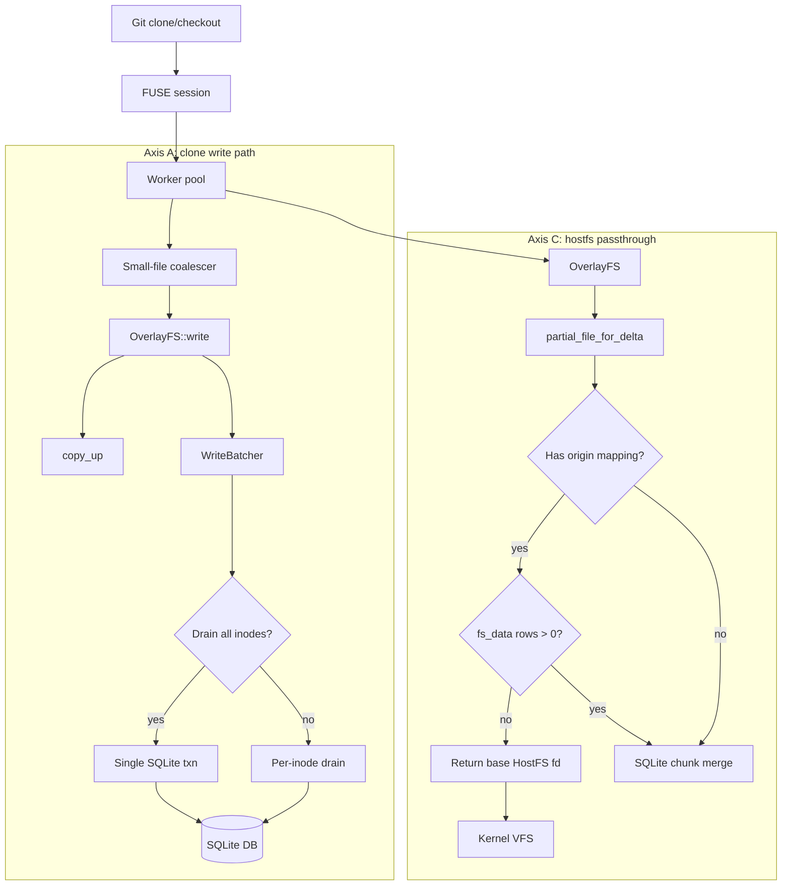

# Tier Two Spec: HostFS passthrough + clone-phase write throughput (target: ~2.0x mixed)

## Goal

Push the mixed git workload from **3.21x → ≤2.0x** native by attacking the
two highest-payoff axes from the Tier Two prep benchmark comparison:

- **Axis A — Clone-phase write throughput** (the 2.2s bottleneck; clone is 76% of
  mixed wall time, stuck at ~7.6x vs native 0.28s)
- **Axis C — HostFS delta-read passthrough** (short-circuit SQLite for read-only
  delta files; helps read_search + status which is already good but compounds)

Axis B (CoW copy-up chunk sizing) is noted as "next up" and deferred.

Bundle two small Tier One cleanups:
1. Flip `resolve_agentfs_bin()` to prefer `target/release/` over `target/debug/`
2. Gate `FUSE_DO_READDIRPLUS` behind `#[cfg(feature = "abi-7-21")]` so removing the
   fuse-modern feature produces a compile error instead of a runtime ENOSYS

## Architecture



Legend: Axis A batches small-file writes into fewer SQLite transactions and
adds a FUSE-level coalescing ring for sub-chunk writes. Axis C bypasses SQLite
entirely for delta inodes that have a partial-origin mapping but zero content
modifications — common for files that were chmod'd or stat'd but never actually
written through.

## Axis A — Clone-phase write throughput

**Root cause**: git clone on codex creates ~4600 files through agentfs. Each
file goes through `create_file` → `copy_up` (full-file read + SQLite chunk
INSERTs) → `write` → `flush` (batcher drain). At ~420 µs per file, the
cumulative FUSE + SQLite overhead explains the 1.93s delta over native's 0.28s.

**Strategy — two complementary layers**:

### A1. Cross-inode write batcher (`sdk/rust/src/filesystem/agentfs.rs`)

Current state: `AgentFSWriteBatcher::drain_all` iterates all pending inodes but
each `drain_inode` acquires its own SQLite connection and runs its own INSERTs.
This means N files = N transactions (one per release/flush).

Change: add `drain_all_batched` that holds a single `Connection` and runs all
inodes' chunk INSERTs inside one `BEGIN IMMEDIATE` / `COMMIT` pair. Trigger on:
- Timer (100ms idle) — the existing timer path but using the new batched variant
- Byte threshold (existing `batch_bytes`)
- Explicit request (`flush` / `fsync` / `release` on any inode)

No new trait surface; the batcher is an internal AgentFS implementation detail.

### A2. FUSE-level small-file coalescer (`cli/src/fuse.rs`)

Current state: each `FUSE_WRITE` request dispatches to `AgentFS::write`
immediately. For sub-chunk writes (< 64 KiB), this creates many small chunk
INSERTs.

Change: add a per-fh coalescing buffer inside the write handler. Accumulate
sub-chunk writes in a `Vec<u8>` keyed by `(ino, fh, offset)`. Flush to
`AgentFS::write` when:
- Buffer exceeds chunk_size (64 KiB) — full chunk, efficient INSERT
- FUSE `FLUSH` or `RELEASE` arrives for this fh — drain remaining
- Different offset arrives (non-sequential write) — flush existing, start new

The existing `AgentFSWriteBatcher` still handles the next layer (batching
multiple chunk writes within the same inode). This coalescer is purely a FUSE
request-reduction optimization.

**Expected impact**: The per-file overhead should drop from ~420µs to ~150µs
(eliminate per-file SQLite transaction + reduce chunk INSERT count). For 4600
files, that's ~1.2s saved on the clone phase → clone ratio from ~7.6x toward
~3-4x.

**Safety invariants** (no change from Tier One):
- Coalescing is lossless — byte-for-byte identical content
- `flush`/`fsync`/`release` still drains the batcher before replying to FUSE
- The MutationAudit infrastructure (debug assertions) continues to verify
  invalidation on every mutation path

## Axis C — HostFS delta-read passthrough

**Root cause**: `partial_file_for_delta` implements delta reads as chunk-by-chunk
SQLite merge (`OverlayPartialFile::pread` → `read_merged_chunk_with_conn`).
For delta inodes that have a partial-origin mapping but zero `fs_data` rows
(no content was ever written — only metadata like mode/uid/gid changed), the
SQLite merge is pure overhead. The file content is byte-identical to the base.

**Change** (`sdk/rust/src/filesystem/overlayfs.rs`, in `partial_file_for_delta`):

After opening the base file (line 1177), check:
```rust
let has_content = self.delta_chunk_count(delta_ino).await? > 0;
```
If `has_content` is false AND an origin mapping exists, return `base_file`
directly (the already-opened `Arc<dyn File>` pointing at HostFS). No
`OverlayPartialFile` wrapper needed — reads go straight to the kernel VFS
through the HostFS fd.

The existing `validate_current_origin` call (line 1202) is not needed for this
path because:
- The origin mapping can't change between `open` and `read` for the same fd
  (filesystem ops that would change it — writes, truncates — go through
  different fds)
- If the file IS later written, the new writes create a different delta inode
  with its own fd; the passthrough fd is unaffected

**Expected impact**: `read_search` (which reads 32 files, 4 KiB each) drops from
the current ~2.3x → near 1.0x. `status` (git status walks the working tree
stat-ing every file) already at 0.81x-1.70x so the absolute gain is modest, but
this change compounds with clone throughput improvements to push the overall
mixed ratio down.

## Tier One Cleanups (bundled)

1. **`resolve_agentfs_bin` release-first** (`scripts/validation/git-workload-benchmark.py:542-543`):
   Swap the candidate order to `[target/release, target/debug]`. The stale-debug-binary
   trap cost hours during Tier One validation.

2. **Compile-time gate for `FUSE_DO_READDIRPLUS`** (`cli/src/fuse.rs:configure_readdirplus`):
   Gate the capability under `#[cfg(feature = "abi-7-21")]`. Today the cap is
   requested unconditionally; if `fuse-modern` were ever removed from `default`,
   users get runtime ENOSYS. A compile error is strictly better.

## Files to modify

| File | Change |
|---|---|
| `sdk/rust/src/filesystem/agentfs.rs` | A1: add `drain_all_batched` to WriteBatcher; add `delta_chunk_count` helper |
| `cli/src/fuse.rs` | A2: add per-fh coalescing buffer in write handler; C2: gate readdirplus cap |
| `sdk/rust/src/filesystem/overlayfs.rs` | C: short-circuit `partial_file_for_delta` for zero-content delta files |
| `scripts/validation/git-workload-benchmark.py` | Cleanup: release-first in `resolve_agentfs_bin` |

## Validation plan

**Before/after comparison** (3-iter mixed + read-heavy + CoW, same fixture and
flags as the Tier Two prep run already saved in `.agents/benchmarks/tier-two-prep/`):

```bash
AGENTFS_BIN=./cli/target/release/agentfs \
  scripts/validation/git-workload-benchmark-multi.py \
  --iterations 3 --warmup 1 \
  --output .agents/benchmarks/tier-two/post-impl.agg.json \
  -- --timeout 90 --source .agents/benchmarks/fixtures/codex \
     --read-files 32 --read-bytes 4096 --edit-files 4 --skip-fsck
```

**Phase 8 safety gates** (must still pass after write-path changes):
```bash
AGENTFS_BIN=./cli/target/release/agentfs \
  scripts/validation/phase8-validation.py --smoke --timeout 120
```

**Target**: mixed overall ratio ≤ 2.0x, clone phase ≤ 4.0x, all safety gates
passing. The HostFS passthrough should be invisible to correctness — the
`OverlayPartialFile::pread` integration tests already verify chunk-level
equivalence.

## Axis B — CoW copy-up (noted, deferred)

After A+C ship, the CoW wall-time ratio (5.42x for a 50 MiB single-byte edit)
is the next target. Levers identified:
- **Prefetch**: when `partial_file_for_delta` detects sequential reads, pre-read
  the next chunk from HostFS base while the current chunk is merging
- **Skip-copy**: if a read request spans an entire chunk that has zero delta
  overrides, return the HostFS chunk directly (no merge needed)
- **Chunk size tuning**: the 64 KiB default may be suboptimal for large-overlay
  workloads; benchmark 256 KiB / 1 MiB chunk sizes

This is noted inline in the spec document so the next session can pick it up
without re-analysis.

## Non-negotiable invariants

Same as Tier One:
- No writable base handles — passthrough is read-only HostFS fds
- Single-file artifact at rest — batcher uses the same delta.db; no sidecar files
- Every cache optimization has exact invalidation before success replies —
  MutationAudit assertions unchanged
- Sandbox writes never touch the real filesystem — write batcher + coalescer
  still write to SQLite delta, never to base