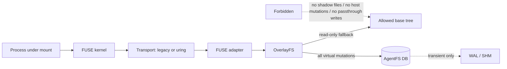
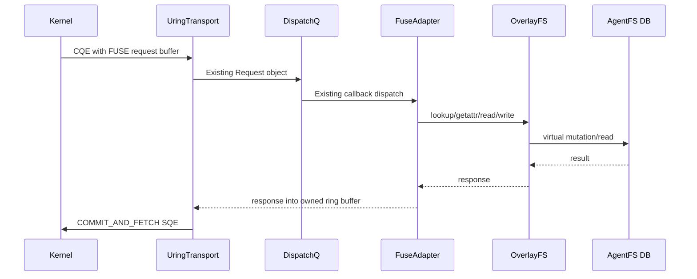

## Goal
Reduce metadata overhead and evaluate a FUSE-over-io_uring transport without weakening either AgentFS invariant:

1. **Persistence remains single-file:** all virtual filesystem state/content remains in the AgentFS SQLite database; SQLite `-wal`/`-shm` sidecars are allowed only as the existing transient database mechanism and are finalized as today.
2. **The exposed base tree remains read-only:** no optimization may mutate, shadow, materialize, or passthrough-write host/base files. Reads remain constrained by the existing allowed-root overlay boundary.

This explicitly **rejects the old shadow-tree/FOPEN_PASSTHROUGH Tier 6 design**: it would materialize virtual content in host files and violates the selected security contract.

## Grounded current state

- Tier 4 is the committed starting point (`daf67ef` / `6e2c856`); do not touch the existing untracked `.agents/05_29_2026/` directory.
- Metadata acceleration already exists: 1s entry/attr/negative TTLs, exact invalidations on mutation, `FOPEN_KEEP_CACHE`, and `READDIRPLUS=auto` under the default `fuse-modern` feature.
- The vendored FUSE transport still receives requests via blocking `/dev/fuse` `read()` and replies via `writev()` in `cli/src/fuser/{channel,session,reply}.rs`.
- This host is suitable for an io_uring spike: Linux headers expose FUSE protocol 7.42 (`FUSE_OVER_IO_URING`, `FUSE_IO_URING_CMD_REGISTER`, `FUSE_IO_URING_CMD_COMMIT_AND_FETCH`) and kernel config includes `CONFIG_IO_URING=y` and `CONFIG_FUSE_FS=y`. The repo currently builds protocol only through 7.31, although dormant 7.36/7.40 struct conditionals already exist.

## Non-negotiable architecture boundary

- `Transport` may change how callbacks cross the kernel/userspace boundary; it must not change `OverlayFS` routing or storage semantics.
- `HostFS` mutation methods remain unreachable from the overlay write path; no shadow-tree, real-file copy-up destination, or FOPEN passthrough will be introduced.

## Phase 1 — Measurement and safety instrumentation

### 1.1 Preserve and harden the invariants first

Extend the existing validation surface rather than relying on performance tests alone:

- Reuse/extend `scripts/validation/partial-origin-no-real-write.py` to exercise create, overwrite, truncate, rename, unlink, chmod/utimens, and concurrent read-after-write through the mount.
- Snapshot/hash the allowed base tree before and after each run; fail on any content or stable metadata mutation outside the AgentFS session DB and its transient SQLite sidecars.
- Verify clean remount from the single DB reproduces all virtual mutations, proving no hidden host-side state was introduced.
- Run these checks for every candidate mode: legacy transport + baseline metadata mode, legacy + optimized metadata mode, and io_uring mode once available.

### 1.2 Make metadata cost measurable by phase

Add profiling needed to separate kernel round-trips from cheaper daemon/backend work:

- In `sdk/rust/src/profiling.rs`, add counters for FUSE adapter `entry_cache` hit/miss, `attr_cache` hit/miss, and invalidation notification counts, while preserving existing kernel-callback (`fuse_lookup_count`, `fuse_getattr_count`, `fuse_readdir_plus_count`) and backend cache counters.
- In the git/read benchmark tooling, record profile summaries for isolated metadata-heavy operations (at minimum `checkout`, `status`, `diff`, and read/search), plus clone separately, instead of inferring cause from one aggregate summary.
- Establish a Tier 4 control run before promoting any behavior: `AGENTFS_FUSE_READDIRPLUS=auto`, legacy read/write transport, N≥9 with ≥2 warmups.

## Phase 2 — Cut avoidable metadata round-trips using existing safe machinery

The first candidate is deliberately narrow and storage-neutral: **promote `READDIRPLUS` from kernel-selected `auto` to `always` only if it reduces real callbacks.** It is already implemented, ABI-supported by the default build, and replies with attrs/entry TTLs through the same invalidation regime.

### Implementation

- Use `AGENTFS_FUSE_READDIRPLUS=always` for an A/B run against the Tier 4 control before changing defaults.
- If the gate below passes, change `readdirplus_mode_from_env()` default from `Auto` to `Always`, retaining `AGENTFS_FUSE_READDIRPLUS=auto|off` as rollback controls.
- Add tests that `readdirplus`-seeded kernel/adapter entries are invalidated correctly after create, write/truncate, rename-overwrite, unlink, and copy-up mutations.
- Do **not** increase TTL values in this tier: asynchronous invalidation currently gives safe bounded staleness at the existing 1s fallback, and lengthening that window without stronger failure handling would weaken the safety model.

### Metadata promotion gate

Promote `READDIRPLUS=always` only if all are true:

- base-tree/no-real-write and consistency gates pass;
- `fuse_lookup_count + fuse_getattr_count` falls by at least **10%** on at least one metadata-heavy operation and does not increase on the others;
- median wall time improves or remains within **5%** on every canonical phase;
- no increase in stale-read, invalidation, or Phase 8 failures.

If the gate does not pass, retain `auto` and record the result as evidence that remaining metadata callbacks are not removable through readdir seeding; do not ship complexity without a measured win.

## Phase 3 — Linux-only FUSE-over-io_uring transport spike

This spike targets callback transport cost, not storage or semantic behavior.

### Transport implementation

- Add a Linux-only optional feature/configuration for the spike: `AGENTFS_FUSE_TRANSPORT=uring`; default remains the existing `readwrite` `/dev/fuse` transport. A specifically requested unsupported uring mode must fail loudly rather than silently benchmark the legacy path.
- Extend the vendored FUSE ABI feature cascade through protocol **7.42** in `cli/Cargo.toml` and `cli/src/fuser/ll/fuse_abi.rs`/`ll/request.rs`:
  - extended init flags/`flags2`;
  - `FUSE_OVER_IO_URING` negotiation;
  - `fuse_uring_req_header`, `fuse_uring_cmd_req`, and uring command constants copied from the installed UAPI definitions.
- Add an optional Linux `io-uring` dependency for the experimental transport and implement a new transport alongside `Channel` in `cli/src/fuser/`:
  - register a bounded set of request buffers on `/dev/fuse` using `IORING_OP_URING_CMD` + `FUSE_IO_URING_CMD_REGISTER`;
  - convert completed request buffers into the existing `Request` dispatch path;
  - implement a ring-backed `ReplySender` that serializes the existing reply into its owned buffer and submits `FUSE_IO_URING_CMD_COMMIT_AND_FETCH`;
  - retain current scheduling/worker lanes and deferred invalidation semantics wherever the kernel ABI permits; verify notification behavior before running mutation workloads.
- Add explicit profiling for active transport, ring registration success/fallback/error, CQE request count, and transport wait time, so a run cannot be mistaken for legacy mode.

### Spike limitations

- Do not add `FOPEN_PASSTHROUGH`, backing fd exposure, writable shadow files, or any alternate data persistence path.
- The spike may reduce cost per metadata callback; it will not itself reduce callback count. It is evaluated separately from `READDIRPLUS=always` and then in combination.

## Phase 4 — Validation and re-touching the target

### Correctness/security gate (must pass before performance is considered)

- `cargo fmt --check`, clippy, SDK tests, and CLI tests using the repository’s existing commands discovered during implementation.
- Full Phase 8 validation suite, including concurrent git/writeback/durability/no-fsync crash coverage.
- Expanded no-real-write validation: base tree byte/metadata snapshot unchanged after every mutation class and after crash/remount; only DB/WAL/SHM contain virtual writes.
- io_uring mode must run the same applicable safety gates; if notification/mutation semantics cannot be made equivalent in the spike, keep uring read-only/benchmark-only and mark it NO-GO for shipping.

### Performance matrix

Run N≥9, ≥2 warmups for each supported configuration:

| Run | Transport | Metadata mode | Purpose |
| --- | --- | --- | --- |
| A | legacy read/write | readdirplus auto | committed Tier 4 control |
| B | legacy read/write | readdirplus always | metadata callback reduction |
| C | io_uring | promoted metadata mode | transport benefit |
| D | legacy read/write | promoted metadata mode | matched comparator for C |

Measure per-phase elapsed time and callback/backend counters; do not use one aggregate ratio to explain causality.

### Decision gates

- **Metadata GO:** the promotion gate in Phase 2 passes; otherwise do not change its default.
- **io_uring GO for further development:** registration is confirmed, safety gates pass in supported workload classes, and matched C vs D shows either ≥**15%** reduction in a metadata-heavy phase median or ≥**25%** reduction in measured transport/dispatch wait without a phase regression >5%.
- **1.5x target assessment:** after the winning safe configuration is established, report each canonical operation against `≤1.5x native` and the mixed median. Declare success only if measured; otherwise identify the remaining callback classes/costs from the new per-phase counters and stop rather than introducing storage/security compromises.

## Expected files/surfaces

- Metadata/profiling: `cli/src/fuse.rs`, `sdk/rust/src/profiling.rs`, validation benchmark scripts and tests.
- Uring spike: `cli/Cargo.toml`, `cli/Cargo.lock`, `cli/src/fuser/{mod.rs,session.rs,channel.rs,reply.rs,ll/fuse_abi.rs,ll/request.rs}` plus focused tests.
- Storage code (`sdk/rust/src/filesystem/{agentfs.rs,overlayfs.rs,hostfs_linux.rs}`) changes only if needed for invariant tests or profiling; **no new persistence path**.

## Delivery sequence

1. Add safety/per-phase profiling gates and capture the committed baseline.
2. A/B `READDIRPLUS=always`; promote only on the specified measurable win.
3. Build the feature-gated io_uring transport spike and validate it against the same safety contract.
4. Run the matched benchmark matrix, decide GO/NO-GO, and report whether `≤1.5x` was achieved without violating AgentFS’s principles.