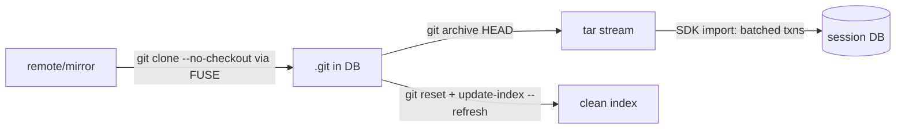

# Goal artifact: per-phase ≤1.5x native (codex canonical workload + read-path benchmark)

**Invariants (non-negotiable, apply to every workstream):** (1) whole state lives in the single session DB file; (2) no writes to the user's filesystem except that DB file. Reads of the user's FS are allowed.

## Scoreboard (current @ 121fdd4 → target)

| Phase | Now | Target | Lever |
|---|---|---|---|
| clone | **2.34x** via `agentfs clone` (WS3 done; was 8.41x via plain FUSE) | **≤1.5x**; plain-FUSE path stays ~8x (bottoms ~5x) | WS3 done; residual = pack+import double write |
| checkout | 0.99x | hold ≤1.5x | — |
| status | 2.41x | ≤1.5x | WS1+WS2 |
| read_search | 3.39x | ≤1.5x | WS1 |
| diff | 2.79x | ≤1.5x | WS1+WS2 |
| edit | 14.5x (8ms) | ≤3ms absolute; 1.5x likely unreachable at this absolute scale, recorded honestly | WS2 |
| fsck | 1.07x | hold ≤1.5x | — |
| read-path warm steady | 12.7x | ≤1.5x | WS1 |

First commit: write this scoreboard + plan to `.agents/specs/2026-06-11-per-phase-1.5x-roadmap.md` and update it after each workstream's verdict.

## WS1 — Read-side kernel caching (TTL 10s)
1. `cli/src/fuse.rs`: split `DEFAULT_FUSE_TTL_MS` into entry/attr default **10_000ms** and negative default **1_000ms** (existing `AGENTFS_FUSE_{ENTRY,ATTR,NEG}_TTL_MS` env overrides remain the kill switch). Document the cross-mount staleness bound (second `agentfs run --session` mount sees attr changes within 10s; negatives within 1s).
2. Verify FOPEN_KEEP_CACHE engages on warm re-opens (steady-state reads must come from page cache, not FUSE READ).
3. Acceptance: read-path warm steady-state ≤1.5x; clone-phase lookups drop (dentries now outlive the ~4s workload); status/diff/read_search improve; alternating idle-host A/B (8 pairs) + full correctness gates (incl. a cross-mount visibility sanity check: mount B sees mount A's mutation within 10s).

## WS2 — Per-request cost (47µs avg → ~15µs)
1. **Measure first**: add per-op latency nanos to `sdk/rust/src/profiling.rs` (lookup/getattr/read/write/flush/release/setattr handler wall time), run clone, rank the top costs. No optimization before this breakdown exists.
2. Fix top-3 measured offenders. Known candidates (validate against data, don't assume): `block_on` runtime hop on paths that are memory-only (e.g. write-enqueue into the batcher could be a sync call), per-request allocations (`data.to_vec()` in write), dispatch/lane overhead, tracing format cost.
3. Acceptance: measured mean per-dispatch overhead during clone falls; edit phase ≤3ms; A/B + gates as usual.

## WS3 — `agentfs clone`: bulk ingest without per-file FUSE round trips
New CLI command orchestrating (no new heavy deps; uses system git + SDK):

1. SDK bulk-ingest: `import_tree(tar_or_dir, dest)` in `sdk/rust/src/filesystem/agentfs.rs` — writes inodes+data in bounded multi-inode transactions (reuse `AGENTFS_BATCH_TXN_INODES/_BYTES` machinery, ~0.3s expected for 63MiB/4.7k files). Exposed as `agentfs fs import`.
2. `agentfs clone <url> <dst>`: `git clone --no-checkout` through the mount (pack = few large sequential writes, already fast) → `git archive | import` → `git reset --mixed` + `update-index --refresh` so `git status` is clean. All writes land in the DB; invariants hold.
3. Benchmark: add an `agentfs-clone` variant to `git-workload-benchmark.py` measuring it as the clone phase; keep plain-FUSE clone measured alongside (target ~2.5x there).
4. Fallback recorded in spec notes: if git-orchestration overhead (archive + refresh re-stat) eats the win, evaluate gitoxide-based in-process checkout before considering LD_PRELOAD interception.
5. Acceptance: `agentfs clone` phase ≤1.5x native clone; resulting repo passes fsck --strict, `git status` clean, full correctness + mutation gates.

## Process (every workstream)
Kill-switch-gated implementation → SDK/CLI tests + clippy/fmt → correctness gates (phase8 suite, metadata-mutation, overlay-OFF clone) → idle-host alternating A/B (8 pairs, paired-ratio verdict) → GO/NO-GO entry in spike notes + scoreboard update → commit + push (code commit, then docs/verdict commit).

Order: WS1 → WS2 → WS3, re-running the full scoreboard after each so the artifact always reflects measured reality.

## Status log
- **WS3 (2026-06-11): DONE — `agentfs clone` lands at 2.34x (from 8.41x; target ≤1.5x missed, recorded honestly).** SDK `AgentFS::import_entries` bulk import (bounded multi-inode transactions, parents-before-children, inline/chunked/symlink storage, dentry UNIQUE → AlreadyExists) + CLI `agentfs clone <db> <source> [name]`. Pipeline deviates from spec (see notes): `git clone --no-checkout` through a temp mount → `ls-tree -r -z` + `cat-file --batch` → `import_entries` → fabricate git index v2 with cached stat data matching what the FS serves (ino/dev/size/times/sha), instead of `git archive | import` + `update-index --refresh` (refresh would re-stat+re-read every file through FUSE). Acceptance benchmark (`scripts/validation/agentfs-clone-benchmark.py`, codex fixture, 5 iters): native median 0.374s, agentfs 0.875s, ratio 2.34x (paired 2.48x), every iteration verified — `git status` clean through a FRESH mount, `git fsck --strict` clean, sha256 worktree hash identical to native. Stage budget (`AGENTFS_CLONE_TIMINGS=1`): git-clone-no-checkout 330ms (pack write into DB), import 288ms (42.8MB → DB), cat-file 104ms, ls-tree 37ms, index 6ms, process+mount ~85ms. Residual gap is the content double write (pack + worktree, both into the single DB — same shape as native's pack+worktree but against SQLite txns); candidate future shaves: overlap cat-file with import, larger import txns, shared-clone pack reuse. Limitations: no submodules, no smudge/clean filters, SHA-1 repos only.
- **WS2 (2026-06-11): DONE (instrumentation + create fast path + critical-path discovery; deep per-request work deferred behind WS3).** Per-op dispatch latency counters added (`fuse_op_<op>_{count,nanos}`, dispatch-wrapped parse→handler→reply). Findings: dispatch-time ranking ≠ critical-path ranking — setattr (857ms-1.2s) is issued async by kernel writeback and never blocks git (deferred-SETATTR A/B parity re-confirmed at today's HEAD, paired median 1.008 → stays opt-in permanently). Git-visible sync ops in clone ≈ 1.07s of the 2.84s overhead; the rest is queue wait, kernel round trips, and SQLite write-lock contention (sync creates queue behind async setattr txns). create_file fast path: existence pre-check SELECT replaced by dentry UNIQUE-constraint mapping, parent mtime/ctime stashed into the batcher overlay instead of an in-txn UPDATE → 145µs → 125µs (txn-boundary ~115µs floor now dominates; only create-deferral or WS3 bypass goes lower). Conclusion: FUSE clone bottoms out ~5x even with all sync dispatch zeroed → WS3 `agentfs clone` is the only ≤1.5x clone route; read-path per-request work (read 83µs, open 46µs) revisited after WS3.
- **WS1 (2026-06-11): DONE, minor lever.** Entry/attr TTL default 1s→10s (neg stays 1s). Git workload: lookups −32% (18.2k→12.3k), getattrs +2.6k (revalidation shift), net dispatches −4-9%; wall time flat. Read-path steady-state hypothesis falsified: request counts identical across TTLs (one round trip per object per mount); its ≤1.5x target moves to WS2 (per-request cost, measured ~98µs/req on metadata-heavy paths). Cross-mount sanity passed (create ≤1s, modify immediate; `run --session` joins the same mount). Correctness gates green; phase8 perf thresholds pre-existing stale (followup logged).