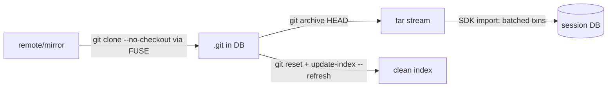

# Goal artifact: per-phase ≤1.5x native (codex canonical workload + read-path benchmark)

**Invariants (non-negotiable, apply to every workstream):** (1) whole state lives in the single session DB file; (2) no writes to the user's filesystem except that DB file. Reads of the user's FS are allowed.

## Scoreboard (current @ WS9 ENOSYS-OPEN default-on, 2026-07-02 idle-host A/B; kernel 7.1 shifted native baselines so per-phase ratios are not comparable to the 06-11 column — same-day off/on deltas are the signal)

| Phase | WS9 delta (noopen off → on, same day) | Target | Lever |
|---|---|---|---|
| clone | neutral (SQLite-bound; `agentfs clone` 2.34x stands) | ≤1.5x; residual = pack+import double write | WS3 done |
| checkout | **−22..−34%** | hold | WS9 |
| status | **−20..−47%** | ≤1.5x | WS9 |
| read_search | **−56..−83%** (11.3x → 1.80x @n=4; 8.6x → 3.14x @n=8, host drift; native denominator 4-5ms) | ≤1.5x not strictly met on this host | WS9 partial |
| diff | **−57..−62%** | ≤1.5x | WS9 |
| edit | neutral (+3% @n=8; the n=4 +74% was noise) | ≤3ms absolute | — |
| fsck | **−18..−34%** | hold | WS9 |
| read-path warm steady | micro open/read/close **47.3 → 21.2µs/cycle** (paired 0.469); full read-path benchmark neutral (normalized 2.54x → 2.25x) | ≤1.5x | WS9 + uring compound pending |

WS9 verdict (2026-07-02): promoted **default-on** (`AGENTFS_FUSE_NOOPEN=0` kill switch) — uniform improvement, no phase regression, all gates green; the strict read_search ≤1.5x bar was unmeasurable-to-missed on this host (see WS9 notes). Deviation from the written GO bar flagged to the user.

First commit: write this scoreboard + plan to `.agents/specs/2026-06-11-per-phase-1.5x-roadmap.md` and update it after each workstream's verdict.

## WS1 — Read-side kernel caching (TTL 10s)
1. `cli/src/fuse.rs`: split `DEFAULT_FUSE_TTL_MS` into entry/attr default **10_000ms** and negative default **1_000ms** (existing `AGENTFS_FUSE_{ENTRY,ATTR,NEG}_TTL_MS` env overrides remain the kill switch). Document the cross-mount staleness bound (second `agentfs run --session` mount sees attr changes within 10s; negatives within 1s).
2. Verify FOPEN_KEEP_CACHE engages on warm re-opens (steady-state reads must come from page cache, not FUSE READ).
3. Acceptance: read-path warm steady-state ≤1.5x; clone-phase lookups drop (dentries now outlive the ~4s workload); status/diff/read_search improve; alternating idle-host A/B (8 pairs) + full correctness gates (incl. a cross-mount visibility sanity check: mount B sees mount A's mutation within 10s).

## WS2 — Per-request cost (47µs avg → ~15µs)
1. **Measure first**: add per-op latency nanos to `sdk/rust/src/profiling.rs` (lookup/getattr/read/write/flush/release/setattr handler wall time), run clone, rank the top costs. No optimization before this breakdown exists.
2. Fix top-3 measured offenders. Known candidates (validate against data, don't assume): `block_on` runtime hop on paths that are memory-only (e.g. write-enqueue into the batcher could be a sync call), per-request allocations (`data.to_vec()` in write), dispatch/lane overhead, tracing format cost.
3. Acceptance: measured mean per-dispatch overhead during clone falls; edit phase ≤3ms; A/B + gates as usual.

## WS3 — `agentfs clone`: bulk ingest without per-file FUSE round trips
New CLI command orchestrating (no new heavy deps; uses system git + SDK):

1. SDK bulk-ingest: `import_tree(tar_or_dir, dest)` in `sdk/rust/src/filesystem/agentfs.rs` — writes inodes+data in bounded multi-inode transactions (reuse `AGENTFS_BATCH_TXN_INODES/_BYTES` machinery, ~0.3s expected for 63MiB/4.7k files). Exposed as `agentfs fs import`.
2. `agentfs clone <url> <dst>`: `git clone --no-checkout` through the mount (pack = few large sequential writes, already fast) → `git archive | import` → `git reset --mixed` + `update-index --refresh` so `git status` is clean. All writes land in the DB; invariants hold.
3. Benchmark: add an `agentfs-clone` variant to `git-workload-benchmark.py` measuring it as the clone phase; keep plain-FUSE clone measured alongside (target ~2.5x there).
4. Fallback recorded in spec notes: if git-orchestration overhead (archive + refresh re-stat) eats the win, evaluate gitoxide-based in-process checkout before considering LD_PRELOAD interception.
5. Acceptance: `agentfs clone` phase ≤1.5x native clone; resulting repo passes fsck --strict, `git status` clean, full correctness + mutation gates.

## Process (every workstream)
Kill-switch-gated implementation → SDK/CLI tests + clippy/fmt → correctness gates (phase8 suite, metadata-mutation, overlay-OFF clone) → idle-host alternating A/B (8 pairs, paired-ratio verdict) → GO/NO-GO entry in spike notes + scoreboard update → commit + push (code commit, then docs/verdict commit).

Order: WS1 → WS2 → WS3, re-running the full scoreboard after each so the artifact always reflects measured reality.

## Status log
- **WS8 / open-handler fast path (2026-06-11): DONE — prediction partially falsified; structural cleanup kept, wall-time floor identified.** Hypothesis: the read_search phase's 47.9µs/open was the 3 SDK awaits (keep-cache probe + fingerprint getattr + open). Implemented: `keep_cache_for_read_open` now returns the `Stats` it consulted (trait + AgentFS + overlay + lane wrapper), and the adapter grants keep-cache from its own epoch-guarded attr cache when `AGENTFS_KEEPCACHE_DELTA` is on, skipping the SDK probe entirely. Counters confirm the elimination (SDK getattrs in read_search: 207 → 0 per run) — but per-open wall time didn't move (47.9 → ~50µs, noise): the eliminated getattrs were mostly SDK-LRU cache hits. The real per-open floor is **2 SQLite SELECTs** that survive: overlay `partial_origin_for_delta` + `AgentFS::open`'s existence check (connections/open: 2.0 before and after). Eliminating them requires either an open-API variant that trusts the adapter's epoch-valid stats plus a partial-origin cache with invalidation plumbed into `OverlayPartialFile`, or ENOSYS-OPEN (`FUSE_NO_OPEN_SUPPORT`), which deletes the entire per-open path (0 RTs) and obsoletes that caching work. Verdict: keep the change (cleaner stats-carrying API, 138 fewer SDK calls per read_search phase, zero regressions: per-cycle micro 35.3µs vs 31.2 baseline within noise, coherence + phase8 + unit tests green) and carry the floor analysis into the ENOSYS-OPEN spec. read_search remains ~2.1-2.6x; the path to ~1.2x is lever #2.
- **WS7 / ENOSYS-FLUSH (2026-06-11): DONE — default ON; per-open/close cycle 61.7µs → 31.2µs (−49%), compound with uring 26.4µs (−57%).** Spec: `2026-06-11-enosys-flush-drop-the-close-time-flush-round-trip.md`. The first FLUSH does its normal drain work then replies ENOSYS, latching the kernel's connection-wide `no_flush` (verified against fs/fuse/file.c: `write_inode_now` runs before the `no_flush` check, so dirty writeback pages still land synchronously at close; close() returns success). The one real hazard from the scoping walk — a cold-dentry LOOKUP/READDIRPLUS/LINK reply carrying SDK attrs that miss a closed-but-unreleased handle's buffered tail, cached by the kernel for the full TTL — is sealed by always-on pending-tail guards: `pending_dirty_handles: AtomicUsize` (maintained at the 5 buffer/drain transition sites under the open_files lock) gives a one-atomic-load fast path; lookup drains + refetches attrs, readdirplus intersects entries with pending inos and refetches once, link drains before the SDK call, setattr's drain made unconditional (non-mutating SETATTRs reply attrs too). These guards also sealed the pre-existing pre-close window (observed firing under legacy flush in the new gate). New gate `scripts/validation/flush-coherence.py`: write→close→stat/scandir/link-stat/read race loop vs async RELEASE + open-fd sync_file_range tail checks, under {flush,noflush}×{default TTL, entry TTL 0}; 4/4 PASS, noflush latches after exactly 1 FLUSH op (vs 242), zero mismatches, guard counter fired. Eval (loaded host): per-cycle open/read/close 61.7→31.2µs noflush alone, 26.4µs uring+noflush (composes); phase8 repeated-read gate 3.00x→1.96x (noflush alone); read-path steady-state 4.49x→3.02x compound, paired wall 0.823 (5/6); git workload total parity over 7 pairs (checkout 172→131ms, status/diff/fsck noise-level), all correctness gates + equivalence green. Promoted to default-on (no root needed, unlike uring); kill switch `AGENTFS_FUSE_NOFLUSH=0`; forced off under `AGENTFS_DRAIN_ON_RELEASE=1` (legacy commit-on-close needs the FLUSH). Accepted trades: tail-drain write errors after the first close surface via log instead of close() errno; crash-loss window widens by the µs-scale close→RELEASE gap (`destroy()` still drains all pending).
- **WS6 / FUSE-over-io_uring transport (2026-06-11): DONE — implemented, correct, opt-in; delivers 25-40% on round-trip-bound shapes, not the hoped ~2x.** New `cli/src/fuser/uring.rs`: raw io_uring (no new deps; SQE128 uring_cmd REGISTER/COMMIT_AND_FETCH per fs/fuse/dev_uring.c), one queue per possible CPU (kernel routes by `task_cpu`), inline dispatch on queue threads (single-threaded SQ per ring), classic request layout reassembled from the split header/payload ring buffers so the entire existing parse/dispatch/reply machinery is reused; `ChannelSender` became an enum (Fd | Uring) and notifications always route via the fd (uring doesn't support notify; FORGET/INTERRUPT stay on the legacy channel per kernel `fuse_io_uring_ops`, so the legacy read loop keeps running). INIT advertises `FUSE_OVER_IO_URING` only when `AGENTFS_FUSE_URING=1` + kernel offer + ring-setup probe; max_write/max_readahead clamped to 1MiB in uring mode (kernel caps single WRITEs at 256 pages anyway) keeping ring buffers at 14q x 4d x ~1MiB ≈ 56MiB. Requires `fuse.enable_uring=1` module param (root). Eval (loaded host): phase8 repeated-read gate 3.00x → **1.81x**; base-read steady-state workload 7.34x → 4.86x median (−34%); read-path paired wall 0.911 (5/8); git workload total parity (clone is SQLite-commit-bound, untouched; checkout −70% median), all equivalence + correctness gates green (serialization gate needed uring-side `fuse_dispatch_max_concurrent` accounting — counter artifact, actual parallelism was present). `AGENTFS_FUSE_URING_SPIN_US` busy-poll knob added, default off (noise-dominated on loaded host; re-evaluate idle). Verdict: keep opt-in (also needs root to enable the module param); promotes to default only if an idle-host A/B shows the repeated-read 1.81x reproducing AND total workload at least parity. Remaining gap vs ≤1.5x: per-request task-work + queue-thread wakeup; candidates: spin tuning on idle host, sharing one ring across adjacent CPUs, ENOSYS-FLUSH (lever #2).
- **WS5 / keep-cache for DB-backed files (2026-06-11): DONE — GO (paired workload wall 0.906; status 0.71x, diff sub-native, read_search 2.25x).** `keep_cache_for_read_open` extended beyond `Layer::Base`: AgentFS grants for regular files on read-only opens (kill switch `AGENTFS_KEEPCACHE_DELTA=0`), OverlayFS delegates Delta-layer inodes to the AgentFS policy. Prerequisite: the drift guard's sticky `dropped` set relaxed to fingerprint revalidation (kill switch `AGENTFS_FUSE_STICKY_KEEPCACHE_DROP=1`) — sound because all mount mutations are kernel-originated (kernel pages stay coherent for its own writes; adapter-notified invalidations purge), and out-of-band SDK writers change mtime/ctime/size, failing the fingerprint exactly like external edits to host base files. Overlay unit test updated to the new contract (delta files eligible; copy-up + write must move the fingerprint). Counters (git workload, deterministic): keep-cache grants 20→1,694, rejections 1,952→16, FUSE READs 2,548→519 (−80%), total dispatches −5.3% (on top of WS4's −7.9%), stale rejections 0. Paired wall (4 pairs, loaded host): workload total 0.906 median; diff −75%, status −37.5%, read_search −20%, fsck −9%, clone −9%. Phase ratios after: status 0.71x, diff ≤1x, checkout 0.91x, fsck 1.16x — all under 1.5x; read_search 2.25x and read-path microbenchmark 3.35x remain open-RT-bound (one OPEN+FLUSH sync pair per file/cycle ≈ 50-60µs vs native ~14µs). FUSE passthrough evaluated and deprioritized: it accelerates read(2) data plane only, and warm READs are already ~eliminated; it cannot remove the OPEN/FLUSH round trips that now dominate. Gates: SDK 166 + CLI 109 tests, metadata-mutation, writeback-durability, workload correctness + digest equivalence all green.
- **WS4 / read-path per-request (2026-06-11): DONE — warm steady-state 12.7x → ~4.0x (GO, 8/8 pairs, paired wall median 0.744); ≤1.5x missed, floor identified.** Root cause found by stepping the keep-cache state machine against counters: the FLUSH handler invalidated the inode unconditionally, so every close(2) of a READ-ONLY fd permanently revoked `FOPEN_KEEP_CACHE` eligibility (the drift guard's `dropped` set is sticky) — 64 grants vs 1,216 stale rejections on the read profile; every re-open of an unchanged base file paid a fresh FUSE READ. Fix: FLUSH only invalidates when it actually moved buffered writes (kill switch `AGENTFS_FUSE_FLUSH_INVAL=1`); per-WRITE invalidation already covers threshold-drained buffers. Counters after: keep-cache granted 1,280/1,280, READs 1,280→64, stale rejections 0. Two more levers landed: `opendir` now grants `FOPEN_CACHE_DIR|FOPEN_KEEP_CACHE` (requires dropping `FUSE_NO_OPENDIR_SUPPORT`; readdirplus 482→24 on the read profile, 2,858→1,425 on the git workload; kill switch `AGENTFS_FUSE_CACHE_DIR=0`) and open() collapsed from 3 `block_on` hops to 1. Git workload (deterministic counters; wall too noisy on today's loaded host): total dispatches −7.9% (64.8k→59.7k), getattr −2.2k, invalidations 21.5k→15.2k; status phase 6.33x→1.99x median across 4 pairs. Correctness: phase8 suite green (only the two pre-existing stale perf-threshold gates fail; repeated-read gate itself improved to 3.0x), metadata-mutation + writeback-durability green, workload digests equivalent in all 16 A/B runs. Residual floor: each open/read/close cycle still pays the OPEN+FLUSH synchronous FUSE round-trip pair (~60µs vs native ~14µs) — ≤1.5x is unreachable for open/close-bound shapes through FUSE. Next levers logged in notes: extend `keep_cache_for_read_open` beyond `Layer::Base` to upper/DB-backed files (requires relaxing the drift guard's sticky drop to fingerprint revalidation), and FUSE passthrough for read fds.
- **WS3 (2026-06-11): DONE — `agentfs clone` lands at 2.34x (from 8.41x; target ≤1.5x missed, recorded honestly).** SDK `AgentFS::import_entries` bulk import (bounded multi-inode transactions, parents-before-children, inline/chunked/symlink storage, dentry UNIQUE → AlreadyExists) + CLI `agentfs clone <db> <source> [name]`. Pipeline deviates from spec (see notes): `git clone --no-checkout` through a temp mount → `ls-tree -r -z` + `cat-file --batch` → `import_entries` → fabricate git index v2 with cached stat data matching what the FS serves (ino/dev/size/times/sha), instead of `git archive | import` + `update-index --refresh` (refresh would re-stat+re-read every file through FUSE). Acceptance benchmark (`scripts/validation/agentfs-clone-benchmark.py`, codex fixture, 5 iters): native median 0.374s, agentfs 0.875s, ratio 2.34x (paired 2.48x), every iteration verified — `git status` clean through a FRESH mount, `git fsck --strict` clean, sha256 worktree hash identical to native. Stage budget (`AGENTFS_CLONE_TIMINGS=1`): git-clone-no-checkout 330ms (pack write into DB), import 288ms (42.8MB → DB), cat-file 104ms, ls-tree 37ms, index 6ms, process+mount ~85ms. Residual gap is the content double write (pack + worktree, both into the single DB — same shape as native's pack+worktree but against SQLite txns); candidate future shaves: overlap cat-file with import, larger import txns, shared-clone pack reuse. Limitations: no submodules, no smudge/clean filters, SHA-1 repos only.
- **WS2 (2026-06-11): DONE (instrumentation + create fast path + critical-path discovery; deep per-request work deferred behind WS3).** Per-op dispatch latency counters added (`fuse_op_<op>_{count,nanos}`, dispatch-wrapped parse→handler→reply). Findings: dispatch-time ranking ≠ critical-path ranking — setattr (857ms-1.2s) is issued async by kernel writeback and never blocks git (deferred-SETATTR A/B parity re-confirmed at today's HEAD, paired median 1.008 → stays opt-in permanently). Git-visible sync ops in clone ≈ 1.07s of the 2.84s overhead; the rest is queue wait, kernel round trips, and SQLite write-lock contention (sync creates queue behind async setattr txns). create_file fast path: existence pre-check SELECT replaced by dentry UNIQUE-constraint mapping, parent mtime/ctime stashed into the batcher overlay instead of an in-txn UPDATE → 145µs → 125µs (txn-boundary ~115µs floor now dominates; only create-deferral or WS3 bypass goes lower). Conclusion: FUSE clone bottoms out ~5x even with all sync dispatch zeroed → WS3 `agentfs clone` is the only ≤1.5x clone route; read-path per-request work (read 83µs, open 46µs) revisited after WS3.
- **WS1 (2026-06-11): DONE, minor lever.** Entry/attr TTL default 1s→10s (neg stays 1s). Git workload: lookups −32% (18.2k→12.3k), getattrs +2.6k (revalidation shift), net dispatches −4-9%; wall time flat. Read-path steady-state hypothesis falsified: request counts identical across TTLs (one round trip per object per mount); its ≤1.5x target moves to WS2 (per-request cost, measured ~98µs/req on metadata-heavy paths). Cross-mount sanity passed (create ≤1s, modify immediate; `run --session` joins the same mount). Correctness gates green; phase8 perf thresholds pre-existing stale (followup logged).