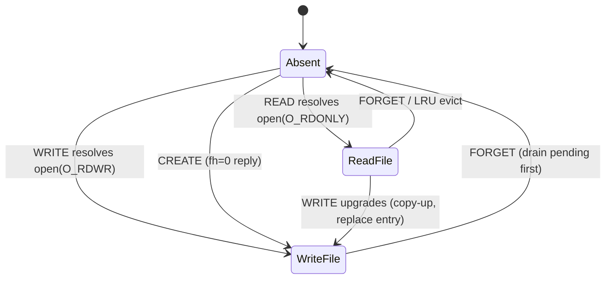

# WS9: ENOSYS-OPEN — zero round trips per open/close (`AGENTFS_FUSE_NOOPEN`)

## Kernel contract (verified from torvalds/linux fs/fuse/file.c, inode.c, dir.c)
- ENOSYS to the first FUSE_OPEN latches `fc->no_open` connection-wide; that open(2) and all later ones succeed with a default `ff = {fh: 0, open_flags: FOPEN_KEEP_CACHE}` and **no request sent**. The kernel advertises `FUSE_NO_OPEN_SUPPORT` in INIT (gate on its presence).
- `fuse_file_put` skips FUSE_RELEASE for **all** files once `no_open` is set — **including CREATE-opened files**, so no fh-keyed state can rely on RELEASE for cleanup.
- All file ops echo `fh=0`: READ/WRITE/FSYNC/SETATTR(FATTR_FH)/FLUSH. fh is opaque, never validated.
- O_TRUNC safe: we never advertise `FUSE_ATOMIC_O_TRUNC`, so the VFS delivers it as SETATTR size=0 (already drained+handled; kernel truncates its own pagecache on the reply).
- Page-cache coherence without an open hook: kernel keeps pages by default; self-writes are kernel-coherent (writeback), truncates invalidate via SETATTR reply, external DB writers unsupported live. Drift guard stays for the kill-switch path only.

## State model (the one invented structure)
`ino_files: Mutex<HashMap<u64, InoFile>>` where `InoFile { file: BoxedFile, pending: WriteBuffer, write_capable: bool }`.

Resolution uses double-checked insert (never hold the lock across `block_on`). Write-upgrade **replaces** the entry, so post-copy-up reads go through the delta file — strictly more coherent than today's per-fh stale base fds.

## Walk results (all flows computed end-to-end)
| Flow | Outcome |
|---|---|
| warm open/read/close | 0 FUSE requests (KEEP_CACHE + cached attrs) — native |
| cold read | 1 READ; ino resolution (2 SELECTs) once per ino, cached until FORGET |
| create+write+close | CREATE populates ino_files; WRITEs fh=0 buffer per-ino; tails drain via WS7 guards/FORGET/destroy |
| overlay base→write | read entry upgraded to delta on first WRITE |
| ftruncate | SETATTR fh=0 → route unknown fh to existing ino-based truncate branch |
| ENOSYS latch race | first open's I/O already works via fh=0 path |
| flock/locks | local (no_lock), no release needed |
| O_DIRECT | degrades to cached I/O (no FOPEN_DIRECT_IO grant) — documented trade |

## Implementation (cli/src/fuse.rs + small fuser touch)
1. `noopen: bool` (env `AGENTFS_FUSE_NOOPEN=1`, opt-in initially) gated on kernel INIT offering `FUSE_NO_OPEN_SUPPORT`; counter `fuse_noopen_enosys_replies`.
2. `open()`: when noopen, reply ENOSYS (after recording). Legacy path untouched otherwise.
3. `ino_files` table + `resolve_read(ino)` / `resolve_write(ino)` helpers; counters for resolutions/upgrades.
4. Route handlers: read/write/fsync/flush/setattr-with-fh try `open_files[fh]`, fall back to ino_files resolution (write ops resolve write-capable, upgrading as needed).
5. CREATE under noopen: store created BoxedFile in ino_files (`write_capable: true`), reply `fh=0`.
6. Extend WS7 pending machinery over ino_files: `has_pending_write_for_inode`, drain helpers, `pending_dirty_handles` transitions, `flush_all_pending`/destroy.
7. FORGET/batch_forget: drain ino pending tail, drop entry. Soft LRU cap (default 65,536; evict only empty-pending entries; env-tunable) as safety valve.
8. New validation `scripts/validation/noopen-coherence.py` (sibling of flush-coherence): create/write/close/stat races, copy-up read-after-write upgrade check, ftruncate-via-fh0, mmap+msync, latch counter assertions, under {noopen on/off} x {default TTL, entry TTL 0}.

## Eval and GO bar (user-set)
- Correctness: full gate suite + flush-coherence + noopen-coherence, with noopen on; equivalence everywhere.
- A/B (interleaved, plus compound with uring): per-cycle open/read/close micro (expect ~native warm), read_search phase, full git workload, read-path benchmark.
- **GO = read_search <=1.5x AND no phase regression.** On GO: promote default-on (kill switch `AGENTFS_FUSE_NOOPEN=0`), noflush-style, same workstream. Record verdict in spec log + notes either way.

## Accepted trades (documented in notes)
- No per-open revalidation hook: page-cache coherence rests on the same TTL + self-coherence contract as WS5/WS7 (drift guard becomes kill-switch-path-only).
- O_DIRECT opens behave as cached I/O.
- Permission enforcement at open(2) unchanged (we never enforced in the open handler; kernel-side checks unaffected).